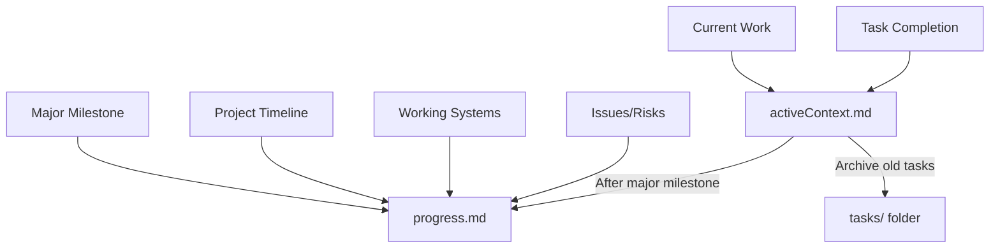

# Memory Bank Maintenance Guidelines

## File Purpose and Content Rules

### activeContext.md (Target: 30-40 lines)
**Purpose**: Current work focus only
**Content Rules**:
- Current task being worked on (1 task maximum)
- Last 2-3 completed tasks (1 line each, brief)
- Immediate next steps (1-2 tasks ahead)
- Active decisions requiring immediate attention
- Current blockers or considerations

**What NOT to include**:
- Detailed technical achievements (belongs in progress.md)
- Historical task completion details beyond last 2-3
- Success metrics and percentages (belongs in progress.md)
- Multiple "Recent Changes" sections
- Duplicate information from progress.md

**Update Frequency**: After each task completion or when changing focus

### progress.md (Target: 50-60 lines)
**Purpose**: Project trajectory and working systems
**Content Rules**:
- Overall project status percentage
- What systems are currently working (brief list)
- Major milestone timeline (chronological)
- What's left to build (remaining work overview)
- Known issues and risks

**What NOT to include**:
- Current active work details (belongs in activeContext.md)
- Duplicate task completion information
- Daily work updates (belongs in activeContext.md)

**Update Frequency**: Weekly or after major milestones

### Duplication Prevention Rules

1. **Project Status**: Only in progress.md
2. **Current Task**: Only in activeContext.md
3. **Next Steps**: Only in activeContext.md (immediate) or progress.md (strategic)
4. **Technical Achievements**: Only in progress.md "What's Working"
5. **Task Completion**: Brief mention in activeContext.md (last 2-3), detailed timeline in progress.md

## Information Flow



## Update Procedures

### When Completing a Task
1. **Update activeContext.md**:
   - Move current task to "Recent Changes" (1 line)
   - Add new current task to "Current Work Focus"
   - Update "Next Steps" with immediate actions
   - Remove oldest task from "Recent Changes" if >3 tasks

2. **Update progress.md** (if major milestone):
   - Add milestone to timeline
   - Update "What's Working" if new capability added
   - Update project status percentage if applicable

### When Starting a New Task
1. **Update activeContext.md**:
   - Replace "Current Work Focus" with new task
   - Update "Next Steps"
   - Update "Active Decisions" if applicable

### Weekly Maintenance
1. **Review for duplication** between activeContext.md and progress.md
2. **Archive completed tasks** from activeContext.md to tasks/ folder
3. **Update progress.md** with any new working systems or capabilities

## Content Templates

### activeContext.md Template
```markdown
# Active Context

## Current Work Focus
**[Task ID - Task Name]**: [Brief description of current work and goals]

## Recent Changes
**[Date]**: **[Task ID] COMPLETED** - [One line achievement summary]
**[Date]**: **[Task ID] COMPLETED** - [One line achievement summary]

## Next Steps
**Immediate Focus**: [Next task or action]
- [Specific immediate goal]
- [Approach or method]

**Upcoming**: [Future task sequence overview]

## Active Decisions and Considerations
[Current blockers, decisions needed, or important context for ongoing work]
```

### progress.md Template
```markdown
# Progress

## Current Status
**Overall Project Status:** [X]% Complete - [Brief status summary]

## What's Working
- **[System/Feature]**: [Brief description of working capability]
- **[System/Feature]**: [Brief description of working capability]

## Timeline of Progress
- **[Date]**: [Major milestone] - [Brief description]
- **[Date]**: [Major milestone] - [Brief description]

## What's Left to Build
**Remaining Work**:
- [High-level remaining tasks or features]

## Known Issues and Risks
- **[Issue]**: [Brief description and impact]
```

## Quality Checks

Before updating memory bank files, verify:
- [ ] No duplicate information between activeContext.md and progress.md
- [ ] activeContext.md focuses only on current/immediate work
- [ ] progress.md focuses only on project trajectory
- [ ] File sizes remain within target ranges (30-40 and 50-60 lines)
- [ ] All critical information preserved (no information loss)

## Red Flags - When to Restructure

If you see these patterns, the memory bank needs cleanup:
- ❌ activeContext.md >50 lines
- ❌ Multiple "Recent Changes" sections in same file
- ❌ Same information in both activeContext.md and progress.md
- ❌ Current work details buried in historical information
- ❌ Developers spending >2 minutes to understand current status

Following these guidelines ensures the memory bank serves both AI context needs and developer productivity effectively.