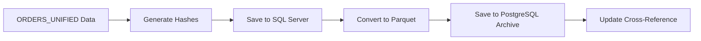
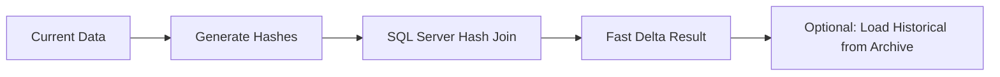
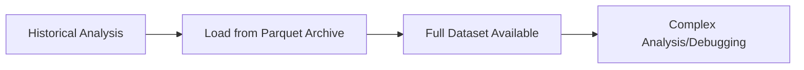

# Hybrid Snapshot Storage Architecture - ORDERS_UNIFIED_SNAPSHOT

## 🎯 **Overview**

**Decision**: ✅ **Hybrid Approach** - SQL Server table + Parquet archive in Kestra PostgreSQL  
**Rationale**: Best of both worlds - fast queries + long-term storage + existing code compatibility

---

## 🏗️ **Architecture Components**

### **1. Primary Storage: SQL Server Table**
**Location**: `dbo.ORDERS_UNIFIED_SNAPSHOT` in ORDERS database  
**Purpose**: Fast change detection queries, existing `change_detector.py` compatibility  
**DDL**: [`sql/ddl/tables/orders/dbo_orders_unified_snapshot.sql`](../sql/ddl/tables/orders/dbo_orders_unified_snapshot.sql)

**Features**:
- ✅ Fast hash-based change detection with optimized indexes
- ✅ Compatible with existing `change_detector.py` code
- ✅ Rolling window storage (current + 1 previous snapshot)
- ✅ Customer-based partitioning
- ✅ Built-in cleanup procedures

**Schema**:
```sql
CREATE TABLE [dbo].[ORDERS_UNIFIED_SNAPSHOT] (
    [record_uuid] UNIQUEIDENTIFIER NOT NULL,
    [row_hash] NVARCHAR(64) NOT NULL,           -- SHA-256 for change detection
    [AAG ORDER NUMBER] NVARCHAR(255) NOT NULL,   -- Business key
    [CUSTOMER NAME] NVARCHAR(255) NULL,
    [CUSTOMER STYLE] NVARCHAR(255) NULL,
    [snapshot_date] DATETIME2 NOT NULL,
    [customer_filter] NVARCHAR(255) NOT NULL,
    [batch_id] UNIQUEIDENTIFIER NULL,
    [parquet_archive_id] BIGINT NULL,           -- FK to PostgreSQL archive
    -- Indexes for performance
    CONSTRAINT PK_ORDERS_UNIFIED_SNAPSHOT PRIMARY KEY CLUSTERED ([record_uuid])
);
```

### **2. Archive Storage: Kestra PostgreSQL + Parquet**
**Location**: `snapshot_archive` table in Kestra PostgreSQL  
**Purpose**: Long-term storage, historical analysis, debugging  
**DDL**: [`sql/ddl/tables/kestra/snapshot_archive_postgresql.sql`](../sql/ddl/tables/kestra/snapshot_archive_postgresql.sql)

**Features**:
- ✅ Compressed Parquet storage (efficient for 276+ columns)
- ✅ Full historical snapshots with metadata
- ✅ Schema validation and integrity checks
- ✅ Flexible JSON tags for categorization
- ✅ Automatic retention management
- ✅ Compression ratio tracking

**Schema**:
```sql
CREATE TABLE snapshot_archive (
    archive_id BIGSERIAL PRIMARY KEY,
    snapshot_date TIMESTAMP NOT NULL,
    customer_filter VARCHAR(255) NOT NULL,
    parquet_data BYTEA NOT NULL,              -- Compressed Parquet file
    parquet_size BIGINT,                      -- Size tracking
    compression_ratio DECIMAL(5,2),          -- Efficiency metrics
    schema_hash VARCHAR(64),                  -- Schema validation
    tags JSONB,                              -- Flexible metadata
    retention_until DATE                     -- Auto-cleanup
);
```

### **3. Hybrid Manager: Python Utility**
**Location**: [`utils/hybrid_snapshot_manager.py`](../utils/hybrid_snapshot_manager.py)  
**Purpose**: Unified interface for both storage systems

**Features**:
- ✅ Seamless integration with existing `change_detector.py`
- ✅ Automatic dual-storage (SQL Server + Parquet)
- ✅ Archive loading and analysis capabilities
- ✅ Cross-reference between systems
- ✅ Maintenance and cleanup tools

---

## 🔄 **Data Flow Workflow**

### **Save Snapshot Process**:


### **Change Detection Process**:


### **Analysis/Debug Process**:


---

## 💡 **Benefits of Hybrid Approach**

### **Performance Benefits**:
- ⚡ **Fast Queries**: SQL Server indexes for change detection
- ⚡ **Efficient Storage**: Parquet compression for large datasets
- ⚡ **Parallel Processing**: Independent systems don't block each other

### **Operational Benefits**:
- 🔄 **Zero Breaking Changes**: Existing `change_detector.py` works unchanged
- 🔄 **Gradual Migration**: Can add archive features incrementally
- 🔄 **Flexible Retention**: Different policies for fast vs. archive storage

### **Analysis Benefits**:
- 📊 **Historical Trends**: Full dataset history in Parquet
- 📊 **Complex Queries**: PostgreSQL analytics capabilities
- 📊 **Export/Sharing**: Portable Parquet files for data science

### **Reliability Benefits**:
- 🛡️ **Redundancy**: Data stored in two different systems
- 🛡️ **Schema Validation**: Hash-based integrity checks
- 🛡️ **Backup Strategy**: File-based archives easier to backup

---

## 🚀 **Implementation Guide**

### **Step 1: Deploy Database Schemas**
```sql
-- Deploy SQL Server table
sqlcmd -S server -d ORDERS -i sql/ddl/tables/orders/dbo_orders_unified_snapshot.sql

-- Deploy PostgreSQL archive (in Kestra container)
psql -h localhost -U kestra -d kestra -f sql/ddl/tables/kestra/snapshot_archive_postgresql.sql
```

### **Step 2: Install Python Dependencies**
```bash
# Add to requirements.txt
pip install pyarrow psycopg2-binary
```

### **Step 3: Update Existing Code**
```python
# In change_detector.py - minimal changes needed
from utils.hybrid_snapshot_manager import HybridSnapshotManager

# Replace existing snapshot save with:
manager = HybridSnapshotManager()
archive_id = manager.save_snapshot(
    df=current_df, 
    customer_filter=customer_filter,
    batch_id=str(uuid.uuid4()),
    tags={'pipeline': 'orders_v3', 'customer': customer_filter}
)
```

### **Step 4: Monitoring and Maintenance**
```python
# Get storage statistics
stats = manager.get_archive_statistics(days_back=30)
print(stats)

# Cleanup old archives (dry run first)
cleanup_preview = manager.cleanup_old_archives(keep_days=90, dry_run=True)
```

---

## 📋 **Maintenance Procedures**

### **SQL Server Maintenance**:
```sql
-- Cleanup old snapshots (keep current + 1 previous per customer)
EXEC [dbo].[sp_cleanup_snapshot_history] @customer_filter = NULL, @keep_count = 2;

-- Get snapshot statistics
EXEC [dbo].[sp_snapshot_statistics];
```

### **PostgreSQL Archive Maintenance**:
```sql
-- Get archive statistics
SELECT * FROM get_archive_statistics(NULL, 30);

-- Preview cleanup (dry run)
SELECT * FROM cleanup_old_archives(90, true);

-- Actual cleanup
SELECT * FROM cleanup_old_archives(90, false);

-- Validate integrity
SELECT * FROM validate_archive_integrity();
```

---

## 🎯 **Migration Strategy**

### **Phase 1**: SQL Server Only (Current State)
- ✅ Existing `change_detector.py` works unchanged
- ✅ Fast queries and change detection

### **Phase 2**: Add Parquet Archive (Optional)
- ✅ Install PostgreSQL dependencies
- ✅ Deploy archive schema
- ✅ Start dual-storage for new snapshots

### **Phase 3**: Enhanced Analytics (Future)
- ✅ Historical trend analysis
- ✅ Advanced reporting
- ✅ Data science integration

**No Breaking Changes**: Each phase is optional and backwards compatible.

---

## 🔧 **Configuration**

### **Environment Variables**:
```yaml
# Kestra PostgreSQL connection (from docker-compose.yml)
KESTRA_POSTGRES_HOST: localhost
KESTRA_POSTGRES_PORT: 5432
KESTRA_POSTGRES_DB: kestra
KESTRA_POSTGRES_USER: kestra
KESTRA_POSTGRES_PASSWORD: k3str4

# Archive retention settings
ARCHIVE_RETENTION_DAYS: 90
SNAPSHOT_KEEP_COUNT: 2
```

### **VS Code Task Integration**:
```json
{
    "label": "Snapshot: Cleanup Archives",
    "type": "shell",
    "command": "python",
    "args": ["-c", "from utils.hybrid_snapshot_manager import HybridSnapshotManager; m=HybridSnapshotManager(); print(m.cleanup_old_archives(90, True))"],
    "group": "ops"
}
```

---

## ✅ **Post-Action Review**

### **Completed Goals**:
- ✅ **Created hybrid ORDERS_UNIFIED_SNAPSHOT approach**
- ✅ **SQL Server DDL with optimized indexes and procedures**
- ✅ **PostgreSQL archive schema with Parquet BYTEA storage**
- ✅ **Python utility for unified management**
- ✅ **Maintained existing change_detector.py compatibility**
- ✅ **Documentation with implementation guide**

### **Benefits Achieved**:
- ⚡ **Fast change detection** (SQL Server indexes)
- 🗄️ **Efficient long-term storage** (Parquet compression)
- 🔄 **Zero breaking changes** (existing code works)
- 📊 **Historical analysis capabilities** (PostgreSQL + Parquet)
- 🛡️ **Data redundancy and integrity** (dual storage)

### **Next Steps**:
1. **Deploy DDL schemas** to both databases
2. **Install Python dependencies** (`pyarrow`, `psycopg2-binary`)
3. **Test hybrid manager** with small dataset
4. **Integrate with existing pipeline** gradually
5. **Set up monitoring** and maintenance procedures

This hybrid approach gives you the best of both worlds while maintaining complete backwards compatibility with your existing 75% complete implementation.
