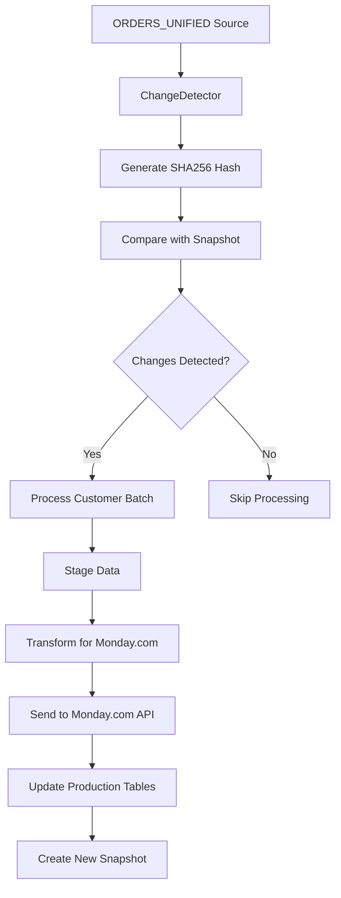

# Customer Orders Processing Workflow

## Hash-Based Change Detection Workflow



## Processing Steps

### 1. Change Detection Phase
**Input**: ORDERS_UNIFIED table  
**Process**: 
- Generate hash for each record (excluding system fields)
- Compare with existing snapshot hashes
- Classify changes: NEW, CHANGED, UNCHANGED, DELETED

**Hash Generation**:
```python
# Generate SHA256 hash from all columns except:
exclude_from_hash = [
    'record_uuid',           # System generated UUID
    'snapshot_date',         # System timestamp 
    'customer_filter',       # System metadata
    'row_hash'              # The hash itself
]
```

### 2. Customer Batching Phase
**Input**: Changed records  
**Process**:
- Group records by customer name
- Apply customer name normalization
- Create batch tracking records
- Process customers in priority order

### 3. Staging Phase
**Input**: Customer batch data  
**Process**:
- Transform data using comprehensive mapping
- Apply business logic and data cleaning
- Stage master items and subitems
- Validate data integrity

### 4. Monday.com Integration Phase
**Input**: Staged data  
**Process**:
- Load GraphQL templates
- Transform to Monday.com format
- Apply rate limiting (0.1s delays)
- Send API requests
- Handle errors and retries

### 5. Production Update Phase
**Input**: API response data  
**Process**:
- Update production tables with Monday.com IDs
- Create audit trail records
- Update batch processing status
- Create new snapshot for next comparison

## Data Flow

### Tables Involved
```
ORDERS_UNIFIED (source)
    ↓ (hash comparison)
ORDERS_UNIFIED_SNAPSHOT (last processed state)
    ↓ (changed records)
MON_CustMasterSchedule (staging for master items)
MON_CustMasterSchedule_SubItems (staging for subitems)
    ↓ (API integration)
Monday.com Boards (external system)
    ↓ (production update)
Production Tables (final state)
```

### Key Fields and Mappings

**Business Key Fields** (for change detection):
- AAG ORDER NUMBER
- CUSTOMER NAME
- CUSTOMER STYLE
- CUSTOMER COLOUR DESCRIPTION
- PO NUMBER
- CUSTOMER ALT PO
- ACTIVE

**System Fields** (excluded from hash):
- record_uuid
- snapshot_date
- customer_filter
- row_hash

**Monday.com Field Mappings** (from `orders-unified-comprehensive-mapping.yaml`):
- Master Item: Customer, Style, Color, Total Qty, Due Date
- Subitems: Individual size/color combinations with quantities

## Error Handling

### Database Errors
- Transaction rollback on failure
- Detailed error logging with context
- Batch status updates for tracking
- Retry logic for transient failures

### API Errors
- Rate limiting compliance
- Exponential backoff for retries
- Error classification and handling
- Partial success processing

### Data Validation Errors
- Type conversion with fallbacks
- Null value handling
- Constraint validation
- Data cleaning and normalization

## Performance Considerations

### Batch Size Optimization
- Default: 500 records per batch
- Customer-based grouping for efficiency
- Configurable chunk sizes for API calls

### Query Optimization
- Index on record_uuid for fast lookups
- Efficient join strategies for change detection
- Parameterized queries for performance

### Rate Limiting
- 0.1 second delays between API calls
- Configurable rate limiting parameters
- Monitoring and adjustment capabilities

## Monitoring and Logging

### Batch Processing Tracking
```sql
-- MON_BatchProcessing table tracks:
batch_id          -- Unique identifier
customer_name     -- Customer being processed
batch_type        -- Type of processing
status           -- STARTED, COMPLETED, FAILED
start_time       -- Processing start
end_time         -- Processing completion
total_records    -- Records in batch
successful_records -- Successfully processed
failed_records   -- Failed processing
error_summary    -- Error details
```

### Logging Levels
- **INFO**: Normal processing progress
- **WARNING**: Non-critical issues handled
- **ERROR**: Processing failures requiring attention
- **DEBUG**: Detailed troubleshooting information

## Testing Workflow

### Test Data: GREYSON PO 4755
- **Purpose**: Validate end-to-end processing
- **Scope**: 5 specific records for controlled testing
- **Validation**: Compare source data vs Monday.com results

### Test Phases
1. **Unit Testing**: Individual component validation
2. **Integration Testing**: End-to-end workflow validation
3. **Performance Testing**: Load and stress testing
4. **API Testing**: Monday.com integration validation
