# ORDER_LIST Pipeline - Technical Architecture Documentation

**Version**: 2.1  
**Date**: July 11, 2025  
**Status**: 🟢 Production Ready with SharePoint Integration  
**Owner**: Data Engineering Team

## 📐 Architecture Overview

The ORDER_LIST pipeline implements a high-performance Extract-Transform-Load (ETL) architecture optimized for processing large-scale customer order data from multiple Excel files into a unified production database.

### 🎯 Design Principles
- **Performance First**: Optimized for 100K+ records in under 6 minutes
- **Zero Downtime**: Atomic operations with staging/production swaps
- **Fault Tolerance**: Comprehensive error handling and rollback capabilities
- **Scalability**: Designed to handle growing data volumes
- **Maintainability**: Modular components with clear separation of concerns

---

## 🏗️ High-Level Architecture

```mermaid
graph TB
    subgraph "☁️ AZURE CLOUD"
        subgraph "📦 Blob Storage"
            A[📄 Customer XLSX Files<br/>~41 files, 100K+ records]
            B[📁 CSV Staging<br/>Temporary upload area]
        end
        
        subgraph "🔐 Authentication"
            C[🎫 Service Principal<br/>Client Credentials Flow]
            C2[🗄️ Database Token Cache<br/>MSAL cache in SQL Server]
        end
        
        subgraph "📡 SharePoint Integration"
            SP[📂 SharePoint Discovery<br/>order_list_blob.py]
        end
    end
    
    subgraph "🖥️ PROCESSING ENVIRONMENT"
        subgraph "🐍 Python Runtime"
            D[⚡ order_list_extract.py<br/>Azure SDK + Pandas]
            E[🔄 order_list_transform.py<br/>SQL Generation + DDL]
            F[📋 order_list_pipeline.py<br/>Orchestration Controller]
            G[📤 order_list_blob.py<br/>SharePoint → Blob]
        end
        
        subgraph "📊 Utilities Layer"
            H[🗄️ db_helper.py<br/>Database Connections]
            I[📝 schema_helper.py<br/>DDL Management]
            J[📋 logger_helper.py<br/>Monitoring & Logging]
            K[🔐 auth_helper.py<br/>Database-backed MSAL]
        end
    end
    
    subgraph "🗄️ SQL SERVER DATABASE"
        subgraph "📂 Raw Tables"
            L[📄 x_CUSTOMER_ORDER_LIST_RAW<br/>41 dynamic tables]
        end
        
        subgraph "🔄 Staging Area"  
            M[📊 swp_ORDER_LIST<br/>DDL-compliant staging]
        end
        
        subgraph "🏭 Production"
            N[📋 ORDER_LIST<br/>Unified production table]
        end
        
        subgraph "⚙️ Infrastructure"
            O[🔗 External Data Source<br/>Blob SAS integration]
            P[📊 BULK INSERT Operations<br/>High-performance loading]
            Q[🗄️ msal_token_cache<br/>Database-backed auth]
        end
    end
    
    subgraph "🎛️ ORCHESTRATION LAYER"
        R[🧪 Test Framework<br/>5-phase validation]
        S[📊 Monitoring Dashboard<br/>Real-time metrics]
        T[🎮 VS Code Tasks<br/>Developer interface]
        U[🔄 Kestra Workflows<br/>Production orchestration]
    end
    
    %% Enhanced Data Flow
    SP --> A
    C2 --> G
    C --> G
    G --> A
    A --> D
    C --> D
    D --> L
    L --> E
    E --> M
    M --> N
    
    %% Control Flow  
    F --> G
    F --> D
    F --> E
    F --> R
    F --> S
    U --> F
    
    %% Support Services
    G --> H
    G --> K
    D --> H
    D --> I
    D --> J
    E --> H
    E --> I
    E --> J
    
    %% Staging Operations
    M --> O
    M --> P
    L --> P
    
    %% Authentication Flow
    K --> Q
    K --> C2
    
    %% User Interfaces
    T --> F
    T --> G
    R --> F
    
    %% Styling
    style A fill:#e3f2fd,stroke:#1976d2,stroke-width:2px
    style N fill:#e8f5e8,stroke:#388e3c,stroke-width:2px
    style M fill:#fff3e0,stroke:#f57c00,stroke-width:2px
    style F fill:#f3e5f5,stroke:#7b1fa2,stroke-width:2px
    style G fill:#fce4ec,stroke:#c2185b,stroke-width:2px
    style K fill:#ffecb3,stroke:#ff8f00,stroke-width:2px
    style U fill:#e1f5fe,stroke:#0277bd,stroke-width:2px
```

---

## 🔄 Data Flow Architecture

### 📊 Extract Stage Data Flow

```mermaid
sequenceDiagram
    participant BlobStorage as 📦 Azure Blob Storage
    participant ExtractScript as ⚡ order_list_extract.py
    participant AzureAuth as 🔐 Azure Authentication
    participant Database as 🗄️ SQL Server
    participant CSVStaging as 📁 CSV Staging
    
    Note over ExtractScript: Stage 1: Initialization
    ExtractScript->>AzureAuth: Request Service Principal Token
    AzureAuth-->>ExtractScript: Return Access Token
    ExtractScript->>Database: Test Connection & Create External Data Source
    
    Note over ExtractScript: Stage 2: File Discovery
    ExtractScript->>BlobStorage: List XLSX Files (*.xlsx, *.xls)
    BlobStorage-->>ExtractScript: Return File List (45 files)
    
    Note over ExtractScript: Stage 3: File Processing Loop
    loop For Each Customer File
        ExtractScript->>BlobStorage: Download XLSX File
        BlobStorage-->>ExtractScript: Return File Data
        
        Note over ExtractScript: Data Processing
        ExtractScript->>ExtractScript: Read Excel (MASTER sheet)
        ExtractScript->>ExtractScript: Clean Data (remove empty rows)
        ExtractScript->>ExtractScript: Add Metadata (_SOURCE_FILE, _EXTRACTED_AT)
        
        Note over ExtractScript: Database Operations
        ExtractScript->>Database: Generate Dynamic DDL
        ExtractScript->>Database: CREATE TABLE x_CUSTOMER_ORDER_LIST_RAW
        ExtractScript->>CSVStaging: Upload CSV to Blob Storage
        ExtractScript->>Database: BULK INSERT via External Data Source
        
        Database-->>ExtractScript: Return Row Count Confirmation
    end
    
    Note over ExtractScript: Stage 4: Summary Report
    ExtractScript->>ExtractScript: Generate Performance Metrics
```

### 🔧 Transform Stage Data Flow

```mermaid
sequenceDiagram
    participant RawTables as 📂 Raw Tables (45)
    participant TransformScript as 🔄 order_list_transform.py
    participant DDLSchema as 📝 DDL Schema File
    participant StagingTable as 📊 swp_ORDER_LIST
    participant ProductionTable as 🏭 ORDER_LIST
    participant Database as 🗄️ SQL Server
    
    Note over TransformScript: Stage 1: Schema Preparation
    TransformScript->>DDLSchema: Load Production Schema Definition
    DDLSchema-->>TransformScript: Return Column Types & Structure
    TransformScript->>Database: DROP TABLE IF EXISTS swp_ORDER_LIST
    TransformScript->>Database: CREATE TABLE swp_ORDER_LIST (DDL Schema)
    
    Note over TransformScript: Stage 2: Data Consolidation
    loop For Each Customer (45 customers)
        TransformScript->>Database: Generate Server-Side INSERT Statement
        Note over Database: Server-Side Processing
        Database->>RawTables: SELECT with Data Cleaning
        Database->>Database: Apply Type Conversions & Precision Fixes
        Database->>StagingTable: INSERT Cleaned Records
        Database-->>TransformScript: Return Processed Row Count
    end
    
    Note over TransformScript: Stage 3: Quality Validation
    TransformScript->>StagingTable: Validate Schema Compliance
    TransformScript->>StagingTable: Count Records & Check Data Types
    StagingTable-->>TransformScript: Return Validation Results
    
    Note over TransformScript: Stage 4: Atomic Swap
    TransformScript->>Database: BEGIN TRANSACTION
    TransformScript->>Database: RENAME ORDER_LIST to ORDER_LIST_OLD
    TransformScript->>Database: RENAME swp_ORDER_LIST to ORDER_LIST
    TransformScript->>Database: DROP TABLE ORDER_LIST_OLD
    TransformScript->>Database: COMMIT TRANSACTION
    
    Database-->>TransformScript: Confirm Zero-Downtime Swap Complete
```

---

## 🎛️ Component Architecture

### 📦 Module Dependencies

```mermaid
graph TD
    subgraph "🎯 PIPELINE ORCHESTRATION"
        A[📋 order_list_pipeline.py<br/>Main Controller]
    end
    
    subgraph "🔄 CORE PROCESSING MODULES"
        B[⚡ order_list_extract.py<br/>Blob → Raw Tables]
        C[🔧 order_list_transform.py<br/>Raw → Staging → Production]
    end
    
    subgraph "🛠️ UTILITY LAYER"
        D[🗄️ db_helper.py<br/>Database Connections]
        E[📝 schema_helper.py<br/>DDL & Schema Management]
        F[📋 logger_helper.py<br/>Logging & Monitoring]
        G[🔄 precision_transformer.py<br/>Numeric Type Handling]
        H[📊 schema_aware_staging_helper.py<br/>Staging Operations]
    end
    
    subgraph "🧪 TESTING FRAMEWORK"
        I[📊 test_order_list_complete_pipeline.py<br/>5-Phase Validation]
        J[🔍 Debug Scripts<br/>Component Testing]
    end
    
    subgraph "🎮 USER INTERFACES"
        K[🎯 VS Code Tasks<br/>Developer Interface]
        L[📋 Command Line<br/>Production Interface]
    end
    
    subgraph "📚 EXTERNAL DEPENDENCIES"
        M[🐍 pandas<br/>Excel Processing]
        N[☁️ azure-storage-blob<br/>Blob Operations] 
        O[🔐 azure-identity<br/>Authentication]
        P[🗄️ pyodbc<br/>Database Connectivity]
    end
    
    %% Dependencies
    A --> B
    A --> C
    A --> I
    
    B --> D
    B --> E
    B --> F
    B --> M
    B --> N
    B --> O
    B --> P
    
    C --> D
    C --> E
    C --> F
    C --> G
    C --> H
    C --> P
    
    I --> A
    I --> D
    I --> F
    
    K --> A
    L --> A
    
    %% Styling
    style A fill:#f3e5f5,stroke:#7b1fa2,stroke-width:2px
    style B fill:#e3f2fd,stroke:#1976d2,stroke-width:2px
    style C fill:#fff3e0,stroke:#f57c00,stroke-width:2px
    style I fill:#fce4ec,stroke:#c2185b,stroke-width:2px
```

### 🔧 Configuration Management

```mermaid
graph LR
    subgraph "⚙️ CONFIGURATION SOURCES"
        A[🔐 Environment Variables<br/>Azure Credentials]
        B[📋 config.yaml<br/>Database Connections]
        C[📝 DDL Files<br/>Schema Definitions]
        D[💾 Hardcoded Constants<br/>Blob Storage Config]
    end
    
    subgraph "📊 CONFIGURATION CONSUMERS"
        E[⚡ Extract Module<br/>Azure Auth + DB Config]
        F[🔧 Transform Module<br/>DB Config + DDL Schema]
        G[🛠️ Utility Modules<br/>DB Connections]
        H[🧪 Test Framework<br/>All Configurations]
    end
    
    A --> E
    B --> E
    B --> F
    B --> G
    B --> H
    C --> F
    D --> E
    
    style A fill:#ffebee,stroke:#d32f2f,stroke-width:2px
    style B fill:#e8f5e8,stroke:#388e3c,stroke-width:2px
    style C fill:#e3f2fd,stroke:#1976d2,stroke-width:2px
    style D fill:#fff3e0,stroke:#f57c00,stroke-width:2px
```

---

## 🗄️ Database Schema Architecture

### 📊 Table Relationships

### 🔄 Schema Evolution Process

```mermaid
flowchart TD
    A[📄 Excel Files<br/>Variable Schemas] --> B[🔍 Dynamic Schema Detection]
    B --> C[📝 Raw Table Creation<br/>VARCHAR for all columns]
    C --> D[📋 DDL Schema Loading<br/>Production column types]
    D --> E[🔄 Type Conversion<br/>Server-side CAST operations]
    E --> F[✅ Schema Validation<br/>Type compliance check]
    F --> G[🏭 Production Table<br/>Typed & validated]
    
    subgraph "🛡️ DATA QUALITY GATES"
        H[🧮 Numeric Precision Validation]
        I[📅 Date Format Standardization]
        J[🔤 String Length Compliance]
        K[❌ NULL Value Handling]
    end
    
    E --> H
    E --> I
    E --> J
    E --> K
    
    H --> F
    I --> F
    J --> F
    K --> F
    
    style A fill:#e3f2fd,stroke:#1976d2,stroke-width:2px
    style G fill:#e8f5e8,stroke:#388e3c,stroke-width:2px
    style F fill:#fff3e0,stroke:#f57c00,stroke-width:2px
```

---

## ⚡ Performance Architecture

### 🚀 Optimization Strategies

```mermaid
mindmap
  root((⚡ Performance<br/>Optimization))
    🔄 Extract Stage
      ☁️ Azure SDK
        Lazy Blob Client Init
        Connection Pooling
        Parallel Downloads
      📊 Data Processing
        Pandas Vectorization
        Memory-Efficient Streaming
        Bulk Operations
      🗄️ Database Loading
        BULK INSERT via SAS
        External Data Sources
        Minimal Logging
    
    🔧 Transform Stage
      🖥️ Server-Side Processing
        SQL Server Optimization
        Reduced Python Overhead
        Native Type Conversion
      📝 DDL Schema
        Pre-defined Types
        No Dynamic Discovery
        Optimized Column Order
      🔄 Staging Strategy
        Atomic Swaps
        Zero Downtime
        Rollback Capability
    
    🎛️ Orchestration
      🐍 Direct Imports
        No Subprocess Overhead
        Shared Memory Space
        Reduced Process Creation
      📊 Monitoring
        Real-time Metrics
        Progress Tracking
        Error Detection
```

### 📊 Performance Benchmarks

| Component | Metric | Target | Achieved | Optimization |
|-----------|--------|--------|----------|--------------|
| **Extract** | Throughput | 300 rec/sec | 478 rec/sec | Azure SDK + BULK INSERT |
| **Transform** | Throughput | 500 rec/sec | 849 rec/sec | Server-side processing |
| **Overall** | Total Time | < 10 min | 5.6 min | Direct imports + staging |
| **Memory** | Peak Usage | < 2GB | ~1.2GB | Streaming + chunking |
| **CPU** | Utilization | < 80% | ~60% | Async operations |
| **Network** | Bandwidth | Minimal | Optimized | SAS + compression |

---

## 🛡️ Security Architecture

### 🔐 Authentication & Authorization

```mermaid
sequenceDiagram
    participant Pipeline as 🎯 Pipeline Process
    participant AzureAD as 🔐 Azure Active Directory
    participant BlobStorage as 📦 Blob Storage
    participant Database as 🗄️ SQL Server
    participant SAS as 🎫 SAS Token Service
    
    Note over Pipeline: Application Startup
    Pipeline->>AzureAD: Service Principal Authentication
    Note over AzureAD: Client Credentials Flow
    AzureAD-->>Pipeline: Access Token (1 hour TTL)
    
    Note over Pipeline: Blob Operations
    Pipeline->>BlobStorage: Access with Bearer Token
    BlobStorage->>AzureAD: Validate Token
    AzureAD-->>BlobStorage: Token Valid
    BlobStorage-->>Pipeline: File Access Granted
    
    Note over Pipeline: Database Operations  
    Pipeline->>Database: Windows Authentication
    Database->>Database: Validate Service Account
    Database-->>Pipeline: Connection Established
    
    Note over Pipeline: CSV Upload Operations
    Pipeline->>SAS: Generate SAS Token (2 hour TTL)
    SAS-->>Pipeline: Temporary Upload Token
    Pipeline->>BlobStorage: Upload CSV with SAS
    BlobStorage-->>Pipeline: Upload Complete
```

### 🛡️ Security Controls

| Layer | Control | Implementation | Purpose |
|-------|---------|----------------|---------|
| **Authentication** | Service Principal | Client ID + Secret | Azure resource access |
| **Authorization** | RBAC | Storage Blob Data Contributor | Minimal required permissions |
| **Network** | Private Endpoints | VNet integration | Secure data transmission |
| **Data** | Encryption at Rest | Azure Storage SSE | Data protection |
| **Data** | Encryption in Transit | TLS 1.2+ | Network security |
| **Access** | SAS Tokens | Time-limited access | Temporary upload permissions |
| **Audit** | Logging | Comprehensive logs | Security monitoring |

---

## 🧪 Testing Architecture

### 📊 Test Framework Structure

```mermaid
graph TD
    subgraph "🧪 TESTING FRAMEWORK"
        A[📋 Main Test Controller<br/>test_order_list_complete_pipeline.py]
        
        subgraph "🔍 TEST PHASES"
            B[1️⃣ Data Availability<br/>Database connectivity]
            C[2️⃣ Extract Validation<br/>File processing & metrics]
            D[3️⃣ Transform Validation<br/>Schema & data quality]
            E[4️⃣ Data Integrity<br/>Production validation]
            F[5️⃣ Performance Testing<br/>Benchmarking & SLA]
        end
        
        subgraph "📊 VALIDATION METHODS"
            G[🗄️ Database Queries<br/>Record counts & schema]
            H[📈 Performance Metrics<br/>Throughput & timing]
            I[🔍 Data Quality Checks<br/>Null values & types]
            J[📋 Schema Compliance<br/>DDL validation]
        end
        
        subgraph "📋 REPORTING"
            K[✅ Success Metrics<br/>Pass/fail criteria]
            L[⚠️ Warning Analysis<br/>Non-critical issues]
            M[❌ Error Analysis<br/>Actionable feedback]
            N[📊 Performance Report<br/>Benchmarking results]
        end
    end
    
    A --> B
    A --> C  
    A --> D
    A --> E
    A --> F
    
    B --> G
    C --> G
    C --> H
    D --> I
    D --> J
    E --> H
    F --> H
    
    G --> K
    H --> N
    I --> L
    J --> M
    
    style A fill:#f3e5f5,stroke:#7b1fa2,stroke-width:2px
    style K fill:#e8f5e8,stroke:#388e3c,stroke-width:2px
    style M fill:#ffebee,stroke:#d32f2f,stroke-width:2px
```

### 🎯 Test Coverage Matrix

| Test Phase | Coverage Area | Success Criteria | Validation Method |
|------------|---------------|------------------|-------------------|
| **Data Availability** | Infrastructure | Database connectivity | Connection tests |
| **Extract Validation** | File Processing | 45 files processed | Record count validation |
| **Transform Validation** | Data Quality | Schema compliance | Type checking |
| **Data Integrity** | Production Data | 100K+ records | Production queries |
| **Performance Testing** | SLA Compliance | < 6 minutes total | Timing benchmarks |

---

## 📝 Recent Updates (Version 2.1)

### 🔄 Pipeline Enhancements
- **Added SharePoint Integration**: Pipeline now starts with `order_list_blob.py` for automated SharePoint file discovery
- **Enhanced Orchestration**: 4-stage pipeline: SharePoint → Blob → Extract → Transform → Load
- **DDL File Reorganization**: Moved schema definition to standardized location

### 📁 File Structure Changes
- **DDL Location**: `db/ddl/tables/orders/dbo_order_list.sql` (previously `notebooks/db/ddl/updates/create_order_list_complete_fixed.sql`)
- **Updated References**: All pipeline components now reference the new DDL path
- **Pipeline Workflow**: Added `--skip-blob` option for flexible execution

### 🎯 Architecture Improvements
- **Complete End-to-End**: Full SharePoint to database automation
- **Database-backed Authentication**: Enterprise MSAL token storage in SQL Server
- **Flexible Execution**: Support for partial pipeline runs (blob-only, extract-only, transform-only)

---

## 🔄 Deployment Architecture

### 🚀 Deployment Pipeline

```mermaid
flowchart TD
    subgraph "💻 DEVELOPMENT"
        A[👨‍💻 Code Development<br/>Feature branches]
        B[🧪 Local Testing<br/>Limited dataset]
        C[📊 Code Review<br/>Pull requests]
    end
    
    subgraph "🧪 TESTING ENVIRONMENT"
        D[🔄 Integration Testing<br/>Full test suite]
        E[📊 Performance Validation<br/>Production-like data]
        F[✅ Quality Gates<br/>95%+ success rate]
    end
    
    subgraph "🏭 PRODUCTION"
        G[🚀 Production Deployment<br/>Direct execution]
        H[📊 Production Monitoring<br/>Real-time metrics]
        I[🔄 Operational Support<br/>24/7 monitoring]
    end
    
    A --> B
    B --> C
    C --> D
    D --> E
    E --> F
    F --> G
    G --> H
    H --> I
    
    %% Feedback loops
    I -.-> A
    F -.-> A
    E -.-> A
    
    style A fill:#e3f2fd,stroke:#1976d2,stroke-width:2px
    style G fill:#e8f5e8,stroke:#388e3c,stroke-width:2px
    style F fill:#fff3e0,stroke:#f57c00,stroke-width:2px
```

### 📋 Environment Configuration

| Environment | Purpose | Data Volume | Runtime | Monitoring |
|-------------|---------|-------------|---------|------------|
| **Development** | Feature development | 5 files | ~1 minute | Console logs |
| **Testing** | Integration validation | 45 files | ~6 minutes | Full metrics |
| **Production** | Live operations | 45 files | ~6 minutes | 24/7 monitoring |

---

## 📊 Monitoring Architecture

### 🎛️ Observability Stack

### 📊 Key Performance Indicators (KPIs)

| Category | Metric | Target | Threshold | Action |
|----------|--------|--------|-----------|---------|
| **Throughput** | Records/second | 300+ | < 200 | Performance investigation |
| **Reliability** | Success rate | 100% | < 95% | Error analysis |
| **Availability** | Uptime | 99.9% | < 99% | Infrastructure review |
| **Performance** | Total runtime | < 6 min | > 10 min | Optimization required |
| **Quality** | Data accuracy | 100% | < 99% | Data validation |

---

**📋 Document Control**
- **Created**: July 10, 2025
- **Last Updated**: July 11, 2025
- **Next Review**: August 11, 2025
- **Version**: 2.0
- **Status**: 🟢 Production Ready
- **Key Updates**: Added SharePoint integration, database-backed authentication, 41 files processed successfully
