```mermaid
flowchart TB
    %% =================================================================
    %% Monday.com Staging Table Refactor - Data Flow Architecture
    %% =================================================================
    
    %% External Data Sources
    OU[(ORDERS_UNIFIED<br/>Production Data)]
    
    %% Customer Processing
    START([Order Sync V2<br/>Start Process])
    CUSTOMERS{{"Get Customers<br/>with New Orders"}}
    CUSTLOOP["For Each Customer<br/>(Batch Processing)"]
    
    %% Staging Infrastructure  
    subgraph STAGING["🏗️ STAGING INFRASTRUCTURE"]
        direction TB
        
        %% Staging Tables
        STG_MAIN[("STG_MON_CustMasterSchedule<br/>📝 Staging Orders")]
        STG_SUB[("STG_MON_CustMasterSchedule_Subitems<br/>📝 Staging Subitems")]
        
        %% Batch Tracking
        BATCH_TRACK[("MON_BatchProcessing<br/>📊 Batch Status Tracking")]
        
        %% Error Tables
        ERR_MAIN[("ERR_MON_CustMasterSchedule<br/>❌ Failed Items")]
        ERR_SUB[("ERR_MON_CustMasterSchedule_Subitems<br/>❌ Failed Subitems")]
    end
    
    %% Processing Components
    subgraph PROCESSING["⚙️ PROCESSING COMPONENTS"]
        direction TB
        
        BATCH_PROC["BatchProcessor<br/>🎯 Main Orchestrator"]
        STAGING_OPS["StagingOperations<br/>🗄️ Database Operations"]
        MONDAY_API["MondayApiClient<br/>🌐 API with Retry Logic"]
        ERROR_HANDLER["ErrorHandler<br/>🚨 Error Management"]
    end
    
    %% Monday.com API
    subgraph MONDAY["☁️ MONDAY.COM"]
        direction TB
        
        GROUPS["Groups<br/>📁 Customer Seasons"]
        ITEMS["Items<br/>📋 Order Records"]
        SUBITEMS["Subitems<br/>📏 Size Records"]
    end
    
    %% Production Tables
    subgraph PRODUCTION["🏭 PRODUCTION DATA"]
        direction TB
        
        PROD_MAIN[("MON_CustMasterSchedule<br/>✅ Live Orders")]
        PROD_SUB[("MON_CustMasterSchedule_Subitems<br/>✅ Live Subitems")]
    end
    
    %% Workflow Steps
    START --> CUSTOMERS
    CUSTOMERS --> CUSTLOOP
    
    %% Step 1: Load to Staging
    CUSTLOOP --> |"1. Load Orders"| STAGING_OPS
    OU --> |"Transform & Load"| STAGING_OPS
    STAGING_OPS --> STG_MAIN
    STAGING_OPS --> BATCH_TRACK
    
    %% Step 2: Create Monday Items  
    STG_MAIN --> |"2. Create Items"| MONDAY_API
    MONDAY_API --> |"API Calls"| GROUPS
    MONDAY_API --> |"Create Items"| ITEMS
    
    %% Success Path
    ITEMS --> |"✅ Success<br/>Update Item ID"| STAGING_OPS
    STAGING_OPS --> |"Update Status"| STG_MAIN
    
    %% Error Path
    MONDAY_API --> |"❌ Failures"| ERROR_HANDLER
    ERROR_HANDLER --> ERR_MAIN
    ERROR_HANDLER --> |"Mark Failed"| STG_MAIN
    
    %% Step 3: Create Subitems (Future Implementation)
    STG_MAIN --> |"3. Process Successful Orders"| STG_SUB
    STG_SUB --> |"Create Subitems"| MONDAY_API
    MONDAY_API --> |"Create Subitems"| SUBITEMS
    SUBITEMS --> |"✅ Success"| STG_SUB
    MONDAY_API --> |"❌ Failures"| ERR_SUB
    
    %% Step 4: Promote to Production
    STG_MAIN --> |"4. Promote Successful"| PROD_MAIN
    STG_SUB --> |"4. Promote Successful"| PROD_SUB
    
    %% Step 5: Cleanup
    PROD_MAIN --> |"5. Cleanup Staging"| STAGING_OPS
    PROD_SUB --> |"5. Cleanup Staging"| STAGING_OPS
    
    %% Monitoring & Retry
    BATCH_TRACK --> |"Monitor Progress"| BATCH_PROC
    ERR_MAIN --> |"Retry Logic"| MONDAY_API
    ERR_SUB --> |"Retry Logic"| MONDAY_API
    
    %% Next Customer Loop
    STAGING_OPS --> |"Next Customer"| CUSTLOOP
    
    %% =================================================================
    %% STYLING
    %% =================================================================
    
    %% Color coding for different stages    classDef staging fill:#e1f5fe,stroke:#01579b,stroke-width:2px,color:#333
    classDef processing fill:#f3e5f5,stroke:#4a148c,stroke-width:2px,color:#333
    classDef monday fill:#e8f5e8,stroke:#1b5e20,stroke-width:2px,color:#333
    classDef production fill:#fff3e0,stroke:#e65100,stroke-width:2px,color:#333
    classDef error fill:#ffebee,stroke:#c62828,stroke-width:2px,color:#333
    classDef success fill:#e8f5e8,stroke:#2e7d32,stroke-width:2px,color:#333
    
    %% Apply styles
    class STG_MAIN,STG_SUB,BATCH_TRACK staging
    class BATCH_PROC,STAGING_OPS,MONDAY_API,ERROR_HANDLER processing
    class GROUPS,ITEMS,SUBITEMS monday
    class PROD_MAIN,PROD_SUB production
    class ERR_MAIN,ERR_SUB error
      %% Special styling for key components
    style START fill:#4caf50,stroke:#1b5e20,stroke-width:3px,color:#333
    style CUSTLOOP fill:#ff9800,stroke:#e65100,stroke-width:2px,color:#333
    style OU fill:#2196f3,stroke:#0d47a1,stroke-width:2px,color:#333
```

## Simplified Data Flow Overview

**High-Level Two-Table Architecture:**

```
ORDERS_UNIFIED 
    ↓ (Change Detection)
    ├── STG_MON_CustMasterSchedule (Master Items)
    └── STG_MON_CustMasterSchedule_Subitems (Size Subitems)
    ↓ (API Processing)
    ├── Monday.com Items ✅
    └── Monday.com Subitems ✅
    ↓ (Promotion)  
    ├── MON_CustMasterSchedule (Production)
    └── MON_CustMasterSchedule_Subitems (Production)
```

**Key Architecture Points:**
- **Parallel Processing Streams**: Master items and subitems processed simultaneously
- **Two-Table Pattern**: Maintains hierarchy between orders and size breakdowns
- **Staging Validation**: All data validated before API calls
- **Production Promotion**: Only successful records promoted to production tables
