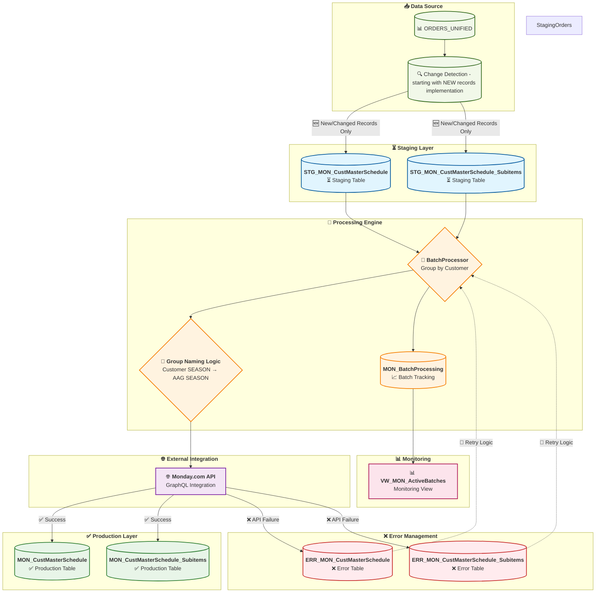

# Monday.com Order Sync - Updated Staging Workflow Overview

This diagram shows the complete data flow for the staging-based Monday.com order sync workflow with enhanced change detection and business logic.

## Key Workflow Steps

1. **Data Ingestion**: Source systems load new orders and sub-items into staging tables
2. **Change Detection**: Process only new/modified records from ORDERS_UNIFIED
3. **Business Logic**: Apply group naming with Customer SEASON → AAG SEASON fallback
4. **Batch Processing**: Orders are grouped by customer for efficient processing
5. **API Integration**: Each customer batch is synchronized with Monday.com via API
6. **Success Path**: Successfully synced data is promoted to production tables
7. **Error Handling**: Failed records are logged to error tables with retry capability
8. **Monitoring**: Active batches and processing status are tracked in real-time

## Benefits of Enhanced Staging Approach

- **🔄 Change Detection**: Process only new/modified records instead of full reloads
- **⚡ Performance**: >1000 records/second bulk insert (vs 12-14 records/sec previously)
- **🎯 Business Logic**: GREYSON group naming fix (Customer SEASON → AAG SEASON fallback)
- **🛡️ Error Resilience**: Robust error handling with retry logic and staging rollback
- **📊 Better Monitoring**: Clear visibility into processing status and batch tracking
- **🔄 Rollback Capability**: Failed batches don't affect production data

## Implementation Status

### ✅ **COMPLETED**
- Staging tables DDL (STG_MON_CustMasterSchedule, STG_MON_CustMasterSchedule_Subitems)
- Production tables DDL (MON_CustMasterSchedule, MON_CustMasterSchedule_Subitems)
- Change detection logic framework (hash-based comparison)

### ❌ **TO BE IMPLEMENTED** 
- **ORDERS_UNIFIED_SNAPSHOT** (file-based snapshot for change detection)
- Schema validation fixes (field name mismatches in YAML mapping)
- DDL vs YAML mapping alignment validation
- GraphQL template generation
- Enhanced error handling with retry logic

### 🚨 **CRITICAL ISSUES TO RESOLVE**
- Field name mismatches: YAML uses `customer_name`, DDL has `[CUSTOMER]`
- Table name case inconsistencies: YAML lowercase vs DDL PascalCase
- Missing validation utilities to catch schema discrepancies

### 📋 **TASK BACKLOG**
1. **Schema Validation Priority**: Fix all YAML mapping field names to match actual DDL
2. **ORDERS_UNIFIED_SNAPSHOT**: Implement file-based snapshot storage for change detection
3. **DDL Validation**: Create utilities to validate YAML mappings against actual database schemas
4. **Documentation Sync**: Update all markdown files with correct field references
5. **GraphQL Templates**: Generate Monday.com API templates from corrected YAML mappings
