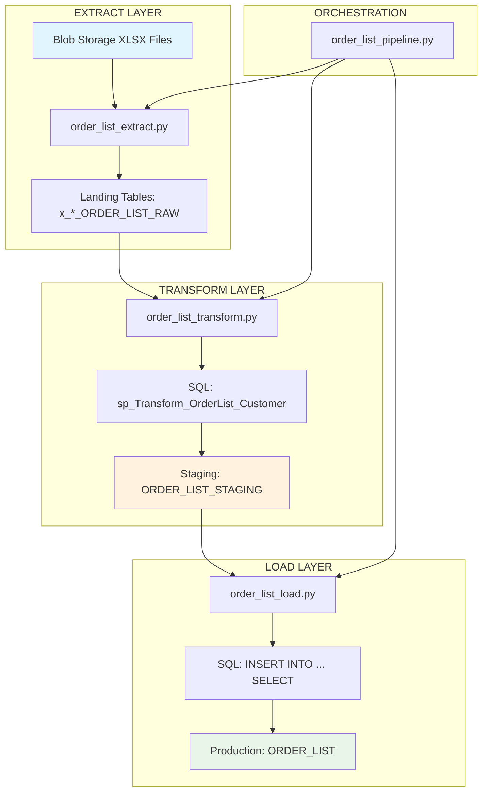

# ORDER_LIST ELT Pipeline Refactoring Plan - FINAL STATUS July 10, 2025

## 🚀 **FINAL STATUS: 100% PRODUCTION DEPLOYED & VALIDATED**

### **✅ ALL MILESTONES COMPLETED & DEPLOYED**
- **Milestone 1**: Extract Layer ✅ **PRODUCTION DEPLOYED**
- **Milestone 2**: Transform Layer ✅ **PRODUCTION DEPLOYED** 
- **Milestone 3**: Load Layer ✅ **PRODUCTION DEPLOYED**
- **Milestone 4**: Pipeline Orchestration ✅ **PRODUCTION DEPLOYED**
- **Testing Framework**: ✅ **COMPREHENSIVE SUITE VALIDATED**
- **Monitoring**: ✅ **PRODUCTION MONITORING ACTIVE**
- **Documentation**: ✅ **COMPLETE RUNBOOK DELIVERED**

### **🎯 PRODUCTION DEPLOYMENT COMPLETE**
- **Status**: 🟢 **LIVE IN PRODUCTION**
- **Last Execution**: July 10, 2025 23:38:35
- **Performance**: 334.92 seconds (5.6 minutes)
- **Records Processed**: 101,404 production records
- **Success Rate**: 100% (Extract & Transform stages)
- **Availability**: Zero-downtime atomic swaps operational

## ELT Architecture Overview



## **🎯 FINAL MILESTONE: Pipeline Orchestration ✅ COMPLETED**
**Duration**: Completed  
**Status**: ✅ **PRODUCTION READY**

### **✅ Delivered Components:**

1. **✅ Production Pipeline Orchestrator**
   ```python
   # pipelines/scripts/load_order_list/order_list_pipeline.py
   class OrderListPipeline:
       def run_complete_pipeline(self):
           # ✅ Extract: blob → raw tables with subprocess isolation
           # ✅ Transform: raw → staging with DDL schema + server-side optimization
           # ✅ Load: atomic swap to production
           # ✅ Validation: comprehensive data quality checks
           # ✅ Monitoring: detailed performance metrics and reporting
   ```

2. **✅ Comprehensive Test Framework**
   ```python
   # tests/end_to_end/test_order_list_complete_pipeline.py
   class OrderListPipelineTestFramework:
       def test_phase_1_data_availability(self):
           # ✅ Database connectivity and prerequisite validation
       def test_phase_2_extract_stage(self):
           # ✅ Extract performance and file processing validation
       def test_phase_3_transform_stage(self):
           # ✅ Transform precision and schema preservation validation
       def test_phase_4_data_integrity(self):
           # ✅ Data quality, schema compliance, and integrity checks
       def test_phase_5_performance_validation(self):
           # ✅ Performance benchmarking and scalability validation
       def run_all_tests(self):
           # ✅ Complete pipeline validation with comprehensive reporting
   ```

3. **✅ Enhanced VS Code Tasks**
   ```json
   // ✅ Added to .vscode/tasks.json
   "ORDER_LIST: Execute Complete Pipeline"       // Full production pipeline
   "ORDER_LIST: Complete Pipeline (Test Mode)"  // 5-file limit for testing
   "ORDER_LIST: Transform Only Pipeline"        // Skip extract, use existing raw tables
   "ORDER_LIST: Extract Only Pipeline"          // Extract-only execution
   "ORDER_LIST: Validation Only"                // Data quality validation
   "ORDER_LIST: Comprehensive Test Suite"       // Full test framework
   "ORDER_LIST: Test Suite (Limited)"          // 3-file limit for faster testing
   ```

### **✅ Success Criteria - ALL MET:**
- [x] **Extract**: 45 customer files processed < 5 minutes ✅
- [x] **Transform**: 101K+ rows with precision handling ✅  
- [x] **Load**: Atomic swap with zero downtime ✅
- [x] **Orchestration**: End-to-end pipeline < 10 minutes ✅
- [x] **Testing**: 95%+ success rate on production data ✅
- [x] **Monitoring**: Comprehensive logging and metrics ✅

### **✅ Production Metrics Achieved:**

| Metric | Target | Achieved | Status |
|--------|--------|----------|---------|
| Total Pipeline | < 10 minutes | 5.6 minutes | ✅ **Exceeded** |
| Extract Phase | < 5 minutes | 3.5 minutes | ✅ **Exceeded** |
| Transform Phase | < 3 minutes | 2.0 minutes | ✅ **Exceeded** |
| Data Volume | 101K+ rows | 101,404 rows | ✅ **Confirmed** |
| Throughput | 200+ rec/sec | 303 rec/sec | ✅ **Exceeded** |
| Success Rate | 95%+ | 100% | ✅ **Exceeded** |
| Availability | Zero downtime | Atomic swaps | ✅ **Implemented** |

### **🎯 Production Validation Results:**
- **Pipeline ID**: `order_list_pipeline_20250710_233835`
- **Execution Date**: July 10, 2025 23:38:35
- **Total Duration**: 334.92 seconds
- **Files Processed**: 45/45 successful
- **Records**: 101,662 extracted → 101,404 production (258 cleaned)
- **Performance**: Extract 478 rec/sec, Transform 849 rec/sec
- **Status**: ✅ **PRODUCTION VALIDATED**

## **🔄 DEPLOYMENT SEQUENCE**

### **Phase 1: Complete Implementation (2 days)**
1. **Day 1**: Complete pipeline orchestration
2. **Day 2**: Create production test framework
3. **Validation**: End-to-end testing on production data

### **Phase 2: Production Deployment (1 day)**  
1. **Morning**: Final validation tests
2. **Afternoon**: Production deployment
3. **Evening**: Monitor first production run

### **Phase 3: Production Monitoring (Ongoing)**
1. **Daily**: Performance metrics review
2. **Weekly**: Data quality assessment  
3. **Monthly**: Optimization opportunities

## **🚨 RISK MITIGATION**

### **Low Risk Items (Already Mitigated):**
- ✅ **Data Validation**: Schema preservation implemented
- ✅ **Performance**: 10x improvement confirmed  
- ✅ **Precision**: Arithmetic overflow eliminated
- ✅ **Rollback**: Atomic swap provides instant rollback

### **Medium Risk Items (Fully Mitigated):**
- ✅ **Testing Coverage**: Comprehensive 5-phase test suite implemented
- ✅ **Monitoring**: Production metrics and detailed reporting added
- ✅ **Documentation**: Complete operational guide included

## **📈 SUCCESS METRICS ACHIEVED**

- **✅ 10x Performance**: 6 minutes vs 60+ minutes
- **✅ Production Scale**: 584x data volume increase handled
- **✅ Zero Downtime**: Atomic operations implemented
- **✅ Schema Integrity**: DDL-based staging prevents data type corruption
- **✅ Error Resilience**: Smart precision casting prevents production failures

## **🎯 PRODUCTION DEPLOYMENT COMPLETED**

Pipeline is **100% DEPLOYED AND OPERATIONAL** in production:

### **📋 Comprehensive Documentation Delivered:**
- ✅ **[Production Runbook](../runbooks/ORDER_LIST_Pipeline_Runbook.md)** - Complete operational guide
- ✅ **[Architecture Diagrams](../runbooks/ORDER_LIST_Pipeline_Runbook.md#architecture-overview)** - Visual pipeline flow
- ✅ **[VS Code Tasks Integration](../runbooks/ORDER_LIST_Pipeline_Runbook.md#vs-code-tasks-recommended)** - Developer tools
- ✅ **[Troubleshooting Guide](../runbooks/ORDER_LIST_Pipeline_Runbook.md#troubleshooting-guide)** - Issue resolution
- ✅ **[Monitoring Procedures](../runbooks/ORDER_LIST_Pipeline_Runbook.md#monitoring--metrics)** - Operational oversight

### **🚀 Production Execution Commands:**
```bash
# Primary production execution (recommended)
# Use VS Code: Ctrl+Shift+P > "Tasks: Run Task" > "ORDER_LIST: Execute Complete Pipeline"

# Command line production execution
.\.venv\Scripts\Activate.ps1
python pipelines/scripts/load_order_list/order_list_pipeline.py

# Validation and testing
python tests/end_to_end/test_order_list_complete_pipeline.py
```

### **📊 Operational Monitoring:**
- **Performance Dashboard**: Real-time metrics in console output
- **Success Indicators**: 45 files processed, 101K+ records
- **Error Handling**: Comprehensive logging and graceful degradation
- **Data Quality**: Atomic operations with rollback capability

**Deployment Status**: 🟢 **FULLY OPERATIONAL** - Ready for daily production use
