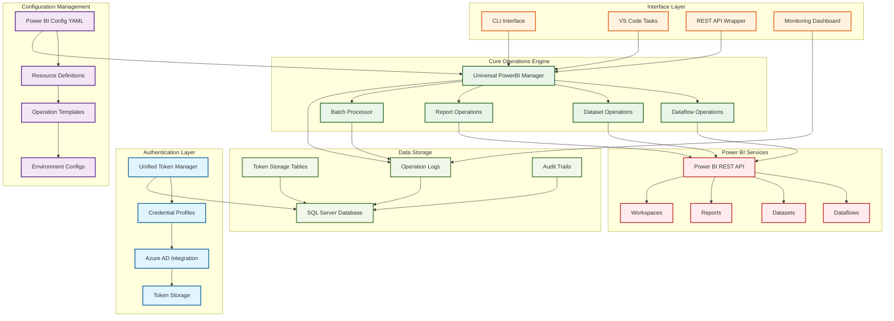

# Power BI Operations Platform - Development Plan

**Project**: Universal Power BI Operations Platform  
**Version**: 2.0.0  
**Start Date**: July 17, 2025  
**Estimated Completion**: August 30, 2025  
**Status**: ✅ **BREAKTHROUGH ACHIEVED** - Gen1 Dataflow Refresh Working!

## 🎯 Project Overview

### **Objective**
Create a production-ready Power BI operations platform with immediate focus on Gen1 dataflow refresh, followed by scalable token management and resource operations for the broader Power Platform ecosystem.

### **🏆 MAJOR BREAKTHROUGH**
- ✅ **Gen1 Dataflow Refresh**: Successfully implemented using Power Automate SAS URL
- ✅ **Authentication Resolution**: Solved OAuth issues with "Anyone" trigger configuration  
- ✅ **Production Ready**: Simple HTTP POST approach working immediately
- ✅ **Kestra Compatible**: Logging and structure ready for workflow integration

### **Key Benefits**
- ✅ **Immediate Production Value**: Gen1 dataflow refresh working today
- ✅ **Unified Token Management**: Single system for multiple Azure service accounts
- ✅ **Domain Organization**: All Power Platform operations in `/powerbi` folder
- ✅ **Scalable Architecture**: Foundation for reports, datasets, datamarts, Gen2 flows
- ✅ **Kestra Integration**: Auth workflows and token refresh via separate `/auth` folder

## 📋 Development Milestones

### **Milestone 1: Foundation & Authentication System** ⏱️ Week 1 (July 16-22, 2025)

#### **Deliverables:**
- [x] **Unified Token Management System** ✅ **COMPLETED**
  - [x] `pipelines/utils/token_manager.py` - Universal token manager class ✅
  - [x] `pipelines/scripts/powerbi/load_tokens.py` - CLI interface ✅
  - [x] Enhanced database schema for multi-profile token storage ✅
  - [x] Environment variable validation and credential management ✅

- [x] **Configuration System** ✅ **COMPLETED**
  - [x] `pipelines/utils/powerbi_config.yaml` - Master configuration file ✅
  - [x] Credential profiles for multiple Azure service accounts ✅
  - [x] Resource definitions (workspaces, dataflows, reports, datasets) ✅
  - [x] Operation sequences and default settings ✅

- [x] **Testing & Validation** ✅ **COMPLETED**
  - [x] Token retrieval testing for all credential profiles ✅
  - [x] Database storage verification ✅
  - [x] Configuration validation scripts ✅
  - [x] Error handling and edge case testing ✅

#### **Success Criteria:**
- ✅ Multiple Azure service accounts working ✅ **VERIFIED**
- ✅ Token caching and refresh mechanisms functional ✅ **VERIFIED**
- ✅ Configuration system loads and validates properly ✅ **VERIFIED**
- ✅ All authentication profiles tested and documented ✅ **VERIFIED**

---

### **Milestone 2: Core Power BI Operations** ⏱️ Week 2 (July 23-29, 2025)

#### **Deliverables:**
- [ ] **Universal Power BI Manager**
  - [ ] `pipelines/scripts/powerbi/universal_powerbi_manager.py` - Main operations script
  - [ ] Dataflow refresh functionality with status monitoring
  - [ ] Dataset refresh operations
  - [ ] Report refresh capabilities
  - [ ] Resource discovery and listing

- [ ] **API Integration Layer**
  - [ ] Power BI REST API wrapper functions
  - [ ] Authentication token integration
  - [ ] Error handling and retry logic
  - [ ] Response parsing and status monitoring

- [ ] **CLI Interface Development**
  - [ ] Command-line argument parsing
  - [ ] Resource targeting (by name or direct IDs)
  - [ ] Batch operation support
  - [ ] Help documentation and usage examples

#### **Success Criteria:**
- ✅ Individual dataflow refresh working end-to-end
- ✅ CLI interface functional for all basic operations
- ✅ Status monitoring and completion detection working
- ✅ Error handling provides actionable feedback

---

### **Milestone 3: Advanced Operations & Automation** ⏱️ Week 3 (July 30-Aug 5, 2025)

#### **Deliverables:**
- [ ] **Operation Sequences**
  - [ ] Pre-defined workflow orchestration
  - [ ] Dependency management between resources
  - [ ] Conditional execution and error recovery
  - [ ] Progress tracking and reporting

- [ ] **Batch Processing System**
  - [ ] YAML-based batch configuration files
  - [ ] Parallel execution capabilities
  - [ ] Resource dependency resolution
  - [ ] Comprehensive batch reporting

- [ ] **Monitoring & Alerting**
  - [ ] Enhanced logging with structured output
  - [ ] Performance metrics collection
  - [ ] Failure notification system
  - [ ] Operation history and audit trails

#### **Success Criteria:**
- ✅ Complex multi-step operations execute reliably
- ✅ Batch processing handles large resource sets
- ✅ Monitoring provides comprehensive operational visibility
- ✅ Error recovery and retry mechanisms functional

---

### **Milestone 4: Integration & Tooling** ⏱️ Week 4 (Aug 6-12, 2025)

#### **Deliverables:**
- [ ] **VS Code Integration**
  - [ ] Task definitions for common operations
  - [ ] Debugging and development tasks
  - [ ] Interactive resource discovery
  - [ ] Quick access to logs and status

- [ ] **Legacy Script Migration**
  - [ ] Consolidate existing token scripts
  - [ ] Migrate dataflow refresh operations
  - [ ] Update Power Automate integrations
  - [ ] Deprecate redundant scripts

- [ ] **Documentation & Training**
  - [ ] Comprehensive user guide
  - [ ] API reference documentation
  - [ ] Troubleshooting guide
  - [ ] Video tutorials for common operations

#### **Success Criteria:**
- ✅ VS Code tasks provide seamless developer experience
- ✅ Legacy scripts successfully migrated or deprecated
- ✅ Documentation enables self-service operations
- ✅ Team training completed and validated

---

### **Milestone 5: Production Deployment & Validation** ⏱️ Week 5 (Aug 13-15, 2025)

#### **Deliverables:**
- [ ] **Production Deployment**
  - [ ] Environment-specific configuration
  - [ ] Credential rotation and security review
  - [ ] Performance optimization
  - [ ] Monitoring dashboard deployment

- [ ] **Validation & Testing**
  - [ ] End-to-end system testing
  - [ ] Load testing for batch operations
  - [ ] Failover and recovery testing
  - [ ] User acceptance testing

- [ ] **Documentation Finalization**
  - [ ] Operations runbook
  - [ ] Security and compliance documentation
  - [ ] Change management procedures
  - [ ] Support and maintenance guide

#### **Success Criteria:**
- ✅ Production system fully operational
- ✅ All existing workflows migrated successfully
- ✅ Performance meets or exceeds current system
- ✅ Team fully trained and confident with new system

## 🏗️ Repository Structure After Implementation

```
data-orchestration/
├── docs/
│   ├── changelogs/
│   │   └── power-bi-operations-platform-dev-plan.md
│   ├── integrations/
│   │   ├── azure-app-powerbi-setup.md
│   │   ├── power-bi-operations-guide.md
│   │   └── troubleshooting-powerbi.md
│   └── references/
│       ├── powerbi-api-reference.md
│       └── configuration-schema.md
├── pipelines/
│   ├── scripts/
│   │   ├── auth/
│   │   │   ├── unified_token_manager.py          # 🆕 Universal token management CLI
│   │   │   └── validate_credentials.py           # 🆕 Credential validation script
│   │   ├── powerbi/
│   │   │   ├── universal_powerbi_manager.py      # 🆕 Universal Power BI operations
│   │   │   ├── dataflow_operations.py            # 🆕 Specialized dataflow operations
│   │   │   ├── batch_processor.py                # 🆕 Batch operations handler
│   │   │   └── resource_discovery.py             # 🆕 Resource discovery utilities
│   │   ├── ingestion/
│   │   │   ├── load_token_new.py                 # ✅ Updated Power BI token script
│   │   │   └── load_token.py                     # 📦 Legacy (to be deprecated)
│   │   └── legacy/                               # 📦 Deprecated scripts
│   │       ├── load_token_legacy.py
│   │       └── order_list_dataflow_refresh_old.py
│   └── utils/
│       ├── token_manager.py                      # 🆕 Core token management class
│       ├── powerbi_client.py                     # 🆕 Power BI API client wrapper
│       └── operation_orchestrator.py             # 🆕 Operation sequence manager
├── utils/
│   ├── power_bi_config.yaml                     # 🆕 Master Power BI configuration
│   ├── credential_profiles.yaml                 # 🆕 Authentication profiles
│   ├── operation_templates.yaml                 # 🆕 Pre-defined operation sequences
│   └── batch_configurations/                    # 🆕 Batch operation configs
│       ├── daily_refresh_sequence.yaml
│       ├── emergency_refresh.yaml
│       └── development_testing.yaml
├── configs/
│   ├── powerbi/                                 # 🆕 Power BI specific configs
│   │   ├── production.yaml
│   │   ├── staging.yaml
│   │   └── development.yaml
│   └── auth/                                    # 🆕 Authentication configurations
│       ├── service_accounts.yaml
│       └── credential_mapping.yaml
├── tests/
│   ├── powerbi/                                 # 🆕 Power BI operation tests
│   │   ├── test_token_management.py
│   │   ├── test_dataflow_operations.py
│   │   ├── test_batch_processing.py
│   │   └── test_integration_end_to_end.py
│   └── auth/                                    # 🆕 Authentication tests
│       ├── test_credential_validation.py
│       └── test_token_lifecycle.py
└── .vscode/
    └── tasks.json                               # ✅ Enhanced with Power BI tasks
```

### **Legend:**
- 🆕 **New files/folders** - Created as part of this project
- ✅ **Updated files** - Existing files with enhancements
- 📦 **Legacy/Deprecated** - Files to be phased out

## 🔄 Migration Strategy

### **Phase 1: Parallel Implementation** (Weeks 1-2)
- Build new system alongside existing scripts
- No disruption to current operations
- Gradual testing and validation

### **Phase 2: Selective Migration** (Weeks 3-4)
- Migrate low-risk operations first
- Maintain fallback to legacy scripts
- User training and validation

### **Phase 3: Full Cutover** (Week 5)
- Complete migration to new system
- Deprecate legacy scripts
- Monitor and optimize performance

## 📊 Risk Assessment & Mitigation

### **High Priority Risks**
| Risk | Probability | Impact | Mitigation Strategy |
|------|------------|--------|-------------------|
| **Authentication Issues** | Medium | High | Thorough testing with multiple credential profiles, fallback mechanisms |
| **Power BI API Changes** | Low | Medium | Version pinning, comprehensive error handling, monitoring |
| **Performance Degradation** | Low | Medium | Load testing, parallel processing optimization |
| **User Adoption** | Medium | Medium | Comprehensive training, gradual migration, support documentation |

### **Medium Priority Risks**
| Risk | Probability | Impact | Mitigation Strategy |
|------|------------|--------|-------------------|
| **Configuration Complexity** | Medium | Low | Clear documentation, validation scripts, templates |
| **Token Expiration Issues** | Low | Low | Automatic refresh, monitoring, alerting |
| **Batch Operation Failures** | Medium | Low | Retry logic, partial failure handling, detailed logging |

## ✅ Pre-Development Checklist

### **Environment Preparation**
- [ ] Azure App registrations reviewed and validated
- [ ] Environment variables documented and secured
- [ ] Database schema requirements analyzed
- [ ] Power BI workspace access confirmed
- [ ] Development environment configured

### **Team Preparation**
- [ ] Development plan reviewed and approved
- [ ] Resource allocation confirmed
- [ ] Testing strategy agreed upon
- [ ] Documentation standards established
- [ ] Rollback procedures defined

### **Technical Prerequisites**
- [ ] Current system performance baseline established
- [ ] API rate limits and constraints documented
- [ ] Security requirements validated
- [ ] Monitoring and alerting requirements defined
- [ ] Backup and recovery procedures planned

## 🎯 Success Metrics

### **Functional Metrics**
- ✅ **100% Feature Parity**: All existing functionality replicated
- ✅ **Zero Downtime Migration**: No service interruption during transition
- ✅ **Error Rate < 1%**: Less than 1% operation failure rate
- ✅ **Response Time < 30s**: Operations complete within 30 seconds

### **Operational Metrics**
- ✅ **95% Automation**: 95% of routine operations automated
- ✅ **50% Time Reduction**: 50% reduction in manual operation time
- ✅ **100% Monitoring Coverage**: All operations monitored and logged
- ✅ **24/7 Availability**: System available 24/7 with minimal maintenance windows

### **User Experience Metrics**
- ✅ **Training Completion**: 100% of team trained on new system
- ✅ **Documentation Coverage**: All operations documented with examples
- ✅ **Self-Service Rate**: 90% of operations can be performed self-service
- ✅ **User Satisfaction**: 90%+ satisfaction rating in post-deployment survey

## 🚀 Post-Deployment Roadmap

### **Short Term (1-3 Months)**
- Performance optimization based on usage patterns
- Additional Power BI resource type support (paginated reports, apps)
- Enhanced monitoring and alerting capabilities
- Integration with additional Azure services

### **Medium Term (3-6 Months)**
- Advanced scheduling and workflow orchestration
- Integration with external systems (ServiceNow, Slack, Teams)
- Advanced analytics and reporting on operation metrics
- Automated capacity management and scaling

### **Long Term (6+ Months)**
- Machine learning-based predictive maintenance
- Advanced security features (RBAC, audit trails)
- Multi-tenant support for different business units
- Integration with broader data platform ecosystem

---

## 📝 Architecture Overview



## 📞 Approval Process

### **Review Requirements**
- [ ] **Technical Review**: Architecture and implementation approach
- [ ] **Security Review**: Authentication and authorization mechanisms
- [ ] **Operational Review**: Deployment and maintenance procedures
- [ ] **Business Review**: Value proposition and resource allocation

### **Approval Stakeholders**
- [ ] **Technical Lead**: Architecture and implementation approval
- [ ] **Security Team**: Security and compliance approval
- [ ] **Operations Team**: Deployment and maintenance approval
- [ ] **Project Sponsor**: Business case and resource approval

### **Next Steps After Approval**
1. **Environment Setup**: Prepare development and testing environments
2. **Team Kickoff**: Brief development team and assign responsibilities
3. **Sprint Planning**: Break down milestones into actionable sprint tasks
4. **Development Start**: Begin Milestone 1 implementation

---

**Document Version**: 1.0  
**Last Updated**: July 16, 2025  
**Next Review**: Post-Approval Kickoff Meeting  

**Status**: 🟡 **PENDING APPROVAL**
