Absolutely! Here's a **complete, production-ready development plan** reflecting your latest design.
This doc can be dropped into your repo### **Key Structural Decisions**

**1. Schema vs Operations Separation**:
- `db/migrations/## Integration with Repository Restructure

### **Prerequisites Completed**:
- SUCCESS: **Phase 0**: Modern `src/pipelines/` package structure
- IN_PROGRESS: **Enhanced Phase 1**: DDL consolidation and integrations cleanup (**REQUIRED BEFORE STARTING**)

### **Leveraging Existing Infrastructure**:ma changes (001, 002) - **run once per environment**
- `sql/operations/`: Business operations (003-006) - **run repeatedly**

**2. Leverage Existing Infrastructure**:
- `src/pipelines/load_order_list/`: Already handles Excel → SQL  
- `src/pipelines/integrations/monday/`: Centralized Monday.com logic
- `src/pipelines/utils/`: Modern import patterns

**3. New Pipeline Module**:
- `src/pipelines/sync_order_list/`: Dedicated to your delta sync workflow
- Imports from existing `load_order_list` and `integrations/monday`

---

## Implementation Timeline & Development Strategyr `PLAN.md`) to align engineers, data, and ops.

---

# Order List → Azure SQL → Monday.com Unified Pipeline

## Quick Links & Key Files

**Configuration & Setup:**
- [Development Config](../../configs/pipelines/sync_order_list_dev.toml) - TOML configuration for development environment
- [Shadow Tables DDL](../../db/migrations/001_create_shadow_tables.sql) - Database migration for shadow tables
- [Config Parser](../../src/pipelines/sync_order_list/config_parser.py) - Python configuration parser
- **Database**: `orders` (contains ORDER_LIST, ORDER_LIST_V2, ORDER_LIST_LINES tables)

**Testing & Validation:**
- [Testing Documentation](../implementation/order-list-delta-testing.md) - Comprehensive testing outcomes and procedures
- [Milestone 1 Test](../../tests/debug/simple_milestone_1_test.py) - Foundation validation test

**Reference Files:**
- [ORDER_LIST Schema](../../db/ddl/tables/orders/dbo_order_list.sql) - Complete production schema reference
- [Copilot Instructions](../../.github/instructions/copilot.instructions.md) - Development standards and patterns

---

# Project Overview

---ly! Here’s a **complete, production-ready development plan** reflecting your latest design.
This doc can be dropped into your repo (as `README.md` or `PLAN.md`) to align engineers, data, and ops.

---

# 📦 Order List → Azure SQL → Monday.com Unified Pipeline

---

# Project Overview

## High-Level Goals

* **Azure SQL is the single source of truth.**
* **Monday.com is a read-only mirror (items + sub-items).**
* **Sync is idempotent, incremental, fast, and audit-friendly.**
* **Exit strategy: drop Monday any time, keep all business data.**

---

## MILESTONE 2 STATUS: IN PROGRESS - Business Key Implementation

**Start Date**: July 19, 2025  
**Focus**: Excel-compatible business key matching with customer-specific duplicate resolution  
**Status**: IMPLEMENTING CUSTOMER RESOLUTION & BUSINESS KEY GENERATION

### Milestone 2 Architecture Changes:
- **CRITICAL**: Replaced UUID-based merge logic with business key matching for Excel compatibility
- **CRITICAL**: Database target is `orders` (contains ORDER_LIST production tables)
- **NEW**: Customer canonicalization using existing [`canonical_customers.yaml`](../../pipelines/utils/canonical_customers.yaml)
- **NEW**: Customer-specific unique key generation from `order_key_config.unique_keys`
- **NEW**: Excel-compatible NEW detection via `AAG ORDER NUMBER` existence check
- **ENHANCED**: Integration with existing [`reconcile_order_list.py`](../../pipelines/utils/reconcile_order_list.py) duplicate resolution logic

### Key Implementation Insight:
Excel source data cannot use UUID as merge keys. The corrected approach:
1. **Primary NEW Detection**: `[AAG ORDER NUMBER]` not in `ORDER_LIST` → **NEW**
2. **Business Key Matching**: Use customer-specific `unique_keys` from YAML config
3. **Duplicate Resolution**: Apply existing reconciliation logic for edge cases
4. **Hash-Based Changes**: Once matched, use row hash for **CHANGED** vs **UNCHANGED**

---

## Project Milestones

| Sprint | Deliverable                             | Milestone Details                                                        |
| ------ | --------------------------------------- | ------------------------------------------------------------------------ |
| 1      | Core Schema, TOML config                | All tables in Azure, baseline pipeline.toml, working ingest/merge        |
| 2      | Delta/Sync Engine + Monday integration  | Header/line delta tables, robust Python sync script, error & retry logic |
| 3      | Automation, Housekeeping, Observability | Scheduled sync (e.g. Kestra/Azure Functions), cleaning, logs, alerts     |
| 4      | Rollout & Handoff                       | Documented flows, runbook, exit script, onboarding for new devs          |

---

## Aligned Repo Structure (Execution Tree)

> **Aligned with data-orchestration repository consolidation plan**

```plaintext
data-orchestration (root)
├── README.md / PLAN.md                  # ← This doc in docs/changelogs/
├── configs/                             # Configuration management
│   └── pipelines/
│       └── sync_order_list.toml         # hash columns, sizes, delta schema, Monday column map
├── db/                                  # 📁 SCHEMA EVOLUTION & MANAGEMENT
│   ├── ddl/                            # CREATE TABLE statements (documentation)
│   │   ├── order_list_tables.sql       # Current schema definitions
│   │   └── delta_tables.sql            # Delta table schemas
│   └── migrations/                     # Version-controlled schema changes
│       ├── 001_alter_order_list.sql    # +row_hash, +sync_state, +last_synced_at (headers)
│       └── 002_create_order_list_lines.sql # +row_hash, +sync_state, +parent_item_id (lines)
├── sql/                                # 📁 OPERATIONS & BUSINESS LOGIC
│   ├── operations/                     # Daily operational queries
│   │   ├── 003_merge_headers.sql       # MERGE SWP_ORDER_LIST → ORDER_LIST + OUTPUT to DELTA
│   │   ├── 004_unpivot_sizes.sql       # UNPIVOT only NEW/CHANGED headers → SWP_ORDER_LIST_LINES
│   │   ├── 005_merge_lines.sql         # MERGE SWP_ORDER_LIST_LINES → ORDER_LIST_LINES + DELTA
│   │   └── 006_housekeeping.sql        # Purge DELTA where SYNCED, old SWP_ batches
│   └── transformations/                # ETL transformation scripts
├── src/pipelines/                      # MODERN PYTHON PACKAGE
│   ├── load_order_list/               # SUCCESS: Existing order list pipeline (leverage this!)
│   │   ├── extract.py                 # Excel → SWP_ORDER_LIST, pre-calc hashes
│   │   ├── transform.py               # Data transformation logic
│   │   └── load.py                    # Database loading utilities
│   ├── sync_order_list/               # NEW: Monday sync pipeline (Business Key-Based)
│   │   ├── __init__.py
│   │   ├── config_parser.py           # ✅ EXISTS: TOML configuration parser
│   │   ├── merge_orchestrator.py      # NEW: Executes 003, 004, 005 SQL in sequence
│   │   ├── monday_sync.py             # NEW: Two-pass sync (headers, then lines)
│   │   └── cli.py                     # NEW: Entry point: end-to-end ingest → merge → sync
│   ├── integrations/                  # SUCCESS: Consolidated integrations
│   │   ├── monday/                    # Monday.com API integration
│   │   │   ├── __init__.py
│   │   │   ├── client.py              # Monday API client
│   │   │   └── sync_engine.py         # Sync state management
│   │   └── __init__.py
│   ├── shared/                        # NEW: Shared functional modules
│   │   ├── customer/                  # Customer-related utilities
│   │   │   ├── __init__.py
│   │   │   ├── canonical_customers.yaml  # ✅ EXISTS: Customer configuration
│   │   │   ├── canonical_manager.py   # ✅ EXISTS: Canonical customer resolution
│   │   │   └── order_key_generator.py # ✅ EXISTS: Customer-specific unique keys
│   │   └── __init__.py
│   └── utils/                         # SUCCESS: Modern utilities
│       ├── db.py                      # Database connections
│       ├── logger.py                  # Logging utilities
│       └── config.py                  # Configuration management
└── docs/
    ├── changelogs/
    │   └── sync-order-list-monday.md     # ← This document
    ├── references/
    │   ├── mermaid_flow.md            # sequence diagram & ERD
    │   └── column_coverage.csv        # full schema audit
    └── implementation/
```

### **🎯 Key Structural Decisions**

**1. Schema vs Operations Separation**:
- `db/migrations/`: Schema changes (001, 002) - **run once per environment**
- `sql/operations/`: Business operations (003-006) - **run repeatedly**

**2. Leverage Existing Infrastructure**:
- `src/pipelines/load_order_list/`: Already handles Excel → SQL  
- `src/pipelines/integrations/monday/`: Centralized Monday.com logic
- `src/pipelines/utils/`: Modern import patterns

**3. New Pipeline Module**:
- `src/pipelines/sync_order_list/`: Dedicated to your delta sync workflow
- Imports from existing `load_order_list` and `integrations/monday`

---

## � **Implementation Timeline & Development Strategy**

### **Migration Phases**:
```
Week 1: Shadow tables + TOML configuration + ORDER_LIST_LINES development
Week 2: Delta sync pipeline against shadows + GraphQL integration  
Week 3: Monday.com sync validation + async batch processing
Week 4: Scheduled maintenance window for production cutover
```

### **Development Approach**:

#### **Milestone 1: Foundation (Week 1)**
1. **Create shadow tables**: `ORDER_LIST_V2`, `ORDER_LIST_LINES`
2. **TOML configuration**: Development environment settings
3. **Migration scripts**: `db/migrations/001_create_shadow_tables.sql`
4. **Configuration parser**: Load TOML settings in Python pipeline

#### **Milestone 2: Business Key-Based Delta Engine (Week 2)**  
1. **Customer Resolution & Business Keys**: Customer canonicalization + unique key generation from YAML config
2. **Excel-Compatible NEW Detection**: AAG ORDER NUMBER existence check (no UUID dependency)
3. **Enhanced Merge Operations**: Business key matching with customer-specific duplicate resolution
4. **Hash-Based Change Detection**: CHANGED vs UNCHANGED using TOML hash logic
5. **GraphQL Integration**: Async batch processing with template loading

#### **Milestone 3: Monday Integration (Week 3)**
1. **Two-pass sync**: Headers → Lines dependency chain
2. **Retry logic**: Failed sync recovery  
3. **State management**: Track sync status across tables
4. **Validation framework**: End-to-end testing

#### **Milestone 4: Production Cutover (Week 4)**
1. **Production TOML**: Switch to production board and tables
2. **Maintenance window**: Atomic schema migration
3. **Validation**: Confirm production sync functionality
4. **Documentation**: Operational runbooks

### **Environment Configuration Strategy**:

#### **Development (`configs/pipelines/sync_order_list_dev.toml`)**:
```toml
[environment]
target_table = "ORDER_LIST_V2"      # Shadow table for safety
board_type = "development"

[monday.development]
board_id = 123456789                 # Test Monday board
```

#### **Production (`configs/pipelines/sync_order_list_prod.toml`)**:
```toml  
[environment]
target_table = "ORDER_LIST"         # Production table after cutover
board_type = "production"

[monday.production] 
board_id = 987654321                 # Production Monday board
```

---

## �🚀 **Integration with Repository Restructure**

### **Prerequisites Completed**:
- ✅ **Phase 0**: Modern `src/pipelines/` package structure
- 🔄 **Enhanced Phase 1**: DDL consolidation and integrations cleanup (**REQUIRED BEFORE STARTING**)

### **Leveraging Existing Infrastructure**:

**From `src/pipelines/load_order_list/`**:
```python
# Reuse existing Excel ingestion
from pipelines.load_order_list.extract import OrderListExtractor
from pipelines.load_order_list.transform import OrderListTransformer

# In your new sync_monday.py
extractor = OrderListExtractor()
data = extractor.load_excel_to_swp_table()
```

**From `src/pipelines/shared/customer/`**:
```python
# Reuse customer resolution and business key logic
from pipelines.shared.customer.canonical_manager import CanonicalCustomerManager
from pipelines.shared.customer.order_key_generator import OrderKeyGenerator

# In your new monday_sync.py
canonical_manager = CanonicalCustomerManager()
key_generator = OrderKeyGenerator()
```

**From `src/pipelines/integrations/monday/`**:
```python  
# Centralized Monday.com integration
from pipelines.integrations.monday.client import MondayClient
from pipelines.integrations.monday.sync_engine import DeltaSyncEngine

client = MondayClient()
sync_engine = DeltaSyncEngine(client)
```
```python
# Modern import patterns (no more sys.path hacks!)
from pipelines.utils.db import get_connection
from pipelines.utils.logger import get_logger
from pipelines.utils.config import load_config

logger = get_logger(__name__)
with get_connection('dms') as conn:
    # database operations
```

### **Development Sequence**:

1. **Complete Enhanced Phase 1** (45 min) - Repository consolidation
2. **Create new pipeline module** - `src/pipelines/sync_order_list/`
3. **Leverage existing components** - Reuse load_order_list infrastructure  
4. **Focus on sync logic** - Delta sync and Monday integration only

---

## File Placement Guidelines

| File Type | Location | Purpose |
|-----------|----------|---------|
| **Schema Changes** | `db/migrations/001_*.sql` | One-time database modifications |
| **Current Schema** | `db/ddl/order_list_*.sql` | Documentation of table structure |
| **Operational SQL** | `sql/operations/003_*.sql` | Repeatable business operations |
| **Pipeline Logic** | `src/pipelines/sync_order_list/` | Delta sync workflow logic |
| **Shared Customer Logic** | `src/pipelines/shared/customer/` | Canonical customers & order keys |
| **Monday Integration** | `src/pipelines/integrations/monday/` | API client and sync engine |
| **Configuration** | `configs/pipelines/sync_order_list.toml` | Pipeline settings |

---

## End-to-End Data/Sync Sequence

```plaintext
STEP 0  ingest_excel.py
   └─ Loads to dbo.SWP_ORDER_LIST (no sync_state)
STEP 1  003_merge_headers.sql
   ├─ dbo.ORDER_LIST (sync_state: NEW, CHANGED, SYNCED, FAILED)
   └─ dbo.ORDER_LIST_DELTA (all $action rows, sync_state = PENDING)
STEP 2  004_unpivot_sizes.sql
   └─ Only headers WHERE sync_state IN ('NEW','CHANGED') unpivoted to dbo.SWP_ORDER_LIST_LINES
STEP 3  005_merge_lines.sql
   ├─ dbo.ORDER_LIST_LINES (sync_state: NEW, CHANGED, SYNCED, FAILED)
   └─ dbo.ORDER_LIST_LINES_DELTA (NEW/CHANGED lines, sync_state = PENDING)
STEP 4  sync_monday.py
   ├─ Pass A (headers): push ORDER_LIST_DELTA WHERE PENDING, update ORDER_LIST/DELTA with Monday IDs and SYNCED
   └─ Pass B (lines): push ORDER_LIST_LINES_DELTA WHERE PENDING (and parent has item_id), update ORDER_LIST_LINES/DELTA
STEP 5  housekeeping
   └─ Purge *_DELTA rows WHERE sync_state='SYNCED'; optionally clear old SWP_ batches
```

---

## Sync State Machine (per table)

| Table                     | sync\_state Values           | When Set                             |
| ------------------------- | ---------------------------- | ------------------------------------ |
| ORDER\_LIST               | NEW, CHANGED, SYNCED, FAILED | Step 1 merge, Step 4 sync\_monday.py |
| ORDER\_LIST\_DELTA        | PENDING, SYNCED, FAILED      | Step 1 merge, Step 4 sync\_monday.py |
| ORDER\_LIST\_LINES        | NEW, CHANGED, SYNCED, FAILED | Step 3 merge, Step 4 sync\_monday.py |
| ORDER\_LIST\_LINES\_DELTA | PENDING, SYNCED, FAILED      | Step 3 merge, Step 4 sync\_monday.py |

**Legend:**

* **NEW**: Inserted this run
* **CHANGED**: Updated this run (hash or qty change)
* **SYNCED**: Last Monday sync succeeded
* **FAILED**: Monday sync failed, row will retry
* **PENDING**: Awaiting Monday sync (delta tables only)

---

## Production Migration Strategy - Option A (Safe Shadow Tables)

### **Migration Approach**: 
SUCCESS: **Zero-downtime shadow table strategy** approved for production safety

### **Phase 1: Shadow Implementation (Zero Production Impact)**
```sql
-- Create shadow tables alongside production for development/testing
CREATE TABLE dbo.ORDER_LIST_V2 (
    record_uuid         UNIQUEIDENTIFIER DEFAULT NEWID() PRIMARY KEY,
    [AAG ORDER NUMBER]  NVARCHAR(100),
    [CUSTOMER NAME]     NVARCHAR(100),
    [STYLE DESCRIPTION] NVARCHAR(100),
    [TOTAL QTY]         SMALLINT,
    [ETA CUSTOMER WAREHOUSE DATE] DATETIME2,
    -- ... other columns ...
    row_hash            CHAR(64) PERSISTED 
        AS (CONVERT(char(64), HASHBYTES('SHA2_256',
            CONCAT_WS('|',
              [AAG ORDER NUMBER], [CUSTOMER NAME], [STYLE DESCRIPTION],
              [TOTAL QTY], [ETA CUSTOMER WAREHOUSE DATE])
        ))),
    sync_state          VARCHAR(10) NOT NULL DEFAULT ('NEW'),
    last_synced_at      DATETIME2 NULL,
    monday_item_id      BIGINT NULL
);

-- ORDER_LIST_LINES (new table, no production impact)
CREATE TABLE dbo.ORDER_LIST_LINES (
    line_uuid           UNIQUEIDENTIFIER DEFAULT NEWID() PRIMARY KEY,
    record_uuid         UNIQUEIDENTIFIER NOT NULL, -- FK to ORDER_LIST
    size_code           NVARCHAR(20) NOT NULL,
    qty                 INT NOT NULL,
    row_hash            CHAR(64) PERSISTED 
        AS (CONVERT(char(64), HASHBYTES('SHA2_256',
            CONCAT_WS('|', record_uuid, size_code, qty)))),
    sync_state          VARCHAR(10) NOT NULL DEFAULT ('NEW'),
    last_synced_at      DATETIME2 NULL,
    monday_item_id      BIGINT NULL,
    parent_item_id      BIGINT NULL -- links to ORDER_LIST.monday_item_id
);
```

### **Phase 2: Parallel Validation (Production Untouched)**
- Complete delta sync pipeline against shadow tables
- Validate hash generation, merge logic, Monday.com sync  
- **Production ORDER_LIST continues unchanged**

### **Phase 3: Atomic Cutover (Scheduled Maintenance)**
```sql
-- During planned maintenance window:
BEGIN TRANSACTION;
-- 1. Add columns to production table
-- 2. Populate hash values from existing data  
-- 3. Drop shadow table
COMMIT;
```

---

## PROJECT OUTCOMES & LESSONS LEARNED

### Milestone 1 Technical Achievements:
1. **Shadow Table Architecture**: Successfully implemented ORDER_LIST_V2 with complete 417-column schema compatibility
2. **Configuration-Driven Design**: TOML-based configuration eliminates hardcoded business logic
3. **Modern Package Structure**: Leveraged src/pipelines/ structure with proper import patterns
4. **Production Safety**: Zero-impact development using shadow tables alongside production
5. **Standards Compliance**: Eliminated Unicode/emoji violations for Kestra compatibility

### Critical Implementation Lessons:
1. **Schema Precision Matters**: Shadow tables must exactly match production schema (417 columns)
2. **Import Path Discipline**: Modern package structure requires careful path resolution
3. **Configuration Over Code**: TOML-driven hash logic prevents SQL migration brittleness
4. **ASCII Output Required**: Unicode violations cause encoding errors in production environments
5. **Test-Driven Foundation**: Structured validation prevents costly integration issues

### Development Process Insights:
1. **Foundation First**: Solid infrastructure validation enables faster milestone progression
2. **Production Safety**: Shadow table strategy provides confidence for zero-downtime deployment
3. **Standards Adherence**: Following project instructions prevents rework and debugging cycles
4. **Modular Testing**: Phase-based validation allows targeted debugging and iteration
5. **Documentation Critical**: Real-time documentation prevents knowledge loss and improves handoffs

### Technical Debt Avoided:
- **No Hardcoded Hash Logic**: Configuration-driven approach enables environment flexibility
- **No Import Path Hacks**: Modern package structure eliminates sys.path manipulation
- **No Mock Data Testing**: Real database validation ensures production compatibility
- **No Unicode Violations**: ASCII-only output prevents encoding errors in logs/terminals
- **No Schema Drift**: Shadow tables ensure exact production compatibility

### Next Phase Readiness Indicators:
- SUCCESS: Foundation test suite achieving 100% pass rate
- SUCCESS: All configuration loading and parsing functional
- SUCCESS: Database integration validated with actual connections
- SUCCESS: Modern import patterns working without path manipulation
- SUCCESS: Documentation aligned with implementation reality

**Foundation Status**: SOLID - Ready for Milestone 2 (Delta Engine) development

---

## Table/DDL Examples

**ORDER\_LIST (production target after cutover)**

**ORDER\_LIST\_LINES (size rows)**

```sql
CREATE TABLE dbo.ORDER_LIST_LINES (
    line_uuid           UNIQUEIDENTIFIER DEFAULT NEWID() PRIMARY KEY,
    record_uuid         UNIQUEIDENTIFIER NOT NULL, -- FK to ORDER_LIST
    size_code           NVARCHAR(20) NOT NULL,
    qty                 INT NOT NULL,
    row_hash            CHAR(64) PERSISTED 
        AS (CONVERT(char(64), HASHBYTES('SHA2_256',
            CONCAT_WS('|', record_uuid, size_code, qty)))),
    sync_state          VARCHAR(10) NOT NULL DEFAULT ('NEW'),
    last_synced_at      DATETIME2 NULL,
    monday_subitem_id   BIGINT NULL,
    parent_item_id      BIGINT NULL -- links to ORDER_LIST.monday_item_id
);
```

---

## 🛠️ Example ALTER statements

```sql
ALTER TABLE dbo.ORDER_LIST
    ADD row_hash AS (
        CONVERT(char(64), HASHBYTES('SHA2_256',
            CONCAT_WS('|',
                [AAG ORDER NUMBER], [CUSTOMER NAME], [STYLE DESCRIPTION],
                [TOTAL QTY], [ETA CUSTOMER WAREHOUSE DATE]
            )
        ))
    ) PERSISTED,
    sync_state VARCHAR(10) NOT NULL DEFAULT ('NEW'),
    last_synced_at DATETIME2 NULL,
    monday_item_id BIGINT NULL;
```

---

## 🐍 Key Python Script Snippets

**ingest\_excel.py (load Excel, write to SWP\_ORDER\_LIST):**

```python
import pandas as pd, pyodbc, uuid

df = pd.read_excel('order_list.xlsx')
df['record_uuid'] = [str(uuid.uuid4()) for _ in range(len(df))]
# bulk-insert to SWP_ORDER_LIST with record_uuid
```

**merge_orchestrator.py:**

```python
import pyodbc
# Call each of 003_merge_headers.sql, 004_unpivot_sizes.sql, 005_merge_lines.sql in order
```

**monday_sync.py (two-pass):**

```python
# ARCHITECTURE CLARIFICATION (July 21, 2025):
# - Processing Model: Record-based batch processing using record_uuid as unifying key
# - NO batch_id column - use record_uuid to link ORDER_LIST ↔ ORDER_LIST_LINES ↔ DELTA tables
# - sync_state + sync_completed_at ONLY exist in DELTA tables (not main tables)

# Pass A: sync headers (ORDER_LIST_DELTA WHERE sync_state = 'PENDING')
# for each record_uuid batch:
#   - call Monday.com API to create/update item
#   - update ORDER_LIST_V2.monday_item_id (main table)
#   - update ORDER_LIST_DELTA.sync_state = 'SYNCED', sync_completed_at = GETUTCDATE()

# Pass B: sync lines (ORDER_LIST_LINES_DELTA WHERE sync_state = 'PENDING' AND parent has monday_item_id)
# for each record_uuid batch with existing monday_item_id:
#   - call Monday.com subitem API linked to parent monday_item_id
#   - update ORDER_LIST_LINES.monday_item_id (main table)  
#   - update ORDER_LIST_LINES_DELTA.sync_state = 'SYNCED', sync_completed_at = GETUTCDATE()
```

---

## 🗂️ Enhanced TOML Configuration System

### **Comprehensive Configuration Strategy**

The TOML configuration file defines all business logic, mappings, and environment-specific settings:

```toml
# configs/pipelines/sync_order_list.toml

[environment]
# Development uses shadow tables and test Monday board
target_table = "ORDER_LIST_V2"  # Production: "ORDER_LIST"
lines_table = "ORDER_LIST_LINES"
board_type = "development"      # or "production"

[hash]
# Business logic for change detection
columns = [
    "AAG ORDER NUMBER", 
    "CUSTOMER NAME", 
    "STYLE DESCRIPTION",
    "TOTAL QTY", 
    "ETA CUSTOMER WAREHOUSE DATE"
]
algorithm = "SHA2_256"

[sizes]
# Dynamic size detection based on ordinal position
start_marker = "UNIT OF MEASURE"  # Column that precedes GROUP 2
end_marker = "TOTAL QTY"          # Column that follows GROUP 2
codes = ["XS","S","M","L","XL","XXL","2T","3T","4T","5T","6T","7T", "8", "10", "12", "14", "16", "18", "20"]
# Note: codes can be overridden by ordinal position discovery

[order_list_columns]
# Maps ORDER_LIST fields to data types for delta table creation
"AAG ORDER NUMBER" = "NVARCHAR(100)"
"CUSTOMER NAME" = "NVARCHAR(100)"
"STYLE DESCRIPTION" = "NVARCHAR(100)"
"TOTAL QTY" = "SMALLINT"
"ETA CUSTOMER WAREHOUSE DATE" = "DATETIME2"
"PO_NUMBER" = "NVARCHAR(50)"
"STYLE" = "NVARCHAR(100)"
"COLOR" = "NVARCHAR(50)"

[order_list_lines_columns]
# Maps ORDER_LIST_LINES fields for delta table creation
"record_uuid" = "UNIQUEIDENTIFIER"
"size_code" = "NVARCHAR(20)"
"qty" = "INT"
"line_uuid" = "UNIQUEIDENTIFIER"

[monday.development]
# Development/testing Monday.com board
board_id = 123456789
group_id = "development_group"
item_id_col = "monday_item_id"
subitem_id_col = "monday_subitem_id"

[monday.production]
# Production Monday.com board
board_id = 987654321
group_id = "production_group"  
item_id_col = "monday_item_id"
subitem_id_col = "monday_subitem_id"

[monday.column_mapping.headers]
# ORDER_LIST → Monday.com item columns
"AAG ORDER NUMBER" = "text_order_number"
"CUSTOMER NAME" = "text_customer"
"STYLE DESCRIPTION" = "text_style_desc"
"TOTAL QTY" = "numbers_total_qty"
"ETA CUSTOMER WAREHOUSE DATE" = "date_eta"
"PO_NUMBER" = "text_po"
"STYLE" = "text_style"
"COLOR" = "text_color"

[monday.column_mapping.lines]
# ORDER_LIST_LINES → Monday.com subitem columns  
"size_code" = "text_size"
"qty" = "numbers_qty"

[monday.graphql_templates]
# GraphQL template configuration for async batch updates
create_item = "create-master-item"
update_item = "update_item" 
create_subitem = "create-subitem"
update_subitem = "update_subitem"
batch_size = 15  # Items per batch for async processing

[delta_tables]
# Delta table configuration
retention_days = 7  # Keep delta records for 7 days after SYNCED
batch_size = 1000   # Records per processing batch
```

### **TOML-Driven Architecture Benefits**

1. **Environment Flexibility**: 
   - Development: `ORDER_LIST_V2` + test Monday board
   - Production: `ORDER_LIST` + production Monday board

2. **Dynamic Size Detection**:
   - Uses ordinal position between `UNIT OF MEASURE` and `TOTAL QTY`
   - Configurable size codes with fallback to discovery

3. **GraphQL Integration**:
   - Templates loaded via `src/pipelines/integrations/monday/graphql_loader.py`
   - Async batch processing configuration
   - Template names mapped to operations

4. **Schema Generation**:
   - Delta tables built from column mappings
   - Type-safe SQL generation
   - Automatic DDL creation

### **TOML-to-GraphQL Integration Flow**:

```python
# Example: TOML configuration drives GraphQL template selection
from pipelines.utils.config import load_config
from pipelines.integrations.monday.graphql_loader import GraphQLLoader

# Load environment-specific configuration
config = load_config('sync_order_list_dev.toml')  # or _prod.toml

# GraphQL templates loaded based on TOML configuration
loader = GraphQLLoader()
create_template = loader.get_mutation(config['monday']['graphql_templates']['create_item'])
update_template = loader.get_mutation(config['monday']['graphql_templates']['update_item'])

# Column mappings from TOML drive GraphQL variable construction
monday_columns = config['monday']['column_mapping']['headers']
# "AAG ORDER NUMBER" = "text_order_number" → GraphQL variables

# Async batch processing using TOML batch size
batch_size = config['monday']['graphql_templates']['batch_size']  # 15
```

## 🗂️ Example TOML Config (Legacy Format)

---

## 🧬 MERGE SQL EXAMPLES

**Headers:**

```sql
MERGE dbo.ORDER_LIST AS tgt
USING dbo.SWP_ORDER_LIST AS src
ON tgt.record_uuid = src.record_uuid
WHEN NOT MATCHED THEN
    INSERT (record_uuid, [AAG ORDER NUMBER], [CUSTOMER NAME], ..., row_hash, sync_state)
    VALUES (src.record_uuid, src.[AAG ORDER NUMBER], src.[CUSTOMER NAME], ..., src.row_hash, 'NEW')
WHEN MATCHED AND tgt.row_hash <> src.row_hash THEN
    UPDATE SET
        [AAG ORDER NUMBER] = src.[AAG ORDER NUMBER],
        ...,
        row_hash = src.row_hash,
        sync_state = 'CHANGED'
OUTPUT
    INSERTED.record_uuid, INSERTED.row_hash, $action,
    INSERTED.[AAG ORDER NUMBER], ..., INTO dbo.ORDER_LIST_DELTA (...);
```

**Lines:**

```sql
MERGE dbo.ORDER_LIST_LINES AS tgt
USING dbo.SWP_ORDER_LIST_LINES AS src
ON tgt.record_uuid = src.record_uuid AND tgt.size_code = src.size_code
WHEN NOT MATCHED THEN
    INSERT (record_uuid, size_code, qty, sync_state)
    VALUES (src.record_uuid, src.size_code, src.qty, 'NEW')
WHEN MATCHED AND tgt.qty <> src.qty THEN
    UPDATE SET qty = src.qty, sync_state = 'CHANGED'
OUTPUT
    INSERTED.line_uuid, ..., $action INTO dbo.ORDER_LIST_LINES_DELTA (...);
```

---

## 📝 Mermaid Sequence Diagram

```mermaid
sequenceDiagram
    participant EXCEL
    participant STG as SWP_ORDER_LIST
    participant HDR as ORDER_LIST
    participant HDR_DELTA as ORDER_LIST_DELTA
    participant LNS as ORDER_LIST_LINES
    participant LNS_DELTA as ORDER_LIST_LINES_DELTA
    participant SYNC as sync_monday.py
    participant MON as Monday.com

    EXCEL->>STG: 0. ingest_excel.py
    STG->>HDR: 1. merge_headers.sql (MERGE)
    HDR->>HDR_DELTA: 1b. OUTPUT to delta (NEW/CHANGED → PENDING)
    HDR->>LNS: 2. unpivot_sizes.sql (only NEW/CHANGED)
    LNS->>LNS_DELTA: 3. merge_lines.sql (MERGE, OUTPUT NEW/CHANGED → PENDING)
    SYNC->>HDR_DELTA: 4a. Sync items (PENDING)
    SYNC->>HDR: 4a. Update monday_item_id, sync_state=SYNCED
    SYNC->>LNS_DELTA: 4b. Sync subitems (PENDING, parent_item_id known)
    SYNC->>LNS: 4b. Update monday_subitem_id, sync_state=SYNCED
```



---

## ✅ Summary

* **Ingest → Merge (headers/lines) → Unpivot → Sync.**
* **Sync-state columns** drive incremental logic & auditing.
* **TOML config** defines hash, sizes, delta structure, and Monday mapping.
* **Monday is a mirror, never the owner.**
* **All changes and retries are audit-trailed and recoverable.**

This approach is bulletproof for scale, auditability, low-code changes, and future extensibility.

---

## 📝 **Documentation Update Summary**

**Key Enhancements Made**:
- ✅ **Option A Migration Strategy**: Zero-downtime shadow table approach documented
- ✅ **Enhanced TOML Configuration**: Comprehensive config system with environment support  
- ✅ **Development Timeline**: 4-week phased implementation plan
- ✅ **GraphQL Integration**: TOML-driven template loading and async batch processing
- ✅ **Environment Flexibility**: Development (`ORDER_LIST_V2`) vs Production (`ORDER_LIST`) configurations
- ✅ **Production Safety**: Shadow tables ensure zero impact to existing Kestra workflows

**Implementation Ready**: Documentation reflects approved Option A approach with comprehensive TOML configuration strategy for flexible, maintainable pipeline development.

*Ready for production and easy to onboard new team members or analysts!*
