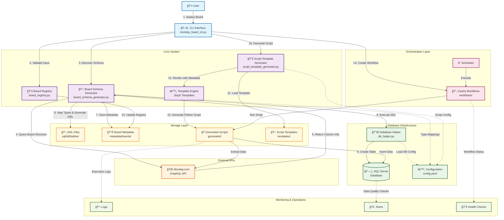
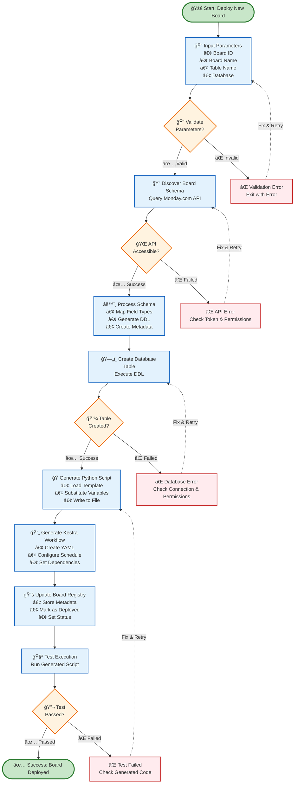

# Dynamic Monday.com Board Template System - Architecture Diagram

```mermaid
flowchart TB
    %% User Interaction
    User[👤 User]
    CLI[ğŸ–¥ï¸ CLI Interface<br/>monday_board_cli.py]
    
    %% Core System Components
    subgraph "Core System"
        BSG[📋 Board Schema Generator<br/>board_schema_generator.py]
        STG[🔧 Script Template Generator<br/>script_template_generator.py]
        BR[📚 Board Registry<br/>board_registry.py]
        TG[âš™ï¸ Template Engine<br/>Jinja2 Templates]
    end
    
    %% External Systems
    subgraph "External APIs"
        MONDAY[🌠Monday.com<br/>GraphQL API]
    end
    
    %% Database Layer
    subgraph "Database Infrastructure"
        DB[(ğŸ—„ï¸ SQL Server<br/>Database)]
        DH[🔌 Database Helper<br/>db_helper.py]
        CONFIG[âš™ï¸ Configuration<br/>config.yaml]
    end
    
    %% Storage & Metadata
    subgraph "Storage Layer"
        DDL[📄 DDL Files<br/>sql/ddl/tables/]
        METADATA[📊 Board Metadata<br/>metadata/boards/]
        SCRIPTS[ğŸ Generated Scripts<br/>generated/]
        TEMPLATES[📋 Script Templates<br/>templates/]
    end
    
    %% Orchestration
    subgraph "Orchestration Layer"
        WORKFLOWS[🔄 Kestra Workflows<br/>workflows/]
        SCHEDULER[â° Scheduler]
    end
    
    %% Monitoring
    subgraph "Monitoring & Operations"
        LOGS[📋 Logs]
        ALERTS[🚨 Alerts]
        HEALTH[💊 Health Checks]
    end
    
    %% Main Flow Connections
    User -->|"1. Deploy Board"| CLI
    CLI -->|"2. Validate Input"| BR
    CLI -->|"3. Discover Schema"| BSG
    BSG -->|"4. Query Board Structure"| MONDAY
    MONDAY -->|"5. Return Column Info"| BSG
    BSG -->|"6. Map Types & Generate DDL"| DDL
    BSG -->|"7. Store Metadata"| METADATA
    BSG -->|"8. Execute DDL"| DH
    DH -->|"9. Create Table"| DB
    CLI -->|"10. Generate Script"| STG
    STG -->|"11. Load Template"| TEMPLATES
    STG -->|"12. Render with Metadata"| TG
    TG -->|"13. Generate Python Script"| SCRIPTS
    CLI -->|"14. Create Workflow"| WORKFLOWS
    BR -->|"15. Update Registry"| METADATA
    
    %% Configuration Connections
    DH -.->|"Load DB Config"| CONFIG
    BSG -.->|"Type Mappings"| CONFIG
    STG -.->|"Script Config"| CONFIG
    
    %% Monitoring Connections
    SCRIPTS -.->|"Execution Logs"| LOGS
    WORKFLOWS -.->|"Workflow Status"| HEALTH
    DB -.->|"Data Quality Checks"| ALERTS
    
    %% Runtime Execution
    SCHEDULER -->|"Execute"| WORKFLOWS
    WORKFLOWS -->|"Run Script"| SCRIPTS
    SCRIPTS -->|"Extract Data"| MONDAY
    SCRIPTS -->|"Insert Data"| DB
    
    %% Styling
    classDef userNode fill:#e1f5fe,stroke:#01579b,stroke-width:2px,color:#333
    classDef coreNode fill:#f3e5f5,stroke:#4a148c,stroke-width:2px,color:#333
    classDef externalNode fill:#fff3e0,stroke:#e65100,stroke-width:2px,color:#333
    classDef databaseNode fill:#e8f5e8,stroke:#1b5e20,stroke-width:2px,color:#333
    classDef storageNode fill:#fff8e1,stroke:#f57f17,stroke-width:2px,color:#333
    classDef orchestrationNode fill:#fce4ec,stroke:#880e4f,stroke-width:2px,color:#333
    classDef monitoringNode fill:#f1f8e9,stroke:#33691e,stroke-width:2px,color:#333
    
    class User,CLI userNode
    class BSG,STG,BR,TG coreNode
    class MONDAY externalNode
    class DB,DH,CONFIG databaseNode
    class DDL,METADATA,SCRIPTS,TEMPLATES storageNode
    class WORKFLOWS,SCHEDULER orchestrationNode
    class LOGS,ALERTS,HEALTH monitoringNode
```

## Process Flow Diagram

```mermaid
flowchart TD
    %% Input Phase
    START([🚀 Start: Deploy New Board])
    INPUT[📠Input Parameters<br/>• Board ID<br/>• Board Name<br/>• Table Name<br/>• Database]
    
    %% Validation Phase
    VALIDATE{🔠Validate<br/>Parameters?}
    ERROR1[⌠Validation Error<br/>Exit with Error]
    
    %% Discovery Phase
    DISCOVER[🔠Discover Board Schema<br/>Query Monday.com API]
    API_ERROR{🌠API<br/>Accessible?}
    ERROR2[⌠API Error<br/>Check Token & Permissions]
    
    %% Schema Processing
    PROCESS[âš™ï¸ Process Schema<br/>• Map Field Types<br/>• Generate DDL<br/>• Create Metadata]
    
    %% Database Deployment
    CREATE_TABLE[ğŸ—„ï¸ Create Database Table<br/>Execute DDL]
    DB_ERROR{💾 Table<br/>Created?}
    ERROR3[⌠Database Error<br/>Check Connection & Permissions]
    
    %% Script Generation
    GEN_SCRIPT[ğŸ Generate Python Script<br/>• Load Template<br/>• Substitute Variables<br/>• Write to File]
    
    %% Workflow Creation
    GEN_WORKFLOW[🔄 Generate Kestra Workflow<br/>• Create YAML<br/>• Configure Schedule<br/>• Set Dependencies]
    
    %% Registry Update
    UPDATE_REGISTRY[📚 Update Board Registry<br/>• Store Metadata<br/>• Mark as Deployed<br/>• Set Status]
    
    %% Completion
    SUCCESS([✅ Success: Board Deployed])
    
    %% Test Execution
    TEST[🧪 Test Execution<br/>Run Generated Script]
    TEST_ERROR{🔬 Test<br/>Passed?}
    ERROR4[⌠Test Failed<br/>Check Generated Code]
    
    %% Main Flow
    START --> INPUT
    INPUT --> VALIDATE
    VALIDATE -->|✅ Valid| DISCOVER
    VALIDATE -->|⌠Invalid| ERROR1
    
    DISCOVER --> API_ERROR
    API_ERROR -->|✅ Success| PROCESS
    API_ERROR -->|⌠Failed| ERROR2
    
    PROCESS --> CREATE_TABLE
    CREATE_TABLE --> DB_ERROR
    DB_ERROR -->|✅ Success| GEN_SCRIPT
    DB_ERROR -->|⌠Failed| ERROR3
    
    GEN_SCRIPT --> GEN_WORKFLOW
    GEN_WORKFLOW --> UPDATE_REGISTRY
    UPDATE_REGISTRY --> TEST
    
    TEST --> TEST_ERROR
    TEST_ERROR -->|✅ Passed| SUCCESS
    TEST_ERROR -->|⌠Failed| ERROR4
    
    %% Error Recovery Paths
    ERROR1 -.->|Fix & Retry| INPUT
    ERROR2 -.->|Fix & Retry| DISCOVER
    ERROR3 -.->|Fix & Retry| CREATE_TABLE
    ERROR4 -.->|Fix & Retry| GEN_SCRIPT
    
    %% Styling
    classDef startEnd fill:#c8e6c9,stroke:#2e7d32,stroke-width:3px,color:#333
    classDef process fill:#e3f2fd,stroke:#1565c0,stroke-width:2px,color:#333
    classDef decision fill:#fff3e0,stroke:#ef6c00,stroke-width:2px,color:#333
    classDef error fill:#ffebee,stroke:#c62828,stroke-width:2px,color:#333
    classDef success fill:#e8f5e8,stroke:#2e7d32,stroke-width:2px,color:#333
    
    class START,SUCCESS startEnd
    class INPUT,DISCOVER,PROCESS,CREATE_TABLE,GEN_SCRIPT,GEN_WORKFLOW,UPDATE_REGISTRY,TEST process
    class VALIDATE,API_ERROR,DB_ERROR,TEST_ERROR decision
    class ERROR1,ERROR2,ERROR3,ERROR4 error
```

## Data Flow Architecture

```mermaid
flowchart LR
    %% Data Sources
    subgraph "Data Sources"
        MB[📋 Monday.com Board<br/>• Items<br/>• Columns<br/>• Groups<br/>• Metadata]
    end
    
    %% Extraction Layer
    subgraph "Extraction Layer"
        API[🔌 GraphQL API<br/>• Pagination<br/>• Cursor-based<br/>• Rate Limited]
        EXTRACTOR[ğŸ Generated Script<br/>• Async Processing<br/>• Error Handling<br/>• Type Conversion]
    end
    
    %% Processing Layer
    subgraph "Processing Layer"
        TRANSFORM[âš™ï¸ Data Transformation<br/>• Type Mapping<br/>• Null Handling<br/>• Validation]
        BATCH[📦 Batch Processing<br/>• Chunking<br/>• Parallel Insert<br/>• Transaction Mgmt]
    end
    
    %% Storage Layer
    subgraph "Storage Layer"
        STAGING[ğŸ—„ï¸ Staging Table<br/>• Temporary Storage<br/>• Data Validation<br/>• Quality Checks]
        TARGET[🯠Target Table<br/>• Production Data<br/>• Optimized Schema<br/>• Indexed]
    end
    
    %% Monitoring Layer
    subgraph "Monitoring"
        METRICS[📊 Metrics<br/>• Row Counts<br/>• Processing Time<br/>• Error Rates]
        ALERTS_FLOW[🚨 Alerts<br/>• Data Quality<br/>• Schema Changes<br/>• Failures]
    end
    
    %% Data Flow
    MB -->|"Extract"| API
    API -->|"Fetch"| EXTRACTOR
    EXTRACTOR -->|"Transform"| TRANSFORM
    TRANSFORM -->|"Batch"| BATCH
    BATCH -->|"Load"| STAGING
    STAGING -->|"Validate & Move"| TARGET
    
    %% Monitoring Flows
    EXTRACTOR -.->|"Performance"| METRICS
    TRANSFORM -.->|"Quality"| METRICS
    BATCH -.->|"Throughput"| METRICS
    STAGING -.->|"Data Issues"| ALERTS_FLOW
    TARGET -.->|"Final Status"| METRICS
    
    %% Styling
    classDef source fill:#e8f5e8,stroke:#2e7d32,stroke-width:2px,color:#333
    classDef extraction fill:#e3f2fd,stroke:#1565c0,stroke-width:2px,color:#333
    classDef processing fill:#f3e5f5,stroke:#4a148c,stroke-width:2px,color:#333
    classDef storage fill:#fff8e1,stroke:#f57f17,stroke-width:2px,color:#333
    classDef monitoring fill:#fce4ec,stroke:#880e4f,stroke-width:2px,color:#333
    
    class MB source
    class API,EXTRACTOR extraction
    class TRANSFORM,BATCH processing
    class STAGING,TARGET storage
    class METRICS,ALERTS_FLOW monitoring
```
