# Monday.com Order Sync - Staging Workflow Overview

This diagram shows the complete data flow for the new staging-based Monday.com order sync workflow.

```mermaid
flowchart TD
    %% Data Sources
    A[("📊 Source Systems")]
    B[("🏢 Customer Orders")]
    C[("📦 Sub-items")]
    
    %% Staging Layer
    D[("`**STG_MON_CustMasterSchedule**
    ⏳ Staging Table`")]
    E[("`**STG_MON_CustMasterSchedule_Subitems**
    ⏳ Staging Table`")]
    
    %% Batch Processing
    F{"`🔄 **Batch Processor**
    Group by Customer`"}
    
    %% Monday.com API
    G["`🌐 **Monday.com API**
    External Service`"]
    
    %% Production Tables
    H[("`**MON_CustMasterSchedule**
    ✅ Production Table`")]
    I[("`**MON_CustMasterSchedule_Subitems**
    ✅ Production Table`")]
    
    %% Error Handling
    J[("`**ERR_MON_CustMasterSchedule**
    ❌ Error Table`")]
    K[("`**ERR_MON_CustMasterSchedule_Subitems**
    ❌ Error Table`")]
    
    %% Batch Tracking
    L[("`**MON_BatchProcessing**
    📈 Batch Tracking`")]
    
    %% Monitoring
    M["`📊 **VW_MON_ActiveBatches**
    Monitoring View`"]
    
    %% Process Flow
    A --> B
    A --> C
    B --> D
    C --> E
    
    D --> F
    E --> F
    
    F -->|"🔄 Process Customer Batch"| G
    
    G -->|"✅ Success"| H
    G -->|"✅ Success"| I
    
    G -->|"❌ Failure"| J
    G -->|"❌ Failure"| K
    
    F --> L
    L --> M
    
    %% Retry Logic
    J -.->|"🔄 Retry Logic"| F
    K -.->|"🔄 Retry Logic"| F
    
    %% Subgraphs for organization
    subgraph "`**📥 Data Ingestion**`"
        A
        B
        C
    end
    
    subgraph "`**⏳ Staging Layer**`"
        D
        E
    end
    
    subgraph "`**🔄 Processing Engine**`"
        F
        L
    end
    
    subgraph "`**🌐 External Integration**`"
        G
    end
    
    subgraph "`**✅ Production Layer**`"
        H
        I
    end
    
    subgraph "`**❌ Error Management**`"
        J
        K
    end
    
    subgraph "`**📊 Monitoring**`"
        M
    end
      %% Styling
    classDef staging fill:#e1f5fe,stroke:#01579b,stroke-width:2px,color:#333
    classDef production fill:#e8f5e8,stroke:#2e7d32,stroke-width:2px,color:#333
    classDef error fill:#ffebee,stroke:#c62828,stroke-width:2px,color:#333
    classDef processing fill:#fff3e0,stroke:#f57c00,stroke-width:2px,color:#333
    classDef external fill:#f3e5f5,stroke:#7b1fa2,stroke-width:2px,color:#333
    classDef monitoring fill:#fce4ec,stroke:#ad1457,stroke-width:2px,color:#333
    
    class D,E staging
    class H,I production
    class J,K error
    class F,L processing
    class G external
    class M monitoring
```

## Key Workflow Steps

1. **Data Ingestion**: Source systems load new orders and sub-items into staging tables
2. **Batch Processing**: Orders are grouped by customer for efficient processing
3. **API Integration**: Each customer batch is synchronized with Monday.com via API
4. **Success Path**: Successfully synced data is promoted to production tables
5. **Error Handling**: Failed records are logged to error tables with retry capability
6. **Monitoring**: Active batches and processing status are tracked in real-time

## Benefits of Staging Approach

- **🔄 Rollback Capability**: Failed batches don't affect production data
- **📊 Better Monitoring**: Clear visibility into processing status
- **⚡ Performance**: Batch processing improves efficiency
- **🛡️ Error Resilience**: Robust error handling with retry logic
- **🔍 Auditability**: Complete tracking of data transformations
