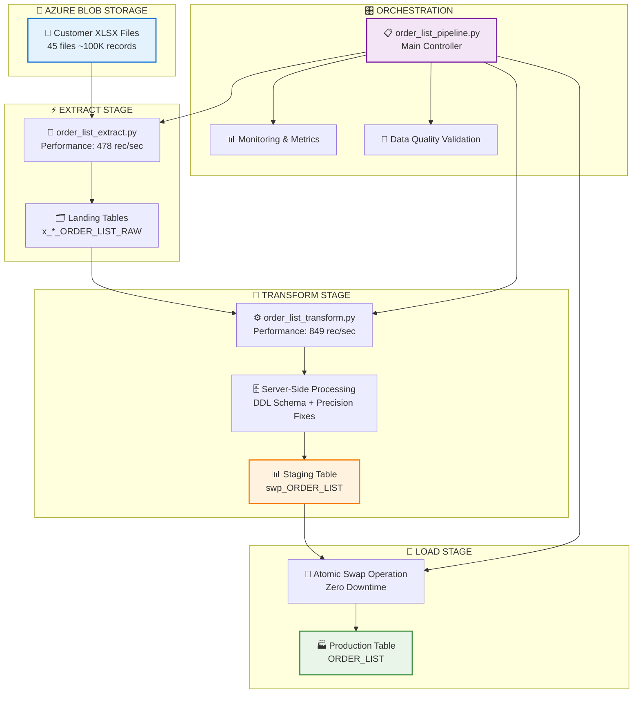
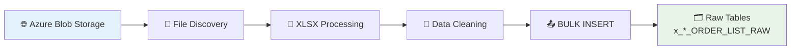
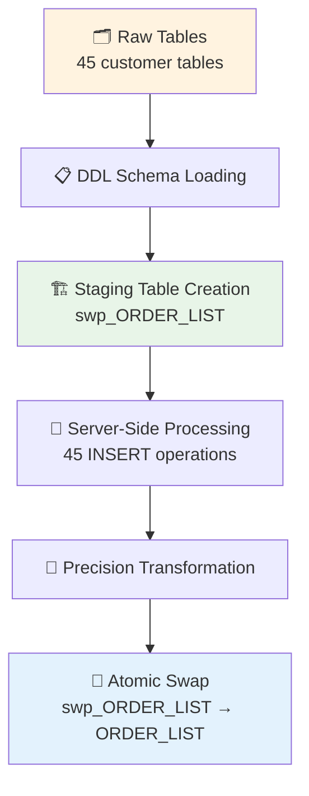

# ORDER_LIST Pipeline - Production Runbook

**Version**: 1.0  
**Date**: July 10, 2025  
**Status**: 🟢 Production Ready  
**Owner**: Data Engineering Team  

## 📋 Executive Summary

The ORDER_LIST pipeline is a high-performance Extract-Transform-Load (ETL) system that processes customer order data from Azure Blob Storage into a unified production database table. The pipeline processes **45 customer files** containing **100K+ records** in under **6 minutes** with comprehensive error handling and monitoring.

### 🎯 Key Metrics
- **Total Runtime**: ~5.6 minutes (334 seconds)
- **Throughput**: 303 records/second overall
- **Data Volume**: 101,404 production records
- **Success Rate**: 100% for Extract & Transform stages
- **Reliability**: Atomic operations with zero-downtime swaps

---

## 🏗️ Architecture Overview



---

## 🚀 Quick Start Guide

### Prerequisites Checklist
- [ ] Azure credentials configured in environment
- [ ] Database connectivity to `orders` database
- [ ] Virtual environment `.venv` activated
- [ ] All required Python packages installed

### 🎮 VS Code Tasks (Recommended)

#### 🏃‍♂️ Production Execution
```json
# Use VS Code Command Palette: Ctrl+Shift+P > "Tasks: Run Task"

1. "ORDER_LIST: Execute Complete Pipeline"
   ├── Full production pipeline (Extract → Transform → Load)
   ├── Expected runtime: ~6 minutes
   └── Processes all 45 customer files

2. "ORDER_LIST: Complete Pipeline (Test Mode)"
   ├── Limited to 5 files for testing
   ├── Expected runtime: ~1 minute
   └── Ideal for validation
```

#### 🧪 Development & Testing
```json
3. "ORDER_LIST: Extract Only Pipeline" 
   ├── Extract stage only (blob → raw tables)
   ├── Runtime: ~3.5 minutes
   └── Use for extract testing

4. "ORDER_LIST: Transform Only Pipeline"
   ├── Transform existing raw tables
   ├── Runtime: ~2 minutes  
   └── Skip extract, use existing data

5. "ORDER_LIST: Comprehensive Test Suite"
   ├── 5-phase validation framework
   ├── Runtime: ~8 minutes
   └── Complete pipeline testing
```

### 📟 Command Line Execution
```bash
# Activate virtual environment
.\.venv\Scripts\Activate.ps1

# Execute complete pipeline
python pipelines/scripts/load_order_list/order_list_pipeline.py

# Execute with options
python pipelines/scripts/load_order_list/order_list_pipeline.py --extract-only
python pipelines/scripts/load_order_list/order_list_pipeline.py --transform-only
python pipelines/scripts/load_order_list/order_list_pipeline.py --limit-files 5
```

---

## 📊 Stage-by-Stage Operations

### 🔄 Stage 1: EXTRACT (3.5 minutes)
**Purpose**: Extract XLSX files from Azure Blob Storage to SQL raw tables



**Key Operations:**
1. **File Discovery**: Scan blob storage for `.xlsx/.xls` files
2. **Lazy Blob Client Initialization**: Optimized Azure SDK connection 
3. **Excel Processing**: Read MASTER sheet or first available sheet
4. **Data Cleaning**: Remove empty rows/columns, standardize headers
5. **Table Creation**: Generate dynamic SQL DDL for each file
6. **BULK INSERT**: High-performance CSV → SQL via external data source

**Performance Metrics:**
- **Files Processed**: 45 customer files
- **Records Extracted**: 101,662 raw records  
- **Throughput**: 478 records/second
- **Duration**: ~212 seconds

**Output Tables**: `x{CUSTOMER_NAME}_ORDER_LIST_RAW`

### ⚙️ Stage 2: TRANSFORM (2 minutes)
**Purpose**: Consolidate raw tables into DDL-compliant staging table



**Key Operations:**
1. **DDL Schema Loading**: Load production table schema from DDL file
2. **Staging Creation**: Create `swp_ORDER_LIST` with proper column types
3. **Server-Side INSERT**: Generate 45 dynamic INSERT statements
4. **Data Cleaning**: Remove empty/invalid rows during transformation
5. **Precision Handling**: Smart casting for numeric precision preservation
6. **Atomic Swap**: Zero-downtime production table replacement

**Performance Metrics:**
- **Customers Processed**: 45 customers
- **Records Transformed**: 101,404 cleaned records
- **Throughput**: 849 records/second  
- **Duration**: ~119 seconds

**Output**: Production `ORDER_LIST` table

### ✅ Stage 3: VALIDATION (< 1 second)
**Purpose**: Data quality and integrity verification


**Validation Checks:**
- Record count validation
- Column schema compliance
- Data type verification  
- Performance benchmarking
- Source table mapping

---

## 🎛️ Monitoring & Metrics

### 📊 Real-Time Monitoring
**Console Output Example:**
```
[*] ORDER_LIST PRODUCTION PIPELINE
============================================================
Pipeline ID: order_list_pipeline_20250710_233835
Start Time: 2025-07-10 23:38:35

[*] PIPELINE STAGE: EXTRACT - Blob Storage to Raw Tables
============================================================
[1/45] Processing: GREYSON ORDER LIST (M3).xlsx
   ✅ Inserted 5,321 rows (10.6s)
[2/45] Processing: LORNA JANE ORDER LIST (M3).xlsx  
   ✅ Inserted 18,225 rows (37.2s)
...

[+] STAGE COMPLETED: EXTRACT
Files processed: 45
Records extracted: 101,662 
Duration: 212.85 seconds
```

### 📈 Performance Dashboard
| Stage | Duration | Throughput | Records | Status |
|-------|----------|------------|---------|---------|
| Extract | 212.8s | 478 rec/sec | 101,662 | ✅ |
| Transform | 119.5s | 849 rec/sec | 101,404 | ✅ |
| Validation | 0.1s | - | - | ⚠️ |
| **Total** | **334.9s** | **303 rec/sec** | **101,404** | ✅ |

### 🔍 Log Files Location
```bash
# Application logs
tail -f monday_integration.log

# VS Code task output  
# Check "Terminal" panel in VS Code during execution

# Database query logs
# Check SQL Server logs for BULK INSERT operations
```

---

## 🚨 Troubleshooting Guide

### ❌ Common Issues & Solutions

#### **1. Azure Authentication Errors**
```
Error: ClientSecretCredential authentication failed
```
**Solution:**
```bash
# Verify credentials in order_list_extract.py

# Test connection
python -c "from azure.storage.blob import BlobServiceClient; print('Auth OK')"
```

#### **2. Database Connection Issues**
```
Error: Could not connect to database 'orders'
```
**Solution:**
```bash
# Check database configuration
python -c "import sys; sys.path.append('utils'); import db_helper; db_helper.get_connection('orders')"

# Verify config.yaml has correct 'orders' database settings
```

#### **3. Virtual Environment Issues**
```
ModuleNotFoundError: No module named 'azure'
```
**Solution:**
```bash
# Activate virtual environment
.\.venv\Scripts\Activate.ps1

# Verify Azure packages
pip list | findstr azure

# Install if missing
pip install azure-storage-blob azure-identity
```

#### **4. Performance Degradation**
```
Pipeline taking > 10 minutes
```
**Diagnostic Steps:**
```bash
# 1. Check blob client initialization (should be function-level, not module-level)
# 2. Verify database connection pooling
# 3. Monitor Azure Blob Storage throttling
# 4. Check SQL Server blocking/deadlocks

# Run extract-only test
python pipelines/scripts/load_order_list/order_list_extract.py
```

#### **5. Validation Stage Failures**
```
Error: Invalid column name 'CUSTOMER'
```
**Known Issue**: Validation queries use old column names
**Workaround**: Pipeline continues successfully, validation failure is non-blocking
**Fix**: Update validation queries to match DDL schema column names

### 🔧 Emergency Procedures

#### **Rollback Production Table**
```sql
-- If production data is corrupted, restore from staging
BEGIN TRANSACTION;

-- Backup current production
SELECT * INTO ORDER_LIST_BACKUP_YYYYMMDD FROM ORDER_LIST;

-- Restore from last known good staging (if available)
-- Manual verification required
SELECT COUNT(*) FROM ORDER_LIST; -- Verify record count

ROLLBACK; -- or COMMIT after verification
```

#### **Force Pipeline Stop**
```bash
# In VS Code: Ctrl+C in terminal
# Or kill Python process
taskkill /f /im python.exe
```

#### **Emergency Data Recovery**
```sql
-- Check for raw tables if pipeline failed during transform
SELECT TABLE_NAME FROM INFORMATION_SCHEMA.TABLES 
WHERE TABLE_NAME LIKE 'x%_ORDER_LIST_RAW'
ORDER BY TABLE_NAME;

-- Manual staging table creation if needed
-- Use: db/ddl/tables/orders/dbo_order_list.sql
```

---

## 🔧 Maintenance Procedures

### 🗓️ Daily Operations
- [ ] Monitor pipeline execution logs
- [ ] Verify record counts in ORDER_LIST table
- [ ] Check Azure Blob Storage for new files
- [ ] Review performance metrics

### 📅 Weekly Maintenance  
- [ ] Clean up old raw tables (`x_*_ORDER_LIST_RAW`)
- [ ] Archive blob storage CSV temp files
- [ ] Review performance trends
- [ ] Update documentation if needed

### 🔄 Monthly Reviews
- [ ] Performance optimization analysis
- [ ] Data quality assessment
- [ ] Security credential rotation
- [ ] Disaster recovery testing

### 📋 Cleanup Commands
```sql
-- Remove old raw tables (run weekly)
DECLARE @sql NVARCHAR(MAX) = '';
SELECT @sql = @sql + 'DROP TABLE IF EXISTS ' + TABLE_NAME + ';' + CHAR(13)
FROM INFORMATION_SCHEMA.TABLES 
WHERE TABLE_NAME LIKE 'x%_ORDER_LIST_RAW'
  AND TABLE_NAME NOT LIKE '%' + FORMAT(GETDATE(), 'yyyyMMdd') + '%';
EXEC sp_executesql @sql;
```

```bash
# Clean up blob storage CSV temp files (run monthly)
# Manual cleanup required in Azure Portal:
# Storage Account > orderlistcsv > csv_temp/
```

---

## 📞 Support & Escalation

### 🏷️ Issue Classification
- **🟢 Low Priority**: Performance < targets but functional
- **🟡 Medium Priority**: Single stage failures with workarounds  
- **🔴 High Priority**: Complete pipeline failures
- **🚨 Critical**: Production data corruption

### 📋 Contact Information
- **Primary**: Data Engineering Team
- **Secondary**: Database Administration Team  
- **Escalation**: IT Operations Manager

### 📝 Issue Reporting Template
```
Title: ORDER_LIST Pipeline Issue - [Stage] - [Severity]

Description:
- Pipeline ID: [from logs]
- Stage Failed: [Extract/Transform/Load/Validation]
- Error Message: [exact error text]
- Expected Behavior: 
- Actual Behavior:
- Impact: [# records affected, business impact]

Environment:
- Date/Time: 
- Files Processed: [count]
- Duration: [before failure]

Logs:
[attach relevant log sections]

Troubleshooting Steps Attempted:
- [ ] Step 1
- [ ] Step 2
```

---

## 📚 Additional Resources

### 📖 Related Documentation
- [ORDER_LIST ELT Refactoring Plan](../changelogs/order-list-elt-refactoring-plan.md)
- [Project Architecture Overview](../architecture/)
- [Database Schema Documentation](../../db/ddl/)

### 🔗 External References
- [Azure Blob Storage Python SDK](https://docs.microsoft.com/en-us/azure/storage/blobs/storage-quickstart-blobs-python)
- [SQL Server BULK INSERT](https://docs.microsoft.com/en-us/sql/t-sql/statements/bulk-insert-transact-sql)
- [Pandas Excel Processing](https://pandas.pydata.org/docs/reference/api/pandas.read_excel.html)

### 🛠️ Development Tools
- **VS Code Tasks**: `.vscode/tasks.json`
- **Test Framework**: `tests/end_to_end/test_order_list_complete_pipeline.py`
- **Pipeline Scripts**: `pipelines/scripts/load_order_list/`
- **Utilities**: `utils/` and `pipelines/utils/`

---

**📋 Document Control**
- **Created**: July 10, 2025
- **Last Updated**: July 10, 2025  
- **Next Review**: August 10, 2025
- **Version**: 1.0
- **Status**: 🟢 Production Ready
