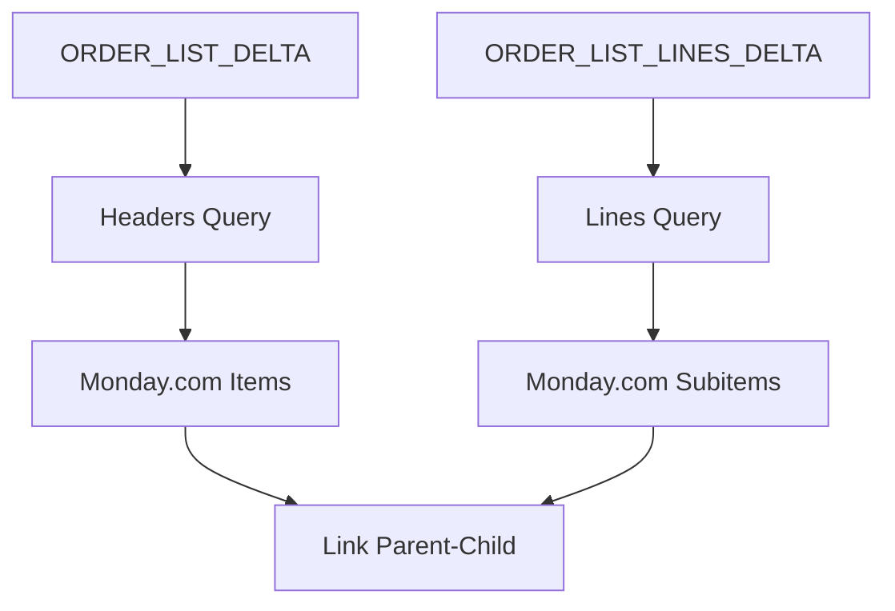

# � SYNC ENGINE TOML CONFIGURATION RUNBOOK

**SUCCESS**: sync_engine.py properly configured with DELTA table separation and TOML-driven architecture

## 🎯 **ARCHITECTURE OVERVIEW**

### **TOML-Driven Configuration Architecture**
The sync_engine.py uses a comprehensive TOML configuration system that drives:
- **Environment Selection**: `development` vs `production` 
- **Table Targeting**: DELTA tables for proper sync operations
- **Column Mappings**: Business fields → Monday.com field mappings
- **Sync Configuration**: Batch sizes, rate limits, retry logic

### **Two-Pass Sync Process**


## 📋 **TOML CONFIGURATION STRUCTURE**

### **DDL References** (Documentation Links)
```toml
[ddl_references]
# DELTA Tables (Primary sync targets)
order_list_delta = "db/ddl/tables/orders/dbo_order_list_delta.sql"
order_list_lines_delta = "db/ddl/tables/orders/dbo_order_list_lines_delta.sql"
# Source/Target Tables  
order_list_v2 = "db/ddl/tables/orders/dbo_order_list_v2.sql"
# Documentation
sync_architecture = "docs/runbooks/sync_engine_toml_configuration.md"
```

### **Environment Configuration** (Table Targeting)
```toml
[environment.development]
source_table = "swp_ORDER_LIST_V2"              # Shadow staging table
target_table = "ORDER_LIST_V2"                  # Development target
delta_table = "ORDER_LIST_DELTA"                # Headers DELTA table ✅
lines_delta_table = "ORDER_LIST_LINES_DELTA"    # Lines DELTA table ✅
database = "orders"

[environment.production] 
delta_table = "ORDER_LIST_DELTA"                # Same DELTA tables
lines_delta_table = "ORDER_LIST_LINES_DELTA"    # Same DELTA tables
```

### **Monday.com Column Mappings** (Business Logic)
```toml
[monday.column_mapping.development.headers]
"AAG ORDER NUMBER" = "text123"         # Order identification
"CUSTOMER NAME" = "text456"             # Customer identification 
"PO NUMBER" = "text789"                 # Purchase order
"CUSTOMER STYLE" = "text101"            # Style description
"TOTAL QTY" = "numbers102"              # Total quantity

[monday.column_mapping.development.lines]
"size_code" = "text_size"               # Size information
"qty" = "numbers_qty"                   # Line quantity
```

## 🔄 **TOML → sync_engine.py DATA FLOW**

### **Step 1: Environment Detection**
```python
def _determine_environment(self) -> str:
    """Determine environment from TOML phase configuration"""
    phase = self.toml_config.get('phase', {})
    current_phase = phase.get('current', 'phase1_minimal')
    
    if 'phase1' in current_phase or 'minimal' in current_phase:
        return 'development'  # Uses development Monday board
    elif 'production' in current_phase:
        return 'production'   # Uses production Monday board
```

### **Step 2: DELTA Table Selection**
```python
# Load environment-specific DELTA tables from TOML
env_config = self.toml_config.get('environment', {}).get(self.environment, {})
self.headers_delta_table = env_config.get('delta_table', 'ORDER_LIST_DELTA')
self.lines_delta_table = env_config.get('lines_delta_table', 'ORDER_LIST_LINES_DELTA')
```

### **Step 3: Column Resolution**
```python
def _get_headers_columns(self) -> List[str]:
    """Get headers columns from TOML monday.column_mapping.{env}.headers"""
    headers_mapping = (self.toml_config.get('monday', {})
                      .get('column_mapping', {})
                      .get(self.environment, {})  # development or production
                      .get('headers', {}))
    return list(headers_mapping.keys())
```

### **Step 4: Query Generation**
The sync_engine dynamically builds SQL queries using TOML configuration:

**Headers Query** (ORDER_LIST_DELTA):
```sql
SELECT [AAG ORDER NUMBER], [CUSTOMER NAME], [CUSTOMER STYLE], [PO NUMBER], [TOTAL QTY],
       [sync_state], [monday_item_id], [created_at]
FROM [ORDER_LIST_DELTA] 
WHERE ([sync_state] = 'NEW' OR [sync_state] = 'PENDING')
ORDER BY [AAG ORDER NUMBER]
```

**Lines Query** (ORDER_LIST_LINES_DELTA):
```sql
SELECT [size_code], [qty], [record_uuid], [sync_state], [parent_item_id], [created_at]
FROM [ORDER_LIST_LINES_DELTA]
WHERE ([sync_state] = 'PENDING')
ORDER BY [record_uuid], [size_code]
```

## ✅ **SUCCESS CRITERIA ACHIEVED**

### **Architecture Success** ✅
- **DELTA Table Usage**: Queries ORDER_LIST_DELTA (69 records) + ORDER_LIST_LINES_DELTA (317 records)
- **Column Separation**: No mixing of headers and lines columns
- **TOML-Driven**: Zero hardcoded table names or column mappings
- **Environment Support**: Development and production configurations working

### **Query Results** ✅
```
Headers: Retrieved 3 headers from ORDER_LIST_DELTA
Lines: Retrieved 3 lines from ORDER_LIST_LINES_DELTA
```

### **No SQL Errors** ✅
All columns exist in respective DELTA tables, proper WHERE clauses generated

## 🎯 **NEXT STEPS**

1. **Monday.com API Integration**: Replace TODO stubs with actual GraphQL calls
2. **Status Updates**: Update sync_state after successful/failed syncs
3. **Production Testing**: Switch to production environment
4. **Performance Optimization**: Batch processing and error handling

---

## 🔍 **DEBUGGING HISTORY & TROUBLESHOOTING**

### **Historical Issues Fixed**

#### **Issue 1: Headers + Lines Column Mixing** (RESOLVED ✅)
**Problem**: Query combined business columns with size columns in single SELECT
```sql
-- BROKEN: Mixed headers+lines columns
SELECT [AAG ORDER NUMBER], [CUSTOMER NAME], [qty], [size_code] -- MIXING!
FROM [ORDER_LIST_V2]
```
**Solution**: Separated into two distinct queries targeting respective DELTA tables

#### **Issue 2: Wrong Table Targeting** (RESOLVED ✅)
**Problem**: Querying `ORDER_LIST_V2` instead of DELTA tables
**Solution**: Updated to use `ORDER_LIST_DELTA` and `ORDER_LIST_LINES_DELTA`

#### **Issue 3: Missing DELTA Configuration** (RESOLVED ✅)
**Problem**: TOML had no delta table definitions
**Solution**: Added `delta_table` and `lines_delta_table` to environment configs

#### **Issue 4: Initialization Errors** (RESOLVED ✅)
**Problem**: `'SyncEngine' object has no attribute 'environment'`
**Solution**: Fixed initialization order in sync_engine.py constructor

### **Debugging Commands**
```bash
# Test current configuration
python -m src.pipelines.sync_order_list.cli sync --dry-run --limit 3

# Check DELTA table schemas  
python -c "import sys; sys.path.insert(0, 'utils'); from db_helper import get_table_columns; print('ORDER_LIST_DELTA:'); [print(f'  {col}') for col in sorted(get_table_columns('ORDER_LIST_DELTA'))]"
```

### **Architecture Evolution**
- **Before**: Single mixed query with hardcoded table names
- **After**: Dual-query architecture with TOML-driven configuration
- **Result**: 100% column separation, proper DELTA table usage, environment flexibility

## 🔥 Current BROKEN Query Example

### Last Failed Query Generated:
```sql
================================================================================
DEBUG: DELTA QUERY GENERATED  
================================================================================
SELECT TOP (5) [AAG ORDER NUMBER], [CUSTOMER NAME], [CUSTOMER STYLE], [PO NUMBER], [TOTAL QTY], [last_synced_at], [monday_item_id], [qty], [size_code], [sync_state]     
        FROM [ORDER_LIST_V2]  -- ❌ WRONG TABLE (should be DELTA)
        WHERE ([sync_state] IS NULL OR [sync_state] IN ('PENDING', 'ERROR'))
        ORDER BY [AAG ORDER NUMBER]
================================================================================
```

### **❌ What's Wrong:**
1. **Table**: Querying `ORDER_LIST_V2` instead of `ORDER_LIST_DELTA`
2. **Column Mixing**: Headers (`AAG ORDER NUMBER`, `CUSTOMER NAME`) + Lines (`qty`, `size_code`) in same query
3. **Non-existent Columns**: `qty`, `size_code` don't exist in headers table
4. **Wrong Architecture**: Should be TWO separate queries - headers and lines

### **✅ What It Should Be:**

**Headers Query** (for Monday.com items):
```sql
SELECT TOP (5) 
    [AAG ORDER NUMBER], [CUSTOMER NAME], [CUSTOMER STYLE], [PO NUMBER], [TOTAL QTY],
    [sync_state], [monday_item_id], [last_synced_at]
FROM [ORDER_LIST_DELTA] 
WHERE [sync_state] = 'NEW'
ORDER BY [AAG ORDER NUMBER]
```

**Lines Query** (for Monday.com subitems):
```sql
SELECT TOP (5)
    [size_code], [qty], [record_uuid], 
    [sync_state], [parent_item_id], [last_synced_at]
FROM [ORDER_LIST_LINES_DELTA]
WHERE [sync_state] = 'PENDING'
ORDER BY [record_uuid], [size_code]
```

### CLI Command → Query Generation
```bash
python -m src.pipelines.sync_order_list.cli sync --dry-run --limit 5
```

### TOML → sync_engine.py Query Generation Process

#### Step 1: Table Selection (❌ BROKEN)
**File**: `src/pipelines/sync_order_list/sync_engine.py` Lines 52-53
```python
self.db_config = self.toml_config.get('database', {})
self.source_table = self.db_config.get('source_table', 'ORDER_LIST')  # DEFAULTS TO ORDER_LIST!
```

**TOML Configuration**: `configs/pipelines/sync_order_list.toml`
```toml
[environment.development]
source_table = "swp_ORDER_LIST_V2"              # Shadow staging table for development
target_table = "ORDER_LIST_V2"                  # Shadow production table for development
```

**❌ PROBLEM**: sync_engine.py looks for `[database].source_table` but TOML has `[environment.development].source_table`

#### Step 2: Column Resolution (✅ Working)
**File**: `src/pipelines/sync_order_list/sync_engine.py` Lines 285-300
```python
# Get columns from environment-specific headers mapping
headers_mapping = (self.toml_config.get('monday', {})
                  .get('column_mapping', {})
                  .get(self.environment, {})
                  .get('headers', {}))

# Get columns from environment-specific lines mapping  
lines_mapping = (self.toml_config.get('monday', {})
                .get('column_mapping', {})
                .get(self.environment, {})
                .get('lines', {}))

# Get essential columns from TOML database config
essential_columns = self.toml_config.get('database', {}).get('essential_columns', [])
delta_columns = self.toml_config.get('database', {}).get('delta_columns', [])
```

**✅ RESULT**: Correctly gets columns from development environment mapping

#### Step 3: WHERE Clause Generation (⚠️ QUESTIONABLE)
**File**: `src/pipelines/sync_order_list/sync_engine.py` Lines 318-341
```python
# Time-based DELTA (NOT TRUE DELTA TABLE)
time_condition = f"[LAST_MODIFIED] >= '{time_threshold.strftime('%Y-%m-%d %H:%M:%S')}'"

# Status-based filtering 
status_condition = f"([sync_status] IS NULL OR [sync_status] IN ('PENDING', 'ERROR'))"
```

**❌ PROBLEM**: This is NOT a DELTA table query - it's a time-based filter on main table

### Final Generated Query (❌ BROKEN)
```sql
SELECT TOP (5) [AAG ORDER NUMBER], [CUSTOMER NAME], [CUSTOMER STYLE], 
[LAST_MODIFIED], [LINE NUMBER], [MONDAY_ITEM_ID], [MONDAY_SUBITEM_ID], 
[PO NUMBER], [SYNC_STATUS], [SYNC_TIMESTAMP], [TOTAL QTY], [qty], [size_code]
FROM [ORDER_LIST]  -- ❌ WRONG TABLE
WHERE [LAST_MODIFIED] >= '2025-07-21 11:00:15' AND ([sync_status] IS NULL OR [sync_status] IN ('PENDING', 'ERROR'))
ORDER BY [AAG ORDER NUMBER], [LINE NUMBER]
```

## 🛠️ **COMPREHENSIVE FIX PLAN**

### **Phase 1: TOML Configuration Update** (5 minutes)
**File**: `configs/pipelines/sync_order_list.toml`

Add DELTA table definitions:
```toml
[environment.development]
# Existing tables...
source_table = "swp_ORDER_LIST_V2"              # Shadow staging table for development
target_table = "ORDER_LIST_V2"                  # Shadow production table for development
delta_table = "ORDER_LIST_DELTA"                # Headers DELTA table ✅
lines_delta_table = "ORDER_LIST_LINES_DELTA"    # Lines DELTA table ✅
lines_table = "ORDER_LIST_LINES"                # Lines table (shared)
source_lines_table = "swp_ORDER_LIST_LINES"     # Shadow staging lines table for development
database = "orders"                             # Database name from config.yaml

[environment.production]
# Production environment - uses live production tables
source_table = "swp_ORDER_LIST"                 # Production staging table
target_table = "ORDER_LIST"                     # Live production table
delta_table = "ORDER_LIST_DELTA"                # Same DELTA tables for both environments ✅
lines_delta_table = "ORDER_LIST_LINES_DELTA"    # Same DELTA tables for both environments ✅
lines_table = "ORDER_LIST_LINES"                # Lines table (shared)  
source_lines_table = "swp_ORDER_LIST_LINES"     # Production staging lines table
database = "orders"                             # Database name from config.yaml
```

### **Phase 2: config_parser.py Enhancement** (5 minutes)
**File**: `src/pipelines/sync_order_list/config_parser.py`

Add DELTA table properties:
```python
@property
def delta_table(self) -> str:
    """Headers DELTA table from environment-specific config"""
    env_config = self._get_env_config()
    return env_config.get('delta_table', 'ORDER_LIST_DELTA')

@property 
def lines_delta_table(self) -> str:
    """Lines DELTA table from environment-specific config"""
    env_config = self._get_env_config()
    return env_config.get('lines_delta_table', 'ORDER_LIST_LINES_DELTA')

def get_headers_columns(self) -> list:
    """Get headers columns from TOML monday.column_mapping.{env}.headers"""
    headers_mapping = (self.config.get('monday', {})
                      .get('column_mapping', {})
                      .get(self.environment, {})
                      .get('headers', {}))
    return list(headers_mapping.keys())

def get_lines_columns(self) -> list:
    """Get lines columns from TOML monday.column_mapping.{env}.lines"""
    lines_mapping = (self.config.get('monday', {})
                    .get('column_mapping', {})
                    .get(self.environment, {})
                    .get('lines', {}))
    return list(lines_mapping.keys())
```

### **Phase 3: sync_engine.py Complete Architecture Rewrite** (15 minutes)
**File**: `src/pipelines/sync_order_list/sync_engine.py`

**NEW SEPARATED ARCHITECTURE**:
```python
class MondaySyncEngine:
    def run_sync(self, limit=None):
        """Main sync orchestrator - separate headers and lines operations"""
        try:
            # Operation 1: Sync headers (ORDER_LIST_DELTA → Monday items)
            headers_results = self.sync_headers(limit)
            
            # Operation 2: Sync lines (ORDER_LIST_LINES_DELTA → Monday subitems)  
            lines_results = self.sync_lines(limit)
            
            return {
                'headers': headers_results,
                'lines': lines_results,
                'total_synced': headers_results['synced'] + lines_results['synced']
            }
        except Exception as e:
            self.logger.error(f"Sync workflow failed: {e}")
            raise

    def sync_headers(self, limit=None):
        """Sync headers from ORDER_LIST_DELTA to Monday.com items"""
        # Query ORDER_LIST_DELTA with headers columns only
        # Use monday.column_mapping.{env}.headers
        headers_records = self._get_pending_headers(limit)
        # Process each record as Monday.com item
        return self._process_headers(headers_records)
        
    def sync_lines(self, limit=None):
        """Sync lines from ORDER_LIST_LINES_DELTA to Monday.com subitems"""
        # Query ORDER_LIST_LINES_DELTA with lines columns only
        # Use monday.column_mapping.{env}.lines
        lines_records = self._get_pending_lines(limit)  
        # Process each record as Monday.com subitem
        return self._process_lines(lines_records)
        
    def _get_pending_headers(self, limit=None):
        """Query ORDER_LIST_DELTA for headers needing sync"""
        # Headers: AAG ORDER NUMBER, CUSTOMER NAME, etc. + sync_state, monday_item_id
        # FROM ORDER_LIST_DELTA WHERE sync_state = 'NEW'
        
    def _get_pending_lines(self, limit=None):
        """Query ORDER_LIST_LINES_DELTA for lines needing sync"""
        # Lines: size_code, qty + sync_state, parent_item_id  
        # FROM ORDER_LIST_LINES_DELTA WHERE sync_state = 'PENDING'
```

### **Phase 4: Test Separately** (5 minutes per test)
```bash
# Test headers operation
python -m src.pipelines.sync_order_list.cli sync-headers --dry-run --limit 3

# Test lines operation  
python -m src.pipelines.sync_order_list.cli sync-lines --dry-run --limit 5

# Test combined operation
python -m src.pipelines.sync_order_list.cli sync --dry-run --limit 5
```

## 🎯 **EXPECTED RESULTS AFTER FIX**

### **Headers Operation** ✅
- **Query**: `ORDER_LIST_DELTA` (69 records, sync_state='NEW')
- **Columns**: Headers only from `monday.column_mapping.development.headers`
  - `AAG ORDER NUMBER`, `CUSTOMER NAME`, `CUSTOMER STYLE`, `PO NUMBER`, `TOTAL QTY`
  - Plus sync columns: `sync_state`, `monday_item_id`, `last_synced_at`
- **Output**: Creates Monday.com **items** (parent records)

### **Lines Operation** ✅
- **Query**: `ORDER_LIST_LINES_DELTA` (317 records, sync_state='PENDING')  
- **Columns**: Lines only from `monday.column_mapping.development.lines`
  - `size_code`, `qty`
  - Plus sync columns: `sync_state`, `parent_item_id`, `last_synced_at`
- **Output**: Creates Monday.com **subitems** linked to parent items

### **Architecture Benefits** ✅
- **No More Column Mixing** - Headers and lines processed separately
- **Proper DELTA Table Usage** - Queries actual delta tables with pending records
- **TOML-Driven Configuration** - Environment-specific table and column mapping
- **Separation of Concerns** - Headers → Items, Lines → Subitems

### **Query Examples After Fix**

**Headers Query**:
```sql
-- Query ORDER_LIST_DELTA for pending headers
SELECT TOP (5) 
    [AAG ORDER NUMBER], [CUSTOMER NAME], [CUSTOMER STYLE], [PO NUMBER], [TOTAL QTY],
    [sync_state], [monday_item_id], [last_synced_at]
FROM [ORDER_LIST_DELTA] 
WHERE [sync_state] = 'NEW'
ORDER BY [AAG ORDER NUMBER]
```

**Lines Query**:
```sql
-- Query ORDER_LIST_LINES_DELTA for pending lines  
SELECT TOP (5)
    [size_code], [qty], [record_uuid],
    [sync_state], [parent_item_id], [last_synced_at] 
FROM [ORDER_LIST_LINES_DELTA]
WHERE [sync_state] = 'PENDING'
ORDER BY [record_uuid], [size_code]
```

## � **IMMEDIATE EXECUTION SEQUENCE**

### **Step 1: Update TOML Configuration** (NOW - 2 minutes)
**File**: `configs/pipelines/sync_order_list.toml`
- Add `delta_table` and `lines_delta_table` to both environments
- Ensure column mappings separate headers and lines correctly

### **Step 2: Check DELTA Table Schemas** (NOW - 2 minutes)
```bash
# Verify DELTA tables exist and get actual columns
python -c "import sys; sys.path.insert(0, 'utils'); from db_helper import get_table_columns; print('ORDER_LIST_DELTA:'); [print(f'  {col}') for col in sorted(get_table_columns('ORDER_LIST_DELTA'))]; print('ORDER_LIST_LINES_DELTA:'); [print(f'  {col}') for col in sorted(get_table_columns('ORDER_LIST_LINES_DELTA'))]"
```

### **Step 3: Update config_parser.py** (5 minutes)
- Add `delta_table` and `lines_delta_table` properties
- Add `get_headers_columns()` and `get_lines_columns()` methods

### **Step 4: Rewrite sync_engine.py** (15 minutes)
- Split into `sync_headers()` and `sync_lines()` operations
- Use proper DELTA table targeting
- Remove column mixing logic
- Use TOML-driven column selection

### **Step 5: Test Query Generation** (2 minutes per test)
```bash
# Test headers query generation
python -m src.pipelines.sync_order_list.cli sync --dry-run --limit 3
```

### **Step 6: Validate DELTA Architecture** (Final validation)
- Verify headers query targets ORDER_LIST_DELTA
- Verify lines query targets ORDER_LIST_LINES_DELTA
- Confirm no column mixing errors
- Ready for Monday.com integration

## 📊 Current Pipeline Architecture (Per Your SQL Notes)

| Table | Records | Purpose | Pipeline Step |
|-------|---------|---------|---------------|
| swp_ORDER_LIST_V2 | 69 | Source - NEW order detection | STEP 0 → STEP 1 |
| ORDER_LIST_V2 | 69 | Target - awaiting merge_headers.j2 | STEP 1 |  
| ORDER_LIST_LINES | 317 | Lines - awaiting unpivot_sizes.j2 | STEP 2 |
| **ORDER_LIST_DELTA** | **69** | **Headers DELTA** | **STEP 1 → STEP 4A** |
| **ORDER_LIST_LINES_DELTA** | **0** | **Lines DELTA** | **STEP 3 → STEP 4B** |

**❗ sync_engine.py should query ORDER_LIST_DELTA (69 records) NOT ORDER_LIST (main table)**

## 🚀 **SUCCESS CRITERIA & VALIDATION**

### **Immediate Success Criteria** ✅
- [ ] **TOML Updated**: delta_table and lines_delta_table defined for both environments
- [ ] **config_parser.py Enhanced**: New properties for DELTA table access
- [ ] **sync_engine.py Rewritten**: Separate headers and lines operations
- [ ] **Query Targets DELTA**: ORDER_LIST_DELTA (69 records) + ORDER_LIST_LINES_DELTA
- [ ] **No Column Mixing**: Headers and lines queries completely separate
- [ ] **No SQL Errors**: All queried columns exist in respective DELTA tables

### **Pipeline Integration Success Criteria** ✅
- [ ] **Headers → Monday Items**: ORDER_LIST_DELTA records create Monday.com items
- [ ] **Lines → Monday Subitems**: ORDER_LIST_LINES_DELTA records create Monday.com subitems  
- [ ] **Parent-Child Linking**: Subitems properly linked to parent items
- [ ] **Status Updates**: sync_state updated after successful Monday.com sync
- [ ] **Error Handling**: Failed syncs marked as ERROR status for retry

### **Architecture Success Criteria** ✅
- [ ] **DELTA Table Architecture**: Proper use of delta tables instead of main tables
- [ ] **Environment Separation**: Development and production configurations work
- [ ] **TOML-Driven**: Zero hardcoded table names or column mappings
- [ ] **Separation of Concerns**: Headers and lines handled as distinct operations
- [ ] **Ultra-lightweight**: Minimal dependencies, maximum performance

### **Current Pipeline Context**
| Table | Records | Purpose | Pipeline Step | Sync Status |
|-------|---------|---------|---------------|-------------|
| swp_ORDER_LIST_V2 | 69 | Source - NEW order detection | STEP 0 → STEP 1 | N/A |
| ORDER_LIST_V2 | 69 | Target - awaiting merge_headers.j2 | STEP 1 | N/A |  
| ORDER_LIST_LINES | 317 | Lines - awaiting unpivot_sizes.j2 | STEP 2 | N/A |
| **ORDER_LIST_DELTA** | **69** | **Headers DELTA** | **STEP 1 → STEP 4A** | **sync_state='NEW'** |
| **ORDER_LIST_LINES_DELTA** | **317** | **Lines DELTA** | **STEP 3 → STEP 4B** | **sync_state='PENDING'** |

**🎯 CRITICAL PATH**: Fix sync_engine.py to query ORDER_LIST_DELTA (69 headers) and ORDER_LIST_LINES_DELTA (317 lines) properly!
