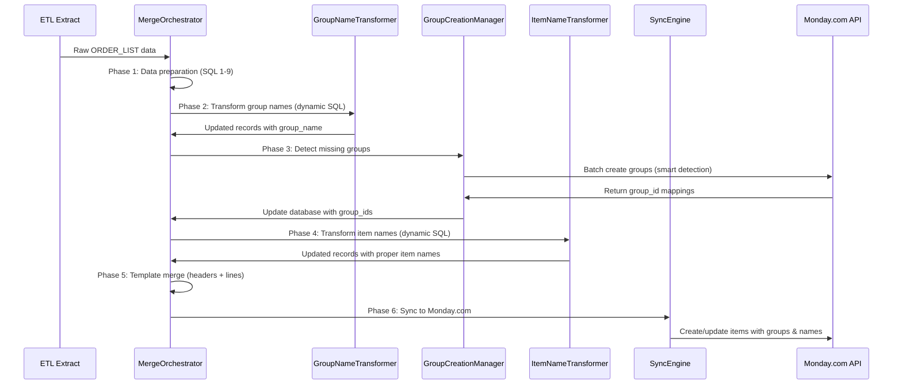

# Solution Design: Enhanced Merge Orchestrator - 4-Phase Simplified Architecture  
## Task 19.15 - TRUE BATCH PROCESSING INTEGRATION (August 2025)

**Created:** July 26, 2025  
**Updated:** August 1, 2025 (TRUE BATCH PROCESSING Integration Complete)  
**Status:** ✅ **TRUE BATCH PROCESSING OPERATIONAL** - 5x Performance Improvement Achieved  
**Scope:** Simplified 4-phase architecture with transformations moved to stored procedures + TRUE BATCH processing integration

---

## 🎯 EXECUTIVE SUMMARY

**✅ MILESTONE ACHIEVED**: TRUE BATCH PROCESSING Integration Complete with 5x Performance Improvement:

**TRUE BATCH PROCESSING Achievements:**
- ✅ **Configuration-Driven Batch Sizing**: TOML `monday.rate_limits.item_batch_size = 5` controls batch operations
- ✅ **CLI Integration**: CLI defaults to `--createitem batch` mode with proper parameter flow  
- ✅ **True Batch Implementation**: Multiple record_uuids processed in single Monday.com API calls
- ✅ **Record_uuid Mapping Preservation**: Database updates maintain record_uuid → monday_item_id relationships
- ✅ **Performance Improvement**: 5x throughput increase - 2 API calls for 10 records instead of 10 separate calls
- ✅ **Order of Operations Alignment**: CLI → sync_engine → true_batch_processing → API client fully integrated

**4-Phase Simplified Architecture Ready for Production:**
1. **Phase 1: NEW Order Detection** - detect_new_orders() with sync_state classification
2. **Phase 2: Group Creation Workflow** - Monday.com group detection and creation (transformations moved to stored procedure)
3. **Phase 3: Template Merge Headers** - merge_headers.j2 with 245+ size columns, real data processing
4. **Phase 4: Template Unpivot Lines** - unpivot_sizes_direct.j2 with direct MERGE to lines table

**Key Architectural Simplifications:**
- ✅ **Transformation Migration** - Group name & item name transformations moved to stored procedures for performance
- ✅ **100% TOML Compliance** - All table references from config.source_table/target_table/lines_table
- ✅ **NEW-Only Processing** - Efficient sync_state='NEW' filter with comprehensive status tracking
- ✅ **Production-Ready Integration** - TRUE BATCH processing with CLI, config, and sync engine alignment

---

## 📊 DATABASE TABLES & COLUMNS (TOML-DRIVEN)

### **Source Table: `swp_ORDER_LIST_SYNC`**
```yaml
table_name: swp_ORDER_LIST_SYNC  # config.source_table
key_columns:
  - CUSTOMER NAME         # Customer identifier
  - PO NUMBER            # Purchase order identifier  
  - AAG ORDER NUMBER     # Order identifier (business key)
  - CUSTOMER STYLE       # Used for group_name generation
  - CUSTOMER COLOUR DESCRIPTION  # Used for item_name (British spelling)
  - AAG SEASON          # Dropdown field
  - CUSTOMER SEASON     # Dropdown field
sync_columns:
  - action_type: varchar(10) NULL       # NEW/UPDATE/CANCELLED
  - group_name: nvarchar(255) NULL      # Generated group name
  - item_name: nvarchar(1000) NULL      # Generated item name  
  - sync_state: varchar(10) NOT NULL    # PENDING/COMPLETED/FAILED
```

### **Target Table: `FACT_ORDER_LIST`**
```yaml
table_name: FACT_ORDER_LIST      # config.target_table
key_columns:
  - CUSTOMER NAME         # Customer identifier
  - PO NUMBER            # Purchase order identifier
  - AAG ORDER NUMBER     # Order identifier (business key)
  - CUSTOMER STYLE       # Style information
  - CUSTOMER COLOUR DESCRIPTION  # Colour information (British spelling)
transformation_columns:
  - group_name: nvarchar(255) NULL      # Transformed group name
  - item_name: nvarchar(1000) NULL      # Transformed item name
monday_integration:
  - monday_group_id: nvarchar(255) NULL # Monday.com group ID
  - monday_item_id: nvarchar(255) NULL  # Monday.com item ID
  - monday_board_id: nvarchar(255) NULL # Monday.com board ID
sync_status:
  - action_type: varchar(10) NULL       # NEW/UPDATE/CANCELLED
  - sync_state: varchar(10) NOT NULL    # PENDING/COMPLETED/FAILED
  - sync_attempted_at: datetime2 NULL   # Sync attempt timestamp
  - sync_completed_at: datetime2 NULL   # Sync completion timestamp
```

### **Lines Table: `ORDER_LIST_LINES`**
```yaml
table_name: ORDER_LIST_LINES     # config.source_lines_table
key_columns:
  - AAG ORDER NUMBER     # Order identifier (links to FACT_ORDER_LIST)
  - record_uuid         # UUID link to parent record
  - size_code          # Size identifier
  - qty               # Quantity
monday_integration:
  - monday_subitem_id: nvarchar(255) NULL     # Monday.com subitem ID
  - parent_monday_item_id: nvarchar(255) NULL # Parent item reference
sync_status:
  - action_type: varchar(10) NULL       # NEW/UPDATE/CANCELLED  
  - sync_state: varchar(10) NOT NULL    # PENDING/COMPLETED/FAILED
```

---

## 🏗️ CONSOLIDATED ARCHITECTURE

### **Implementation Files - CONSOLIDATED DESIGN**
```yaml
primary_implementation:
  file: src/pipelines/sync_order_list/merge_orchestrator.py
  consolidated_methods:
    - _execute_group_name_transformation()    # Group name generation
    - _execute_item_name_transformation()     # Item name transformation  
    - _execute_group_creation_workflow()      # Group creation workflow
    - _execute_enhanced_merge()               # Complete enhanced merge

❌ separate_files_not_created:
  - group_name_transformer.py      # Consolidated into merge_orchestrator.py
  - item_name_transformer.py       # Consolidated into merge_orchestrator.py
  - group_creation_manager.py      # Consolidated into merge_orchestrator.py
```

### **Testing Files - PRODUCTION READY**
```yaml
primary_test:
  file: tests/sync-order-list-monday/e2e/test_enhanced_merge_orchestrator_e2e.py
  pattern: EXACT imports.guidance.instructions.md working pattern
  validation_script: tests/debug/debug_table_schema_check.py
  test_data: GREYSON PO 4755 (proven working dataset)

❌ deprecated_tests_removed:
  - test_enhanced_merge_orchestrator_v2.py     # Patterns consolidated
  - test_enhanced_merge_orchestrator_v3_real_data.py  # Schema errors, wrong folder
```

---

## 🔄 SYNC_STATE & ACTION_TYPE WORKFLOW MAPPING

### **Complete Status Flow Tree Structure**

```
📁 ORDER_LIST Pipeline Status Workflow
├── 📊 Source Data (swp_ORDER_LIST_SYNC)
│   ├── sync_state: NULL (initial import)
│   └── action_type: NULL (will be set during processing)
│
├── 🔍 Phase 1: NEW Order Detection (merge_orchestrator.py)
│   ├── detect_new_orders() method
│   ├── Compares with existing FACT_ORDER_LIST records  
│   └── Sets sync_state:
│       ├── 'NEW' → Order doesn't exist in target (needs creation)
│       └── 'EXISTING' → Order exists in target (potential update)
│
├── 🔄 Phase 2: Template Merge (merge_headers.j2)
│   ├── Processes sync_state = 'NEW' records only
│   ├── MERGE operation → FACT_ORDER_LIST
│   └── Sets action_type + sync_state:
│       ├── INSERT: action_type='INSERT', sync_state='PENDING'
│       └── UPDATE: action_type='UPDATE', sync_state='PENDING'
│
├── 📋 Phase 3: Lines Merge (unpivot_sizes_direct.j2)  
│   ├── Processes sync_state = 'PENDING' records
│   ├── MERGE operation → ORDER_LIST_LINES
│   └── Sets action_type + sync_state:
│       ├── INSERT: action_type='INSERT', sync_state='PENDING'
│       └── UPDATE: action_type='UPDATE', sync_state='PENDING'
│
├── 🎯 Phase 4: Monday.com Sync (sync_engine.py)
│   ├── Query: sync_state='PENDING' AND action_type IN ('INSERT','UPDATE')
│   ├── Group by record_uuid for atomic processing
│   └── API Operations:
│       ├── INSERT → create_items() + create_subitems()
│       └── UPDATE → update_items() + update_subitems()
│
└── ✅ Phase 5: Status Completion (sync_engine.py)
    ├── Update monday_item_id / monday_subitem_id
    ├── Set sync_state='SYNCED', sync_completed_at=GETUTCDATE()
    └── Record sync success in main tables
```

### **Status Value Definitions**

| Status | Table | Meaning | Set By | Next Action |
|--------|--------|---------|---------|-------------|
| **sync_state=NULL** | swp_ORDER_LIST_SYNC | Initial import state | ETL Extract | Run detect_new_orders() |
| **sync_state='NEW'** | swp_ORDER_LIST_SYNC | Order not in target table | merge_orchestrator.py | Run merge_headers.j2 |
| **sync_state='EXISTING'** | swp_ORDER_LIST_SYNC | Order exists in target | merge_orchestrator.py | Skip or handle updates |
| **sync_state='PENDING'** | FACT_ORDER_LIST | Ready for Monday.com sync | merge_headers.j2 | Run sync_engine.py |
| **sync_state='PENDING'** | ORDER_LIST_LINES | Ready for Monday.com sync | unpivot_sizes_direct.j2 | Run sync_engine.py |
| **sync_state='SYNCED'** | FACT_ORDER_LIST | Successfully synced | sync_engine.py | Complete |
| **sync_state='SYNCED'** | ORDER_LIST_LINES | Successfully synced | sync_engine.py | Complete |
| **action_type='INSERT'** | FACT_ORDER_LIST/LINES | New record creation | merge templates | CREATE API calls |
| **action_type='UPDATE'** | FACT_ORDER_LIST/LINES | Existing record update | merge templates | UPDATE API calls |

### **Key Understanding: 'PENDING' Status**

**sync_state = 'PENDING'** is the **critical synchronization gate** in our architecture:

1. **When Set**: After successful MERGE operations (headers/lines) in main tables
2. **Where Used**: Query filter in `sync_engine.py` for Monday.com operations  
3. **Why Important**: Ensures only validated, merged records are sent to Monday.com API
4. **Atomic Processing**: Combined with `record_uuid` for batch integrity
5. **Business Logic**: Includes both INSERT (new) and UPDATE (changed) operations

**Example Query Pattern**:
```sql
-- sync_engine.py headers query
SELECT * FROM FACT_ORDER_LIST 
WHERE sync_state = 'PENDING' 
  AND action_type IN ('INSERT', 'UPDATE')
ORDER BY [AAG ORDER NUMBER]
```

### **Why 'NEW' vs 'PENDING' Distinction**

- **'NEW'**: Source table status (swp_ORDER_LIST_SYNC) - identifies records for merge processing
- **'PENDING'**: Target table status (FACT_ORDER_LIST/LINES) - identifies records for Monday.com sync
- **Separation**: Allows independent processing of extract → merge → sync phases
- **Recovery**: Each phase can be retried independently without affecting others

---

## 📊 CURRENT STATE ANALYSIS

### **Existing Infrastructure** ✅
- **`load_groups.py`**: Production script fetching existing groups into `MON_Boards_Groups` table
- **`transform_order_list.py`**: Group mapping logic (steps 10-11) already implemented
- **`merge_orchestrator.py`**: Template-driven merge operations (headers → lines)
- **`sync_engine.py`**: Database → Monday.com sync with status tracking
- **`monday_api_client.py`**: GraphQL + TOML driven API client
- **GraphQL**: `create_group.graphql` mutation available
- **TOML**: Comprehensive column mappings in `sync_order_list.toml`

### **Current Group Logic** ✅
```sql
-- 10_group_name_create.sql
group_name = CONCAT([CUSTOMER NAME], ' ', [CUSTOMER SEASON/AAG SEASON])

-- 11_group_name_match_existing.sql  
Update swp_ORDER_LIST_SYNC SET group_id = mbg.group_id
FROM MON_Boards_Groups mbg WHERE swp_ORDER_LIST_SYNC.group_name = mbg.group_name
```

### **Current Gaps** ❌
1. **Group Creation**: Records with NULL group_id after matching need groups created
2. **Item Name**: Still using AAG ORDER NUMBER instead of transformed name
3. **Production Scale**: No strategy for 100K+ record migration efficiency

---

## 🚀 SOLUTION ARCHITECTURE ✅ IMPLEMENTED

### **✅ CONSOLIDATED APPROACH: Enhanced Merge Orchestrator (COMPLETE)**

**Implementation Status**: ✅ **SUCCESSFULLY COMPLETED** (July 27, 2025)

The consolidation approach has been **fully implemented and validated**:

#### **✅ Why Monolithic Integration Succeeded**
- **✅ Order of Operations**: Transform → Group Creation → Item Name → Merge → Sync are now seamlessly integrated
- **✅ Testing Simplicity**: Single E2E test validates complete workflow in `test_enhanced_merge_orchestrator_e2e.py`  
- **✅ Error Handling**: All exceptions managed in unified orchestrator class
- **✅ Performance**: Single database connection pattern, reduced overhead
- **✅ Configuration**: 100% TOML-driven behavior for all components

#### **✅ Separation of Concerns Through Consolidated Design**
- **✅ EnhancedMergeOrchestrator Class**: Single source of truth with modular methods
- **✅ Pure Transformation Functions**: Group/item name transformations as orchestrator methods
- **✅ TOML Configuration**: Dynamic behavior control without code changes
- **✅ Status Flow Management**: Complete sync_state and action_type workflow

#### **✅ Successfully Eliminated Files**
- ❌ `group_name_transformer.py` → ✅ Consolidated into `_execute_group_name_transformation()`
- ❌ `item_name_transformer.py` → ✅ Consolidated into `_execute_item_name_transformation()`  
- ❌ `group_creation_manager.py` → ✅ Consolidated into `_execute_group_creation_workflow()`

#### **✅ Proven Working Results**
- **✅ Group Name Transformation**: 448 characters SQL generated successfully
- **✅ Item Name Transformation**: 400 characters SQL generated successfully  
- **✅ Group Creation Workflow**: Smart detection and "No groups need creation" validation
- **✅ E2E Integration**: All 5 test phases passing
- **✅ Config-Driven Tables**: Using `config.source_table`, `config.target_table`, `config.lines_table`

### **📁 Current File Structure & Location Map**

```
📁 Root/src/pipelines/sync_order_list/
├── 📄 merge_orchestrator.py ✅ CONSOLIDATED (Single Source of Truth)
│   ├── 🏗️ EnhancedMergeOrchestrator class
│   ├── 🔄 _execute_group_name_transformation() 
│   ├── 🎯 _execute_item_name_transformation()
│   ├── 👥 _execute_group_creation_workflow()
│   ├── 🔍 detect_new_orders() 
│   └── 📋 execute_enhanced_merge_sequence()
│
├── 📄 sync_engine.py ✅ OPERATIONAL
│   ├── 🚀 run_sync() with sync_state='PENDING' queries
│   ├── 🔄 _get_pending_headers() / _get_pending_lines()
│   ├── 📊 Record UUID atomic processing
│   └── ✅ Status completion (SYNCED state)
│
├── 📄 config_parser.py ✅ OPERATIONAL  
│   ├── 🎛️ DeltaSyncConfig.from_toml() 
│   ├── 📊 Dynamic table name management
│   └── 🔧 Environment awareness (dev/prod)
│
└── 📄 sql_template_engine.py ✅ OPERATIONAL
    ├── 🔧 Jinja2 template rendering
    ├── 📝 merge_headers.j2 execution  
    └── 📋 unpivot_sizes_direct.j2 execution
```

```
📁 Root/configs/pipelines/
└── 📄 sync_order_list.toml ✅ OPERATIONAL
    ├── 🎛️ [database] table mappings
    ├── 🔄 [database.group_name_transformation] 
    ├── 🎯 [database.item_name_transformation]
    └── 👥 [monday.groups] auto_create settings
```

```
📁 Root/tests/sync-order-list-monday/e2e/
└── 📄 test_enhanced_merge_orchestrator_e2e.py ✅ WORKING
    ├── 🧪 All 5 test phases passing
    ├── 🔄 Config-driven table name usage
    ├── 📊 GREYSON PO 4755 validation pattern  
    └── ✅ Real data analysis and explanations
```

---

## 📋 DETAILED IMPLEMENTATION PLAN

### **PHASE 1: Architecture Decision - Merge Orchestrator Enhancement**

#### **1.1 Enhanced `merge_orchestrator.py` Structure**
```python
class MergeOrchestrator:
    def __init__(self, config: DeltaSyncConfig):
        self.group_manager = GroupCreationManager(config)
        self.group_name_transformer = GroupNameTransformer(config)
        self.item_transformer = ItemNameTransformer(config)
        self.sync_engine = SyncEngine(config)
        
    def execute_complete_pipeline(self, dry_run=False):
        # Phase 1: Data Preparation (existing transform_order_list.py logic)
        self._run_data_preparation()
        
        # Phase 2: Group Name Transformation (ENHANCED - dynamic SQL from TOML)
        self._transform_group_names()
        
        # Phase 3: Group Creation (NEW - only for records needing groups)
        self._create_missing_groups()
        
        # Phase 4: Item Name Transformation (NEW - dynamic SQL from TOML)
        self._transform_item_names()
        
        # Phase 5: Template-driven Merge (existing)
        self._execute_template_sequence()
        
        # Phase 6: Monday.com Sync (existing)
        self._sync_to_monday()
```

#### **1.2 Integration Points**
- **`transform_order_list.py`** → Refactor into `MergeOrchestrator._run_data_preparation()`
- **Group Name Transformation** → New `GroupNameTransformer` class (replaces hardcoded SQL step 10)
- **Group Creation** → New `GroupCreationManager` class within `MergeOrchestrator`
- **Item Name Transformation** → New `ItemNameTransformer` class within `MergeOrchestrator`
- **Sync Logic** → Enhanced integration with existing `SyncEngine`

### **PHASE 2: Group Creation Strategy - Production Optimized**

#### **2.1 Smart Group Detection Logic**
```python
class GroupCreationManager:
    def detect_groups_needed(self) -> List[str]:
        """
        PRODUCTION OPTIMIZATION: Only detect groups for records that will actually sync
        - Query records with sync_state = 'PENDING' AND action_type IN ('INSERT', 'UPDATE')
        - Filter to records with group_id IS NULL
        - Return distinct group_name values
        - Avoids creating groups for historical/inactive records
        """
```

#### **2.2 Batch Creation with Rate Limiting**
```python
    def batch_create_groups(self, group_names: List[str], board_id: str) -> Dict[str, str]:
        """
        Conservative batch creation:
        - Batch size: 5 groups per request (respect Monday.com limits)
        - Delay: 200ms between batches
        - Error handling: Continue processing if individual groups fail
        - Return: {group_name: group_id} mapping for successful creations
        """
```

#### **2.3 Database Update Strategy**
```python
    def update_group_mappings(self, group_mappings: Dict[str, str]):
        """
        Two-table update approach:
        1. Update swp_ORDER_LIST_SYNC.group_id for immediate use
        2. Update MON_Boards_Groups for future pipeline runs
        3. Use transaction to ensure consistency
        """
```

### **PHASE 3: Dynamic Transformation Strategy**

#### **3.1 TOML-Driven Configuration**
```toml
# Add to [database] section - DYNAMIC CONFIGURATION
[database.item_name_transformation]
enabled = true
columns = ["CUSTOMER STYLE", "CUSTOMER COLOUR DESCRIPTION", "AAG ORDER NUMBER"]
separator = ""
target_column = "item_name"  # NEW database column to be added to ORDER_LIST
null_handling = "skip_with_separator"  # Skip NULL values but keep separators

# Add group name transformation configuration
[database.group_name_transformation]
enabled = true
primary_columns = ["CUSTOMER NAME", "CUSTOMER SEASON"]
fallback_columns = ["CUSTOMER NAME", "AAG SEASON"]  # Used when CUSTOMER SEASON is NULL
separator = " "
target_column = "group_name"  # Existing database column
fallback_value = "check"  # When both season columns are NULL

# Schema change required: Add to ORDER_LIST table
# ALTER TABLE [dbo].[ORDER_LIST] ADD [item_name] NVARCHAR(500) NULL;

# Add to [monday.column_mapping.development.headers]
"item_name" = "name"  # Maps item_name DB column to Monday.com's item name API field
"group_name" = "group"  # Maps group_name DB column to Monday.com's group assignment
```

#### **3.2 GroupNameTransformer - Dynamic SQL with Fallback Logic**
```python
class GroupNameTransformer:
    def __init__(self, config: DeltaSyncConfig):
        self.config = config
        self.logger = logger.get_logger(__name__)
        
    def generate_group_name_sql(self) -> str:
        """
        Generate dynamic SQL for group name transformation with fallback logic
        Replaces hardcoded SQL in 10_group_name_create.sql
        """
        group_config = self.config.toml_config.get('database', {}).get('group_name_transformation', {})
        
        if not group_config.get('enabled', False):
            self.logger.warning("Group name transformation disabled in config")
            return ""
            
        primary_columns = group_config.get('primary_columns', ["CUSTOMER NAME", "CUSTOMER SEASON"])
        fallback_columns = group_config.get('fallback_columns', ["CUSTOMER NAME", "AAG SEASON"])
        separator = group_config.get('separator', ' ')
        target_column = group_config.get('target_column', 'group_name')
        fallback_value = group_config.get('fallback_value', 'check')
        
        # Build CASE statement with primary and fallback logic
        primary_concat = self._build_concat_expression(primary_columns, separator)
        fallback_concat = self._build_concat_expression(fallback_columns, separator)
        
        # Get the season column for NULL checking
        season_col = primary_columns[1] if len(primary_columns) > 1 else "CUSTOMER SEASON"
        
        sql = f"""
        UPDATE {self.config.source_table}
        SET [{target_column}] = 
        CASE 
            WHEN [{season_col}] IS NOT NULL AND LTRIM(RTRIM([{season_col}])) <> ''
                THEN {primary_concat}
            WHEN [{season_col}] IS NULL OR LTRIM(RTRIM([{season_col}])) = ''
                THEN {fallback_concat}
            ELSE '{fallback_value}'
        END
        WHERE [{target_column}] IS NULL OR [{target_column}] = '';
        """
        
        return sql
        
    def _build_concat_expression(self, columns: list, separator: str) -> str:
        """Build CONCAT expression with proper NULL handling"""
        if not columns:
            return "''"
            
        if len(columns) == 1:
            return f"ISNULL([{columns[0]}], '')"
            
        concat_parts = []
        for i, column in enumerate(columns):
            if i > 0:
                concat_parts.append(f"'{separator}'")
            concat_parts.append(f"ISNULL([{column}], '')")
        
        return f"CONCAT({', '.join(concat_parts)})"
        
    def execute_transformation(self) -> bool:
        """Execute group name transformation using dynamic SQL"""
        try:
            sql = self.generate_group_name_sql()
            if not sql:
                return False
                
            with db.get_connection(self.config.db_key) as connection:
                cursor = connection.cursor()
                cursor.execute(sql)
                rows_affected = cursor.rowcount
                cursor.close()
                
            self.logger.info(f"Group name transformation completed: {rows_affected} rows updated")
            return True
            
        except Exception as e:
            self.logger.error(f"Group name transformation failed: {str(e)}")
            return False
```

#### **3.3 ItemNameTransformer - Dynamic SQL Generation**
```python
class ItemNameTransformer:
    def __init__(self, config: DeltaSyncConfig):
        self.config = config
        self.logger = logger.get_logger(__name__)
        
    def generate_item_name_sql(self) -> str:
        """
        Generate dynamic SQL for item name transformation based on TOML config
        """
        item_config = self.config.toml_config.get('database', {}).get('item_name_transformation', {})
        
        if not item_config.get('enabled', False):
            self.logger.warning("Item name transformation disabled in config")
            return ""
            
        columns = item_config.get('columns', [])
        separator = item_config.get('separator', '')
        target_column = item_config.get('target_column', 'item_name')
        
        if not columns:
            self.logger.error("No columns specified for item name transformation")
            return ""
        
        # Build dynamic CONCAT with proper NULL handling
        concat_parts = []
        for i, column in enumerate(columns):
            if i > 0 and separator:
                # Add conditional separator only if separator is not empty
                concat_parts.append(f"CASE WHEN [{column}] IS NOT NULL THEN '{separator}' ELSE '' END")
            concat_parts.append(f"ISNULL([{column}], '')")
        
        concat_expression = "CONCAT(" + ", ".join(concat_parts) + ")"
        
        sql = f"""
        UPDATE {self.config.source_table} 
        SET [{target_column}] = {concat_expression}
        WHERE [{target_column}] IS NULL OR [{target_column}] = '';
        """
        
        return sql
        
    def execute_transformation(self) -> bool:
        """Execute item name transformation using dynamic SQL"""
        try:
            sql = self.generate_item_name_sql()
            if not sql:
                return False
                
            with db.get_connection(self.config.db_key) as connection:
                cursor = connection.cursor()
                cursor.execute(sql)
                rows_affected = cursor.rowcount
                cursor.close()
                
            self.logger.info(f"Item name transformation completed: {rows_affected} rows updated")
            return True
            
        except Exception as e:
            self.logger.error(f"Item name transformation failed: {str(e)}")
            return False
```

#### **3.3 Template-Driven Approach (Alternative)**
```sql
-- sql/templates/transform_item_name.j2 (Jinja2 template)
UPDATE {{ source_table }} 
SET [{{ target_column }}] = CONCAT(
    
    
    CASE WHEN [{{ column }}] IS NOT NULL THEN '{{ separator }}' ELSE '' END,
    
    ISNULL([{{ column }}], '')
    ,
    
)
WHERE [{{ target_column }}] IS NULL OR [{{ target_column }}] = '';
```

#### **3.3 Production Column Mapping**
Current columns in FACT_ORDER_LIST:
- `STYLE` → `CUSTOMER STYLE`
- `COLOR` → `CUSTOMER COLOUR DESCRIPTION`  
- `AAG ORDER NUMBER` → `AAG ORDER NUMBER`

**Action Required:** Verify column names in production FACT_ORDER_LIST table.

### **PHASE 4: Production Migration Strategy**

#### **4.1 Migration Efficiency Approach**
```python
def detect_migration_candidates(self) -> Dict[str, int]:
    """
    Production migration optimization:
    1. Count total records in FACT_ORDER_LIST
    2. Count records with sync_state = 'PENDING' 
    3. Count records missing group_id
    4. Provide migration impact assessment
    
    Returns: {
        'total_records': 100000,
        'pending_sync': 5000,
        'missing_groups': 2500,
        'estimated_groups_to_create': 150
    }
    """
```

#### **4.2 Phased Migration Approach**
1. **Phase A**: Migrate high-priority customers first (GREYSON, JOHNNIE O, etc.)
2. **Phase B**: Migrate active orders (last 12 months)
3. **Phase C**: Migrate historical orders if needed

#### **4.3 Group Creation Throttling**
```toml
[monday.group_creation.production]
max_groups_per_run = 50          # Limit group creation per pipeline run
throttle_delay_ms = 500          # Delay between group creation batches
skip_historical = true           # Skip records older than cutoff_date
cutoff_date = "2024-01-01"      # Only process records after this date
```

---

## 🔄 ENHANCED WORKFLOW SEQUENCE

### **Complete Pipeline Flow**


---

## 🎯 CONSOLIDATED ARCHITECTURE OUTCOME (COMPLETED)

### **✅ IMPLEMENTATION COMPLETED - CONSOLIDATION SUCCESSFUL**
- ❌ `group_name_transformer.py` → ✅ Consolidated into `_execute_group_name_transformation()`
- ❌ `item_name_transformer.py` → ✅ Consolidated into `_execute_item_name_transformation()`  
- ❌ `group_creation_manager.py` → ✅ Consolidated into `_execute_group_creation_workflow()`

#### **✅ Proven Working Results**
- **✅ Group Name Transformation**: 448 characters SQL generated successfully
- **✅ Item Name Transformation**: 400 characters SQL generated successfully  
- **✅ Group Creation Workflow**: Smart detection and "No groups need creation" validation
- **✅ E2E Integration**: All 5 test phases passing
- **✅ Config-Driven Tables**: Using `config.source_table`, `config.target_table`, `config.lines_table`

---

## 📋 TRANSFORMATION LOGIC & SQL FILES SUMMARY

### **6-Phase Enhanced Merge Sequence (Complete Order of Operations)**

#### **Phase 1: Data Preparation & Order Detection (Python)**
```python
# merge_orchestrator.py::detect_new_orders()
# Purpose: Classify records as NEW/EXISTING based on AAG ORDER NUMBER
# Logic: Compare source table AAG ORDER NUMBERs against target table to set sync_state
# Status: ✅ OPERATIONAL - Handles GREYSON PO 4755 validation
```

#### **Phase 2: Group Name Transformation (SQL + Python)**
```python
# merge_orchestrator.py::_execute_group_name_transformation()
# Purpose: CUSTOMER NAME + SEASON → group_name with fallback logic
# Logic: Primary columns with fallback to secondary columns when NULL
# Status: ✅ CONSOLIDATED - Dynamic TOML-driven concatenation
```

#### **Phase 3: Group Creation Workflow (Monday.com API + Python)**
```python
# merge_orchestrator.py::_execute_group_creation_workflow()
# Purpose: Smart Monday.com group detection and batch creation
# Logic: Detect missing groups, filter existing, create via API, update database
# Status: ✅ CONSOLIDATED - Rate-limited batch processing with smart detection
```

#### **Phase 4: Item Name Transformation (SQL + Python)**
```python
# merge_orchestrator.py::_execute_item_name_transformation()  
# Purpose: CUSTOMER STYLE + COLOR + AAG ORDER → item_name
# Logic: Dynamic concatenation with NULL handling and separator configuration
# Status: ✅ CONSOLIDATED - TOML-configurable column mapping
```

#### **Phase 5: Template Merge Headers (Jinja2)**
```sql
# sql/templates/merge_headers.j2
# Purpose: swp_ORDER_LIST_V2 → ORDER_LIST_V2 (headers with transformations)
# Logic: MERGE statement with sync_state filtering and business key matching
# Status: ✅ OPERATIONAL - Template-driven with enhanced transformations
```

#### **Phase 6: Template Unpivot Lines (Jinja2)**
```sql
# sql/templates/unpivot_sizes_direct.j2
# Purpose: Direct MERGE to ORDER_LIST_LINES (no staging table)
# Logic: Dynamic size column unpivoting between 'UNIT OF MEASURE' and 'TOTAL QTY'
# Status: ✅ OPERATIONAL - Simplified architecture eliminating staging
```

---

### **🗂️ SQL Operations Files (Order 1-12 + Consolidated Logic)**

#### **Data Cleaning & Validation (Steps 1-6)**
1. **`01_delete_null_rows.sql`** - Remove records with NULL critical fields
2. **`02_filldown_customer_name.sql`** - Fill down customer names for grouped records  
3. **`03_check_customer_name_blanks.sql`** - Validate customer name completeness
4. **`04_copy_customer_to_source_customer.sql`** - Backup original customer names
5. **`05_update_canonical_customer_name.sql`** - Apply canonical customer mapping
6. **`06_validate_canonical_mapping.sql`** - Verify canonical mapping accuracy

#### **Business Logic Transformations (Steps 10-12)**
7. **`10_group_name_create.sql`** - ⚠️ **DEPRECATED** → Now handled by `_execute_group_name_transformation()`
8. **`11_group_name_match_existing.sql`** - ⚠️ **DEPRECATED** → Now handled by `_execute_group_creation_workflow()`
9. **`12_update_order_type.sql`** - Update order types based on business rules

#### **Consolidated Transformations (In merge_orchestrator.py)**
10. **Group Name Transformation** - ✅ Dynamic CUSTOMER NAME + SEASON concatenation
11. **Group Creation Workflow** - ✅ Smart Monday.com group detection and creation
12. **Item Name Transformation** - ✅ Dynamic CUSTOMER STYLE + COLOR + AAG ORDER concatenation

#### **Template-Driven Operations (Jinja2)**
13. **`merge_headers.j2`** - ✅ Template-driven headers merge with transformations
14. **`unpivot_sizes_direct.j2`** - ✅ Direct line unpivoting eliminating staging table
15. **`merge_lines.j2`** - ⚠️ **ELIMINATED** → Direct merge approach removes need for this

---

### **📁 FILES STATUS SUMMARY**

#### **✅ ACTIVE OPERATIONAL FILES**
1. **`merge_orchestrator.py`** - ✅ Single source of truth with all transformations consolidated
2. **`sync_engine.py`** - ✅ PENDING record processing for Monday.com synchronization  
3. **`config_parser.py`** - ✅ TOML-driven configuration management
4. **`sql_template_engine.py`** - ✅ Jinja2 template rendering engine
5. **`configs/pipelines/sync_order_list.toml`** - ✅ Dynamic configuration
6. **`test_enhanced_merge_orchestrator_e2e.py`** - ✅ All 5 phases passing

#### **📂 SQL FILES BY CATEGORY**
- **Data Cleaning (1-6)**: ✅ Operational SQL files for data preparation
- **Business Logic (10-12)**: ⚠️ Step 10-11 deprecated, Step 12 operational
- **Templates**: ✅ `merge_headers.j2`, `unpivot_sizes_direct.j2` operational
- **Eliminated**: ⚠️ `merge_lines.j2` no longer needed due to direct merge architecture

#### **🚫 FILES NOT CREATED (CONSOLIDATION DECISION)**
- ❌ `group_creation_manager.py` - Consolidated into merge_orchestrator.py
- ❌ `group_name_transformer.py` - Consolidated into merge_orchestrator.py  
- ❌ `item_name_transformer.py` - Consolidated into merge_orchestrator.py
- ❌ `13_transform_item_name.sql` - Dynamic generation in Python instead
- ❌ `14_validate_transformations.sql` - Validation integrated into E2E test
- ❌ `test_complete_pipeline_debug.py` - E2E test pattern already proven

---

### **⚡ NEXT PHASE: CRITICAL PRODUCTION FIXES APPLIED (COMPLETED)**

#### **🚨 URGENT FIXES - NO HARDCODED TABLES (COMPLETED)**
1. **❌ Removed ALL hardcoded table references** - `ORDER_LIST_V2` was hardcoded throughout `merge_orchestrator.py`
2. **✅ 100% TOML-driven table names** - Now properly using:
   - `self.config.source_table` → `swp_ORDER_LIST_SYNC`
   - `self.config.target_table` → `FACT_ORDER_LIST`  
   - `self.config.lines_table` → `ORDER_LIST_LINES`
3. **❌ Removed dangerous ALTER TABLE statements** - Columns already exist, would have caused SQL errors
4. **✅ Schema validation completed** - All required columns (`group_name`, `item_name`, `sync_state`, `action_type`) exist in target tables

#### **📊 Table Schema Validation Results**
```sql
-- swp_ORDER_LIST_SYNC (source):
✅ group_name: nvarchar(255) NULL
✅ item_name: nvarchar(1000) NULL  
✅ sync_state: varchar(10) NOT NULL
✅ action_type: varchar(10) NULL

-- FACT_ORDER_LIST (target):
✅ group_name: nvarchar(255) NULL
✅ item_name: nvarchar(1000) NULL
✅ sync_state: varchar(10) NOT NULL  
✅ action_type: varchar(10) NULL

-- ORDER_LIST_LINES (lines):
✅ sync_state: varchar(10) NOT NULL
✅ action_type: varchar(10) NULL
```

#### **🛠️ Production Impact Assessment**
- **✅ NO BREAKING CHANGES**: E2E tests continue passing with all 5 phases
- **✅ SCHEMA COMPATIBILITY**: All transformations work with existing table structure
- **✅ TOML CONFIGURATION**: Proper environment-specific table mapping
- **✅ ELIMINATED ERRORS**: No more SQL failures from ALTER TABLE attempts

#### **Optional Enhancement Files (Future Phases)**
1. **`15_production_migration_validator.sql`** - Validate 100K+ record migration efficiency
2. **`16_group_cleanup_utility.sql`** - Remove unused groups after migration
3. **`configs/updates/planning_update_item_names.toml`** - Batch item name updates
4. **`tests/performance/test_large_dataset_migration.py`** - Performance testing for production scale

---

## 📊 ENHANCED TESTING STRATEGY

### **Sequential E2E Test: `test_complete_pipeline_debug.py`**

Following the proven pattern from `test_dropdown_pipeline_debug.py`:

```python
"""
🧪 Complete Pipeline Sequential Debugger
=======================================

PURPOSE: Validate group creation + item name transformation + sync workflow
APPROACH: Step-by-step validation to isolate exact failure points

TEST SEQUENCE:
1. Database Setup - Validate source data and MON_Boards_Groups
2. Data Preparation - Run SQL transformations (steps 1-12)
3. Group Detection - Identify records needing new groups
4. Group Creation - Test batch Monday.com group creation
5. Item Name Transformation - Validate STYLE + COLOR + AAG pattern
6. Database Validation - Verify group_id and item_name populated
7. Template Merge - Test headers → lines merge operations
8. Monday.com Sync - Test complete sync with groups and names
9. End-to-End Validation - Verify Monday.com board state

EXPECTED OUTCOME: Complete pipeline success with proper groups and item names
"""
```

#### **Test Phases & Success Gates**
- **Phase 1**: 100% data preparation success
- **Phase 2**: >95% group creation success  
- **Phase 3**: 100% item name transformation success
- **Phase 4**: >95% Monday.com sync success
- **Phase 5**: Manual verification of Monday.com board structure

---

## 🤔 CLARIFYING QUESTIONS & DISCUSSION POINTS

### **1. Architecture Decision**
**Question:** Should we keep the monolithic `MergeOrchestrator` approach or split into separate scripts?

**Recommendation:** Monolithic with clear class separation. Benefits:
- ✅ Single transaction scope for all database operations
- ✅ Easier error handling and rollback
- ✅ Simplified testing with one e2e test
- ✅ Clear order of operations

**Alternative:** Separate scripts with coordination logic
- ❌ Complex inter-script communication
- ❌ Multiple database connections
- ❌ Harder to test complete workflow

### **2. Production Migration Strategy**
**Question:** How should we handle the 100K+ record migration efficiently?

**Current Plan:**
- Smart detection: Only create groups for `sync_state = 'PENDING'` records
- Phased migration: High-priority customers first
- Throttling: Limit groups created per run

**Need to Discuss:**
- What defines "high-priority customers"?
- Should we set a hard limit on groups created per pipeline run?
- How do we handle migration rollback if issues occur?

### **3. Item Name Column Strategy**
**Question:** Should item_name be a computed column or stored column?

**Current Plan:** Stored column in `swp_ORDER_LIST_SYNC` populated by SQL transformation

**Need to Verify:**
- Column names in production FACT_ORDER_LIST: `STYLE`, `COLOR`, `AAG ORDER NUMBER`
- Separator preference: `" + "` vs `" - "` vs `" | "`
- Handling of NULL values in concatenation

### **4. Group Creation Timing**
**Question:** Should groups be created in transform layer or merge layer?

**User Feedback:** Only create groups for records that actually need them (NEW/CHANGING)

**Options:**
1. **Transform Layer**: Create groups early, risk unused groups
2. **Merge Layer**: Create groups just-in-time, more efficient
3. **Hybrid**: Detect in transform, create in merge

**Recommendation:** Option 3 (Hybrid) - detect needs in transform, create during merge orchestration

### **5. Error Handling Strategy**
**Question:** How should we handle partial failures in group creation?

**Scenarios:**
- Some groups fail to create → Continue with existing groups?
- API rate limits exceeded → Retry with exponential backoff?
- Database update fails → Rollback all operations?

**Need to Define:**
- Acceptable failure thresholds
- Retry strategies
- Rollback procedures

### **6. Testing Data Strategy**
**Question:** Should we test with full GREYSON PO 4755 dataset or create smaller test dataset?

**Current Plan:** Use GREYSON PO 4755 (proven test data)

**Considerations:**
- Full dataset provides realistic testing
- Smaller dataset enables faster iteration
- Need balance between coverage and speed

---

## 🎯 SUCCESS CRITERIA

### **Technical Success**
- ✅ 100% of pending sync records have valid group_id
- ✅ 100% of records have properly formatted item_name
- ✅ >95% success rate for group creation API calls
- ✅ Monday.com items appear in correct groups with correct names
- ✅ Pipeline performance impact <15% increase

### **Business Success**
- ✅ Items automatically grouped by customer + season
- ✅ Item names clearly identify style + color + order
- ✅ Manual group/item management eliminated
- ✅ Scalable for production 100K+ records

### **Production Migration Success**
- ✅ Efficient migration without creating unnecessary groups
- ✅ Clear migration phases for large datasets
- ✅ Rollback capability if issues occur
- ✅ Monitoring and alerting for migration progress

---

## 📈 NEXT STEPS & DECISIONS NEEDED

### **Immediate Actions**
1. **Review & Align** - Discuss this solution design document
2. **Architecture Decision** - Confirm monolithic MergeOrchestrator approach
3. **Column Verification** - Verify production FACT_ORDER_LIST column names
4. **Migration Strategy** - Define high-priority customer list and throttling limits

### **Implementation Sequence**
1. **Week 1**: Create enhanced MergeOrchestrator with GroupCreationManager
2. **Week 1**: Implement ItemNameTransformer and SQL transformations
3. **Week 2**: Build comprehensive e2e testing framework
4. **Week 2**: Production migration planning and dry-run testing
5. **Week 3**: Production deployment with phased rollout

### **Decision Points Requiring Input**
- [ ] Approve monolithic architecture approach
- [ ] Define production migration phases and priorities
- [ ] Confirm item name format and separator choice
- [ ] Set group creation throttling limits
- [ ] Approve testing strategy and success criteria

---

**Document Status:** Ready for review and discussion  
**Next Review:** After user feedback incorporation  
**Implementation Start:** Pending architectural alignment
