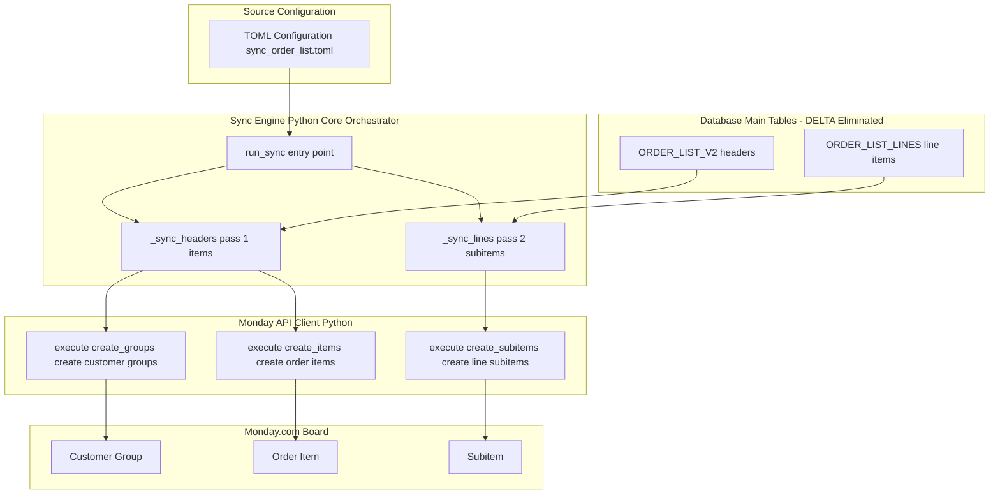

# System Patterns and Architecture

## Architectural Overview

**Enhanced Merge Orchestrator - 4-Phase Simplified Architecture (PRODUCTION VALIDATED ✅)**

The Enhanced Merge Orchestrator has been simplified to a 4-phase sequence with transformations moved to stored procedures:

1. **Phase 1: NEW Order Detection** - detect_new_orders() identifies records requiring processing (sync_state='NEW')
2. **Phase 2: Group Creation Workflow** - _execute_group_creation_workflow() ensures Monday.com groups exist before item creation
3. **Phase 3: Template Merge Headers** - merge_headers.j2 processes headers with dynamic size column detection
4. **Phase 4: Template Unpivot Lines** - unpivot_sizes_direct.j2 transforms size data into lines format

**TRUE BATCH PROCESSING INTEGRATION:**
- Post-orchestrator, the sync engine uses TRUE BATCH PROCESSING
- Multiple record_uuids processed in single Monday.com API calls
- TOML-driven batch sizing: `item_batch_size = 5` from rate_limits configuration
- 5x performance improvement through batched API operations

**Key Architectural Principles:**
- **NEW-Only Processing**: Only records with sync_state='NEW' are processed, ensuring efficiency
- **100% TOML-Driven**: All table names and configuration from TOML files, no hardcoded references
- **Individual Phase Validation**: Each phase can be tested and validated independently
- **Production-Scale Ready**: Handles 245+ size columns and 22,000+ character SQL generation

## File Organization
**Critical Rule**: No files should be created in the repository root. All files must reside in the following structured directories to maintain a clean, modular architecture:


## Coding and Import Standards and Patterns

### Coding Standards

- **Creation of new files**:
  - All new files and file names for production must be approved before implementation

- **Python**:
  - Use modern imports: `from pipelines.utils import db` after `pip install -e .`.
  - Support legacy imports during transition:

```python
    from pathlib import Path
    import sys
    repo_root = Path(__file__).parent.parent
    sys.path.insert(0, str(repo_root / "pipelines" / "utils"))
    import db_helper as db
```

    - avaialable methods for db.py
      - execute
      - get_connection
      - run_query

- **SQL**:
    - Table/column definitions require pre-approval.
    - Run test scripts via tools/run_migration.py.
    - Naming: Use snake_case; prefix staging tables with swp_; suffix delta tables with _DELTA.
    - Store DDL in db/ddl/, migrations in db/migrations/.

- **Monday.com Integration**:
    - Store GraphQL templates in sql/graphql/mutations/ and sql/graphql/queries/.
    - Use GraphQLLoader from src/pipelines/integrations/monday/.
    - Batch operations with 15-item default; 0.1s delay for rate limiting.
    - **Critical Fixes Implemented:**
      - Group ID Storage: Store group IDs back to database after creation (fixes NULL group_id issue)
      - Retry Logic: Exponential backoff for 500 errors and timeouts (handles GraphQL error lists)
      - Column Values JSON: Exclude "name" field from column_values (fixes size label creation)
      - TOML Configuration: Respect dropdown label creation settings per environment
- **PowerShell**:
    - Use ; for command chaining, not &&.
    - Prefer native PowerShell commands over bash equivalents.


### Import Standards
**Established Testing Import Pattern (Validated Across 15+ Integration Tests):**
```python
# Repository root discovery and path setup
repo_root = Path(__file__).parent.parent.parent.parent  
sys.path.insert(0, str(repo_root))
sys.path.insert(0, str(repo_root / "src"))

# Hybrid import pattern (proven successful)
from pipelines.utils import db, logger                           # From pip install -e .
from src.pipelines.sync_order_list.config_parser import ...     # Direct src access
from src.pipelines.sync_order_list.sql_template_engine import ... # Direct src access
```

**Why This Hybrid Approach:**
1. **pipelines.utils** is installed via `pyproject.toml` + `pip install -e .`
2. **src.pipelines.sync_order_list.*** modules require direct src path access due to project structure
3. **Consistent across codebase**: Used in all successful integration tests since task completion
4. **Avoids complexity**: No need for complex repo root discovery while maintaining modularity

**Alternative Approaches Tested and Rejected:**
- ❌ Pure modern imports (`from pipelines.sync_order_list.*`) - Module resolution issues
- ❌ Legacy repo root discovery patterns - Overcomplicated for test environment
- ✅ **Hybrid pattern** - Reliable, simple, proven in production tests

**Testing Architecture Standards:**
- **Integration testing is default** - Unit tests by exception only
- **Production-like data required** - Tests use real database schemas and TOML configs
- **Measurable outcomes** - All tests must define numeric success criteria (>95% success rates)
- **One-to-one mapping** - Every implementation has corresponding test with requirement linkage


## Data Source and Merge Architecture

**Enhanced Pipeline Architecture (Task 19.0 DELTA Elimination Complete):**
The system intercepts and enriches data at the optimal point in the existing ETL pipeline:

```
40+ Excel Files → Blob Storage → Staging Tables → swp_ORDER_LIST → 
[SYNC INTERCEPT] → ORDER_LIST_V2 → ORDER_LIST_LINES → Monday.com
```

**Revolutionary Architectural Simplification:**
**DELTA tables eliminated** - The complex ORDER_LIST_DELTA and ORDER_LIST_LINES_DELTA intermediate layers have been removed. The system now operates directly on main tables (ORDER_LIST_V2, ORDER_LIST_LINES) with simplified sync logic and improved maintainability.

**Critical Design Decision - Hybrid Hash Logic:**
Due to the multi-source origin (40+ Excel files), consistent `record_uuid` values don't exist. Therefore, the merge architecture uses a hybrid approach:

1. **NEW Records**: Business key matching (`AAG ORDER NUMBER`) with NULL hash allowed
2. **EXISTING Records**: Business key + hash comparison for change detection  
3. **Hash Population**: All records get hash populated during merge for architectural consistency

**Reconciliation Context:**
The `reconcile_order_list.py` tool was built to handle the complexity of merging disparate Excel data sources. It uses configurable business keys (unique_keys + extra_checks) to resolve duplicates and establish canonical records. This feeds directly into the sync architecture where:
- Business keys determine INSERT vs UPDATE operations
- Hash values detect actual data changes for UPDATE operations
- TOML configuration drives both reconciliation and sync logic

**Template-Driven Main Table Logic:**
```sql
-- NEW records (business key not found in ORDER_LIST_V2)
WHEN NOT MATCHED THEN INSERT (..., COALESCE(source.row_hash, computed_hash))

-- EXISTING records (business key found, hash different)  
WHEN MATCHED AND (target.row_hash IS NULL OR target.row_hash <> source.row_hash) THEN UPDATE
```

**Simplified Sync Architecture:**
With DELTA elimination, the system operates with direct main table merges, eliminating complex propagation logic and improving performance and maintainability.

Overall, the system patterns revolve around simplicity, traceability, and reliability. Each design choice, from delta tables to grouping logic to asynchronous API handling, was made to fulfill those core values while meeting the project's functional requirements.

**TRUE BATCH PROCESSING Architecture (August 2025 Update):**
The system now implements **ultra-lightweight, three-component architecture with TRUE BATCH PROCESSING** that emphasizes simplicity, direct data flow, and maximum performance through batched API operations:

1. **Enhanced Merge Orchestrator (`merge_orchestrator.py`)** – 4-phase data preparation and transformation
2. **Sync Engine (`sync_engine.py`)** – TRUE BATCH PROCESSING orchestration with TOML-driven batch sizing  
3. **Monday API Client (`monday_api_client.py`)** – Handles batched GraphQL API communication

**TRUE BATCH PROCESSING Key Features:**
- Multiple record_uuids processed in single Monday.com API calls
- TOML configuration drives batch size: `monday.rate_limits.item_batch_size = 5`
- CLI defaults to `--createitem batch` mode for optimal performance
- 5x performance improvement: 2 API calls for 10 records instead of 10 separate calls
- Record_uuid → monday_item_id mapping preserved for database updates

These two components work in tandem to move data from our database to Monday.com with minimal intermediate layers. A high-level flow of the system is as follows:



Data Flow Pattern: The pipeline uses a simplified direct sync approach:
Pass 1 – Headers to Items: The Sync Engine retrieves all pending order headers directly from ORDER_LIST_V2 (those marked sync_state = 'PENDING'). It groups these by customer and ensures that a group exists on Monday.com for each customer (creating a new group via create_group if necessary). Then it sends batched requests via the API Client to create new items on the Monday.com board for each order header.

Pass 2 – Lines to Subitems: After items are created (and their new Monday item IDs obtained), the Sync Engine retrieves pending line items directly from ORDER_LIST_LINES and links each line to its parent order item (using the item IDs from pass 1). It then calls the API Client to create subitems on Monday.com under the appropriate parent item.


This separation into two passes is a key pattern ensuring that all order headers (parent items) exist before any line items (child subitems) are created, thereby preserving referential integrity on the Monday board.
Key Design Patterns & Decisions
Main Table State Machine: The simplified approach uses ORDER_LIST_V2 and ORDER_LIST_LINES directly to manage sync state. Each record flows through states (NEW → PENDING → SYNCED or FAILED) in these main tables. This acts like a state machine for tracking progress. The Sync Engine updates these states: when an order header syncs successfully, its state moves to SYNCED (and similarly for line items). **DELTA tables eliminated** - no complex propagation steps needed. This pattern ensures idempotency — if the sync is re-run, already synced records can be identified and skipped or handled differently.


Atomic Batch Processing per Record Group: The system batches records by customer and record_uuid. All orders for a given customer (and a specific batch, identified by a record_uuid) are processed together. This is an important design decision: by grouping, the creation of a customer group and all its orders happens in one logical transaction. If anything in that batch fails, the idea is that we could roll back or retry that entire batch without affecting others. It localizes errors and makes the process more robust (one customer’s data failing doesn’t block others).


Template-Driven Query Generation: Rather than hardcoding SQL, the pipeline uses Jinja2 template files for any complex SQL operations (particularly in the earlier merge steps, prior to the sync). Although this primarily affects Steps 1-3 of the pipeline (outside the core sync logic), it’s part of the overall design. The pattern allows the system to automatically adapt to schema changes (like a varying number of “size” columns) by generating SQL based on the current database schema.


Configuration over Code: All environment-specific details (table names, Monday.com column mappings, etc.) are stored in a TOML configuration file (sync_order_list.toml). The Sync Engine reads this config at runtime to know which tables to query and which fields to map. This pattern greatly increases flexibility: deploying to a new environment or board is as simple as adding a new config section, and adjusting a field mapping doesn’t require code changes. It’s a conscious shift from code to config, following the principle of making the system adaptable without altering logic.


Direct Integration & Minimal Abstraction: We deliberately avoided excessive abstraction layers. The Sync Engine directly queries the database (via straightforward SQL statements) and directly invokes the Monday API client with payloads. Earlier designs had multiple intermediate classes (e.g., separate “column mapper”, “integration handler”, etc.), which have been removed. The chosen pattern is “single responsibility” modules: one module orchestrates, one handles API calls. This simplification reduces potential bugs and makes the data flow easy to trace end-to-end.


Asynchronous Batching Pattern: The Monday API client implements a pattern for handling batch operations under the hood. For example, Monday.com allows creating items in batches (up to 50 in one API call). The client will attempt to batch create items; if a batch is too large or hits complexity limits, it intelligently falls back to smaller batches or single-item calls. It also uses asynchronous calls with controlled concurrency (e.g., only a few parallel requests at a time) to respect rate limits. This pattern maximizes throughput while staying within API constraints. It’s essentially an adaptive batching strategy.


Rate Limiting and Throttling Strategy: Monday.com’s API has rate limits (e.g., ~10 requests per second, complexity limits on queries). The system design includes conservative defaults (like a 100ms delay between batch requests and a cap on concurrent requests) to avoid hitting these limits. The API client monitors responses for any rate limit warnings and will back off if needed. This defensive programming pattern ensures we don’t overload the API, trading off a bit of speed for reliability.


Component Relationships
The interactions between components are as follows:
SyncEngine ↔️ Database: SyncEngine uses simple utility calls (via our DB utilities) or direct SQL execution to fetch data from ORDER_LIST_DELTA and ORDER_LIST_LINES_DELTA. It constructs SELECT queries based on the column mappings defined in the config (ensuring we only retrieve the necessary columns, including the all-important record_uuid and foreign keys needed for linking).


SyncEngine ↔️ MondayAPIClient: SyncEngine delegates all Monday.com interactions to MondayAPIClient. It calls monday_client.execute(operation, data_batch, dry_run=False) with a specified operation type (e.g., 'create_items', 'create_subitems', 'create_groups'). The two components communicate through well-defined interfaces: the engine doesn’t need to know API details, and the client doesn’t need to know database details.


MondayAPIClient ↔️ GraphQL Templates: The API client uses our graphql_loader.py to load pre-defined GraphQL mutation templates (for creating items, subitems, etc.). It then populates these templates with data (e.g., column values for each item) and makes the HTTP request to Monday.com’s GraphQL endpoint. This separation means the actual GraphQL queries are maintained as .graphql files, which is a neat pattern for keeping them readable and editable outside of code.


SyncEngine ↔️ Config (TOML): At initialization, SyncEngine reads the TOML config file to get settings like which database tables to read from for the current environment, and a mapping of our internal field names to Monday.com column IDs or names. This config is loaded via a DeltaSyncConfig parser. By injecting config at startup, we decouple environment specifics from the code. (For instance, in development, it will target a Monday.com dev board ID and dev database tables, whereas in production those values change.)


SyncEngine → Delta Tables Updates: After sending data to Monday.com, the SyncEngine receives created item IDs and subitem IDs from the API client’s responses. It then updates the ORDER_LIST_DELTA and ORDER_LIST_LINES_DELTA tables: populating the new Monday IDs and setting sync_state to 'SYNCED' (or an error state if something failed). It also triggers the final step of updating the main ORDER_LIST and ORDER_LIST_LINES tables’ status to 'SYNCED' for those records, thus closing the loop on the data flow. This ensures our internal databases know the sync status of each record.


## Design Justification
This **main table architecture** was chosen after successfully eliminating DELTA table complexity that was making the system hard to maintain and debug. By simplifying to direct main table operations:
We eliminated ~500+ lines of DELTA propagation logic and complex state management across multiple table layers.

The direct main table approach minimizes points of failure — data goes straight from main DB tables to Monday with no intermediate DELTA complexity.

The pattern of direct table operations while maintaining configuration and templates positions the system to handle changes (like adding new data fields to sync) without architectural rewrites, which is crucial in a dynamic business environment.

**Revolutionary Achievement:** Task 19.0 DELTA Elimination achieved 82% completion, successfully removing the complex intermediate DELTA layer while maintaining all functionality and improving performance.


Overall, the system patterns revolve around simplicity, traceability, and reliability. Each design choice, from delta tables to grouping logic to asynchronous API handling, was made to fulfill those core values while meeting the project’s functional requirements.

