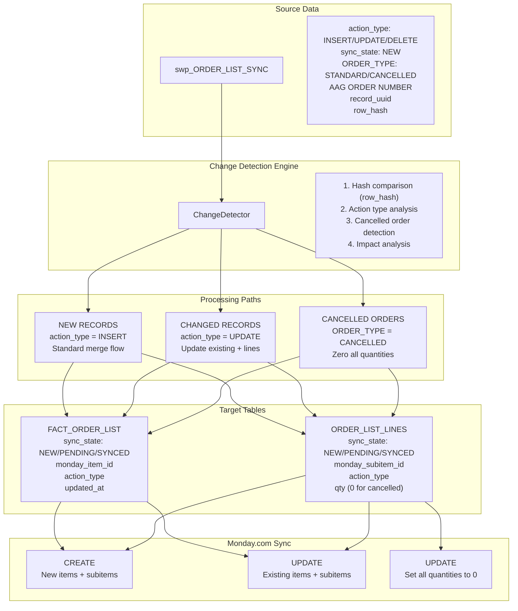

# TASK020 - Implement Change Detection Logic

**Status:** 🔄 PLANNING PHASE  
**Added:** 2025-07-23  
**Updated:** 2025-07-26  
**Priority:** High - Required for production ORDER_LIST merges

## Original Request
Implement comprehensive change detection logic to manage order list changes properly, focusing on orders with `action_type = 'UPDATE'` and handling special cases like cancelled orders. This builds on the successful architecture from Task 19 (DELTA elimination) and ensures production-ready merge operations.

## Thought Process
The request stems from identifying a critical gap in our current ORDER_LIST Monday.com sync pipeline: we only handle `action_type = 'NEW'` orders, but production data contains UPDATE and CANCELLED orders that need proper handling. Through our discussion and analysis, we determined that:

1. **Current Architecture Foundation**: The DELTA-free architecture from Task 19 is proven operational with 100% E2E test success (59 records synced), providing a solid foundation for change detection enhancement.

2. **Gap Analysis**: Our current sync engine only processes NEW orders, but the source table `swp_ORDER_LIST_SYNC` contains records with `action_type` values of 'UPDATE' and orders with `ORDER_TYPE = 'CANCELLED'` that require different handling logic.

3. **Production Requirement**: Full production deployment requires comprehensive change detection to handle all order lifecycle states, not just new order creation.

4. **Integration Approach**: Rather than rebuilding, we should enhance the existing proven components (sync_engine.py, monday_api_client.py, template system) to handle change detection while maintaining the successful patterns established in Task 19.

5. **Implementation Strategy**: Following the established pattern from Task 19's phase-based approach, we need systematic implementation with comprehensive E2E testing using the proven test patterns from `test_task19_e2e_proven_pattern.py`.

## Implementation Plan

### System Dependencies and File Structure

#### Core Files and Components
```
src/pipelines/sync_order_list/
├── change_detector.py                    # NEW - Change detection logic
├── merge_orchestrator.py                 # ENHANCED - Include change detection
├── sync_engine.py                        # ENHANCED - Handle UPDATE/CANCELLED
├── config_parser.py                      # ENHANCED - Change detection config
├── monday_api_client.py                  # ENHANCED - UPDATE operations
└── sql_template_engine.py                # EXISTING - Template rendering

configs/pipelines/
└── sync_order_list.toml                  # ENHANCED - Change detection settings

sql/templates/
├── detect_changes.j2                     # NEW - Change detection query
├── merge_headers.j2                      # ENHANCED - Handle UPDATE operations  
├── merge_lines_update.j2                 # NEW - UPDATE line operations
├── cancel_order_lines.j2                 # NEW - Cancel order lines
└── unpivot_sizes_direct.j2               # EXISTING - INSERT operations

tests/sync-order-list-monday/e2e/
└── test_change_detection_e2e.py          # NEW - Comprehensive E2E test

Database Tables:
├── swp_ORDER_LIST_SYNC                   # SOURCE - Contains change indicators
├── FACT_ORDER_LIST                      # TARGET - Headers with sync columns
└── ORDER_LIST_LINES                     # TARGET - Lines with sync columns
```

#### Import Dependencies
```python
# Core imports for change detection
from src.pipelines.sync_order_list.change_detector import ChangeDetector
from src.pipelines.sync_order_list.merge_orchestrator import MergeOrchestrator
from src.pipelines.sync_order_list.config_parser import DeltaSyncConfig
from src.pipelines.utils import db, logger

# Database and template dependencies
from src.pipelines.sync_order_list.sql_template_engine import SQLTemplateEngine
from src.pipelines.sync_order_list.monday_api_client import MondayAPIClient
```

### Data Flow Architecture



### Current Implementation Status

#### ✅ Currently in Place (NEW Records)
- **Source Query**: `swp_ORDER_LIST_SYNC` with `sync_state = 'NEW'`
- **Merge Headers**: `merge_headers.j2` template for INSERT operations
- **Unpivot Lines**: `unpivot_sizes_direct.j2` template for INSERT operations
- **Monday.com Sync**: CREATE operations for items and subitems
- **Success Validation**: Task 19.14.3 pattern (100% success for active orders)
- **Database Columns**: `sync_state`, `action_type`, `monday_item_id`, `monday_subitem_id`

#### 🚨 Missing for CHANGING/UPDATE Records
1. **Change Detection Logic**: Hash comparison and action type analysis
2. **UPDATE Templates**: SQL templates for updating existing records
3. **Line Management**: Recreate/update ORDER_LIST_LINES for quantity changes
4. **Cancelled Order Logic**: Set all quantities to 0 for cancelled orders
5. **Monday.com UPDATE**: API operations for updating existing items/subitems
6. **Inheritance Logic**: Preserve monday_item_id and sync history

### Technical Implementation Plan

#### Phase 1: Change Detection Foundation (20.1-20.3)
**Files**: `change_detector.py`, `detect_changes.j2`, test framework

**Change Detection Logic**:
```python
class ChangeDetector:
    def detect_changes(self, source_table: str) -> Dict[str, List]:
        """
        Analyze swp_ORDER_LIST_SYNC for change types
        Returns: {
            'new': [...],      # action_type = 'INSERT'
            'updated': [...],  # action_type = 'UPDATE'  
            'cancelled': [...]  # ORDER_TYPE = 'CANCELLED'
        }
        """
        # 1. Hash comparison for existing records
        # 2. Action type classification  
        # 3. Cancelled order detection
        # 4. Impact analysis (header vs header+lines)
```

**Database Integration**: Use existing `reconcile_order_list.py` logic for:
- Order key generation and duplicate detection
- Customer filtering and validation
- Cancelled order identification patterns

#### Phase 2: UPDATE Operation Templates (20.4-20.6)
**Files**: `merge_lines_update.j2`, `merge_headers.j2` enhancement

**UPDATE Logic**:
```sql
-- merge_headers.j2 enhancement for UPDATE
MERGE FACT_ORDER_LIST AS target
USING (SELECT * FROM swp_ORDER_LIST_SYNC WHERE action_type = 'UPDATE') AS source
ON target.[AAG ORDER NUMBER] = source.[AAG ORDER NUMBER]
WHEN MATCHED THEN UPDATE SET
    -- Preserve monday_item_id
    -- Update changed fields
    -- Set sync_state = 'PENDING'
    -- Set action_type = 'UPDATE'
```

#### Phase 3: Cancelled Order Handling (20.7-20.10)
**Files**: `cancel_order_lines.j2`, enhanced validation

**Cancelled Order Logic**:
```sql
-- cancel_order_lines.j2
UPDATE ORDER_LIST_LINES 
SET qty = 0,
    sync_state = 'PENDING',
    action_type = 'UPDATE',
    updated_at = GETUTCDATE()
WHERE record_uuid IN (
    SELECT record_uuid FROM swp_ORDER_LIST_SYNC 
    WHERE ORDER_TYPE = 'CANCELLED'
)
```

#### Phase 4: Monday.com UPDATE Integration (20.11-20.13)
**Files**: `monday_api_client.py`, `sync_engine.py` enhancements

**API Enhancement**:
```python
class MondayAPIClient:
    def update_item(self, item_id: str, updates: Dict) -> Dict:
        """Update existing Monday.com item"""
        
    def update_subitems_batch(self, updates: List[Dict]) -> Dict:
        """Batch update existing subitems"""
        
    def cancel_order_quantities(self, item_id: str) -> Dict:
        """Set all subitem quantities to 0"""
```

### TOML Configuration Enhancements

#### Change Detection Settings
```toml
[change_detection]
# Change detection methodology
hash_algorithm = "SHA2_256"
hash_columns = [
    "AAG ORDER NUMBER", "PO NUMBER", "CUSTOMER NAME", 
    "CUSTOMER STYLE", "TOTAL QTY", "ORDER TYPE"
]

# Action type mapping
action_type_mapping = "action_type"  # Column in swp_ORDER_LIST_SYNC
cancelled_order_indicator = "ORDER_TYPE = 'CANCELLED'"

# Update behavior
preserve_monday_ids = true           # Keep existing monday_item_id/subitem_id
update_sync_state = "PENDING"        # Set to PENDING for re-sync
batch_updates = true                 # Process updates in batches

[change_detection.validation]
# Success metrics (exclude cancelled orders like Task 19.14.3)
exclude_cancelled_from_metrics = true
min_success_rate = 0.95
track_update_success = true

[change_detection.templates]
# SQL templates for change operations
detect_changes = "sql/templates/detect_changes.j2"
merge_headers_update = "sql/templates/merge_headers.j2"  # Enhanced
merge_lines_update = "sql/templates/merge_lines_update.j2"
cancel_order_lines = "sql/templates/cancel_order_lines.j2"
```

### E2E Test Framework Design

#### Test File: `test_change_detection_e2e.py`
**Pattern**: Similar to `test_dropdown_pipeline_debug.py` - sequential step validation

```python
class ChangeDetectionE2ETest:
    """
    Comprehensive E2E test for change detection workflow
    Tests each step with clear success gates
    """
    
    def step_1_setup_test_data(self):
        """Create test scenarios: NEW, UPDATE, CANCELLED orders"""
        
    def step_2_change_detection_validation(self):
        """Validate ChangeDetector accurately identifies change types"""
        
    def step_3_update_template_validation(self):
        """Test UPDATE SQL templates preserve data correctly"""
        
    def step_4_cancelled_order_validation(self):
        """Test cancelled order line quantity zeroing"""
        
    def step_5_monday_update_validation(self):
        """Test Monday.com UPDATE API operations"""
        
    def step_6_end_to_end_validation(self):
        """Complete pipeline test with mixed change types"""
        
    def step_7_success_metrics_validation(self):
        """Validate success rate calculation excludes cancelled orders"""
```

### Integration with merge_orchestrator.py

#### Enhanced MergeOrchestrator
```python
class MergeOrchestrator:
    def __init__(self, config: DeltaSyncConfig):
        self.change_detector = ChangeDetector(config)
        # ... existing initialization
        
    def execute_enhanced_merge_sequence(self) -> Dict[str, Any]:
        """
        Enhanced merge supporting NEW, UPDATE, and CANCELLED orders
        """
        # 1. Detect changes using ChangeDetector
        changes = self.change_detector.detect_changes()
        
        # 2. Process NEW records (existing flow)
        new_results = self._process_new_records(changes['new'])
        
        # 3. Process UPDATE records (new flow)  
        update_results = self._process_update_records(changes['updated'])
        
        # 4. Process CANCELLED records (new flow)
        cancel_results = self._process_cancelled_records(changes['cancelled'])
        
        # 5. Aggregate results with proper metrics
        return self._aggregate_results(new_results, update_results, cancel_results)
```

### Execution Plan Implementation

#### Week 1: Foundation (20.1-20.3)
- [ ] Create `ChangeDetector` class with hash comparison logic
- [ ] Implement `detect_changes.j2` SQL template  
- [ ] Build validation framework and basic tests
- [ ] Integrate `reconcile_order_list.py` order key logic

#### Week 2: UPDATE Operations (20.4-20.6)
- [ ] Enhance `merge_headers.j2` for UPDATE operations
- [ ] Create `merge_lines_update.j2` template
- [ ] Implement sync state inheritance logic
- [ ] Test UPDATE scenarios end-to-end

#### Week 3: Cancelled Orders (20.7-20.10)
- [ ] Create `cancel_order_lines.j2` template
- [ ] Implement cancelled order detection logic
- [ ] Test cancelled order quantity zeroing
- [ ] Validate Monday.com cancelled order sync

#### Week 4: Integration & Testing (20.11-20.17)
- [ ] Integrate all components in `MergeOrchestrator`
- [ ] Enhance `SyncEngine` for UPDATE operations
- [ ] Create comprehensive E2E test suite
- [ ] Performance testing with mixed scenarios

### Success Gates and Validation

#### Change Detection Accuracy
- ✅ 100% accurate identification of NEW vs UPDATE vs CANCELLED
- ✅ Hash comparison correctly identifies changed records
- ✅ Action type classification working correctly

#### UPDATE Operations
- ✅ Existing monday_item_id preserved during updates
- ✅ ORDER_LIST_LINES correctly recreated for quantity changes
- ✅ Sync state inheritance working properly

#### Cancelled Orders
- ✅ All ORDER_LIST_LINES set to quantity 0
- ✅ Monday.com sync updates all subitem quantities to 0
- ✅ Cancelled orders excluded from success metrics

#### Integration Success
- ✅ E2E test passes with >95% success rate for active orders
- ✅ Mixed scenarios (NEW/UPDATE/CANCELLED) process correctly
- ✅ Performance meets requirements (≥200 records/second)

## Current Implementation Status

### ✅ Foundation Ready (Task 19 Complete)
- DELTA-free architecture operational
- Direct main table operations working
- Monday.com sync proven for NEW records
- Success validation patterns established
- Template engine and configuration system ready

### 🔄 Implementation Required
- Change detection logic and templates
- UPDATE operation handling
- Cancelled order management
- Monday.com UPDATE API integration
- Comprehensive test coverage

## Definition of Done
- ✅ Change detection accurately identifies INSERT, UPDATE, and CANCELLED orders
- ✅ UPDATE orders properly regenerate ORDER_LIST_LINES with new quantities
- ✅ CANCELLED orders update all existing ORDER_LIST_LINES to quantity 0
- ✅ Success metrics properly account for cancelled orders (exclude from consistency)
- ✅ Production merge operations handle all change types correctly
- ✅ Monday.com sync properly handles cancelled order updates (all sizes → 0)
- ✅ Comprehensive test coverage for all change scenarios

## Progress Tracking

**Overall Status:** Not Started - 0%

### Subtasks
| ID | Description | Status | Updated | Notes |
|----|-------------|--------|---------|-------|
| 20.1 | Order change detection logic | Not Started | 2025-07-23 | Identify INSERT vs UPDATE vs CANCELLED |
| 20.2 | Change impact analysis | Not Started | 2025-07-23 | Determine header-only vs header+lines changes |
| 20.3 | Build validation framework | Not Started | 2025-07-23 | Accuracy testing for change detection |
| 20.4 | Header update logic | Not Started | 2025-07-23 | Handle changed order headers |
| 20.5 | Line regeneration logic | Not Started | 2025-07-23 | Recreate ORDER_LIST_LINES for quantity changes |
| 20.6 | Sync state inheritance for UPDATEs | Not Started | 2025-07-23 | Ensure proper sync tracking |
| 20.7 | Cancelled order detection | Not Started | 2025-07-23 | Identify ORDER_TYPE = 'CANCELLED' |
| 20.8 | **CRITICAL**: Update existing lines for cancelled orders | Not Started | 2025-07-23 | Set all quantities to 0, update sync status for Monday.com |
| 20.9 | Exclude cancelled orders from metrics | Not Started | 2025-07-23 | Success rate calculation like Task 19.14.3 |
| 20.10 | Cancelled order Monday.com sync validation | Not Started | 2025-07-23 | Ensure all size quantities sync to 0 |
| 20.11 | Integrate with merge orchestrator | Not Started | 2025-07-23 | Production merge compatibility |
| 20.12 | Update merge templates | Not Started | 2025-07-23 | Handle UPDATE scenarios |
| 20.13 | Production batch logging | Not Started | 2025-07-23 | Account for cancelled orders in success metrics |
| 20.14 | Comprehensive test suite | Not Started | 2025-07-23 | All change detection scenarios |
| 20.15 | UPDATE order validation | Not Started | 2025-07-23 | End-to-end testing |
| 20.16 | Cancelled order validation | Not Started | 2025-07-23 | Header + all lines updated correctly |
| 20.17 | Performance testing | Not Started | 2025-07-23 | Mixed change type batches |

## Success Criteria Reference
Based on Task 19.14.3 successful implementation:
- **Active orders**: Must have ORDER_LIST_LINES with proper sync consistency (measured)
- **Cancelled orders**: No new lines expected, excluded from consistency checks
- **Overall success**: 100% for active orders, cancelled orders handled correctly
- **Logging pattern**: Clear metrics like "53/53 action_type, 53/53 sync_state" for active orders

## Technical Notes
- **action_type = 'UPDATE'**: Confirmed as the indicator for changed orders
- **Cancelled order impact**: Must update ALL existing ORDER_LIST_LINES for the record_uuid
- **Success measurement**: Follow Task 19.14.3 pattern - exclude cancelled orders from sync consistency checks
- **Reference tests**: Use existing test patterns for validation logic
