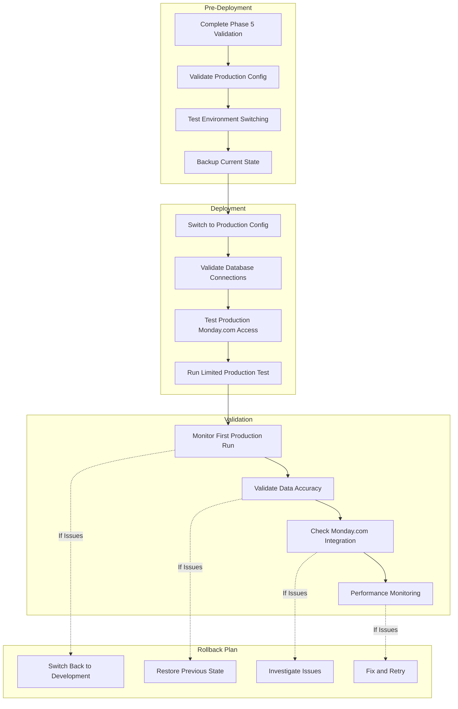

# TASK021 - Production Cutover Plan

**Status:** 🔄 PLANNING PHASE  
**Added:** 2025-07-26  
**Updated:** 2025-07-26  
**Priority:** Critical - Production deployment readiness

## Original Request
Create a comprehensive production cutover plan that addresses all pre-production validation requirements, environment switching, and operational readiness for the ORDER_LIST Monday.com sync pipeline.

## Thought Process
Following the user's request for systematic planning approach, this production cutover plan was developed based on critical analysis of our current system state and production requirements:

1. **Current Foundation Assessment**: The DELTA-free architecture is proven operational with 100% E2E test success (59 records synced), but critical validation gaps exist in Task 19.15 that must be resolved before production deployment.

2. **Risk Analysis**: Task 19.15 has multiple features incorrectly marked as complete (group creation workflow, dropdown population, TOML configuration) that present significant production deployment risks if not properly validated.

3. **Environment Differences**: Production Monday.com board (9200517329) has different column structure and mapping requirements compared to development board (9609317401), requiring comprehensive validation and configuration updates.

4. **Production Readiness Dependencies**: Full production capability requires completion of change detection logic (TASK020) to handle UPDATE/CANCELLED orders, not just NEW orders currently supported.

5. **Systematic Approach**: Following established patterns from successful Task 19 implementation, the cutover plan emphasizes phase-based validation, comprehensive pre-production checklists, and proven E2E test methodologies.

6. **Operational Excellence**: Production deployment requires monitoring, alerting, rollback procedures, and comprehensive documentation to ensure reliable ongoing operations.

## Implementation Plan

### Prerequisite Task Completion
- **TASK019_PHASE05**: Testing & Validation (Currently 75% - Critical gaps remain)
- **TASK019_PHASE06**: DELTA Cleanup & Production Readiness (Blocked until Phase 5 complete)
- **TASK020**: Change Detection Logic (Planning phase - Required for full production)

## Comprehensive Pre-Production Checklist

### 🚨 CRITICAL PHASE 5 COMPLETION REQUIREMENTS

Based on current Task 19.15 status - **MUST COMPLETE BEFORE PRODUCTION**:

#### 1. Group Creation Workflow Validation (19.15.3)
**Current Status**: 🚨 NOT TESTED - marked complete by error  
**Required Action**: 
- [ ] Test customer group creation in Monday.com
- [ ] Validate groups created BEFORE items (sequence critical)
- [ ] Verify group creation workflow in TOML configuration
- [ ] Success Criteria: Customer groups created successfully before item sync

#### 2. Dropdown Population Validation (19.15.2)
**Current Status**: 🚨 UNKNOWN - need validation  
**Required Action**:
- [ ] Test AAG SEASON dropdown population with "2025 FALL" 
- [ ] Test CUSTOMER SEASON dropdown population
- [ ] Validate `createLabelsIfMissing=True` functionality
- [ ] Success Criteria: All dropdown fields populate correctly in Monday.com

#### 3. TOML Configuration Testing (19.15.5)
**Current Status**: 🚨 NOT TESTED - marked complete by error  
**Required Action**:
- [ ] Validate all dropdown/group management settings
- [ ] Test environment switching (development → production)
- [ ] Verify board ID and column mapping accuracy
- [ ] Success Criteria: TOML configuration fully operational

#### 4. Performance Testing (19.16)
**Current Status**: 🔄 Not Started - Final 5% of Phase 5  
**Required Action**:
- [ ] Validate ≥200 records/second throughput
- [ ] Compare DELTA-free vs legacy performance
- [ ] Memory usage validation under load
- [ ] Success Criteria: Performance meets production requirements

## Production Environment Configuration

### Environment Switching Validation

#### Development Environment (Current)
```toml
[environment.development]
source_table = "swp_ORDER_LIST_SYNC"
target_table = "FACT_ORDER_LIST"  
lines_table = "ORDER_LIST_LINES"
database = "orders"

[monday.development]
board_id = 9609317401                   # Dev items board
subitem_board_id = 9609317948           # Dev subitems board
```

#### Production Environment (Required)
```toml
[environment.production]
source_table = "swp_ORDER_LIST_SYNC"     # Production staging table
target_table = "FACT_ORDER_LIST"        # Live production table
lines_table = "ORDER_LIST_LINES"        # Production lines table
database = "orders"                     # Production database

[monday.production]  
board_id = 9200517329                   # Production items board
subitem_board_id = 9200771505           # Production subitems board
```

### Column Mapping Validation

#### Critical Differences: Development vs Production Boards
**Development Board (9609317401)**: 
- `"CUSTOMER NAME" = "dropdown_mkr542p2"`
- `"AAG SEASON" = "dropdown_mkr58de6"`
- `"CUSTOMER SEASON" = "dropdown_mkr5rgs6"`

**Production Board (9200517329)**:
- `"CUSTOMER" = "dropdown_mkp4ar5n"`  # Different column name
- `"SEASON" = "text_mkp47g7m"`        # Text field, not dropdown
- `"CUSTOMER SEASON" = "dropdown_mkp4kmtp"`

**CRITICAL**: Production mappings must be validated before cutover

## Data Readiness Validation

### Source Data Verification
```sql
-- Verify production data availability
SELECT COUNT(*) as total_records,
       COUNT(CASE WHEN sync_state = 'NEW' THEN 1 END) as new_records,
       COUNT(CASE WHEN action_type = 'UPDATE' THEN 1 END) as update_records,
       COUNT(CASE WHEN ORDER_TYPE = 'CANCELLED' THEN 1 END) as cancelled_records
FROM swp_ORDER_LIST_SYNC;

-- Verify sync columns exist in production tables
SELECT COLUMN_NAME 
FROM INFORMATION_SCHEMA.COLUMNS 
WHERE TABLE_NAME IN ('FACT_ORDER_LIST', 'ORDER_LIST_LINES')
  AND COLUMN_NAME IN ('sync_state', 'action_type', 'monday_item_id', 'monday_subitem_id');
```

### Database Schema Readiness
- [ ] FACT_ORDER_LIST has all sync columns (sync_state, action_type, monday_item_id, etc.)
- [ ] ORDER_LIST_LINES has all sync columns (sync_state, action_type, monday_subitem_id, etc.)
- [ ] swp_ORDER_LIST_SYNC contains production data with proper action_type values
- [ ] Database permissions configured for production access

## Monday.com Production Readiness

### Board Configuration Validation
- [ ] Production board access and permissions verified
- [ ] Column mappings tested with production board structure
- [ ] Group creation permissions validated
- [ ] API rate limits and authentication confirmed

### Production Board Differences
**Key Validation Points**:
1. **Column ID Mappings**: Production uses different column IDs (mkp* vs mkr*)
2. **Column Types**: Some dropdowns in dev are text fields in production
3. **Board Structure**: Different group organization may be required
4. **Permissions**: Production board may have different access controls

## Operational Procedures

### Deployment Sequence


### Monitoring and Alerting
- [ ] Database query performance monitoring
- [ ] Monday.com API success rate tracking
- [ ] Error logging and notification setup
- [ ] Data consistency validation procedures

### Rollback Procedures
1. **Immediate Rollback**: Switch back to development configuration
2. **Data Restoration**: Restore sync_state to previous values if needed
3. **Monday.com Cleanup**: Remove any production test data from boards
4. **Investigation**: Document issues and create action plan

## Success Criteria for Production Readiness

### Technical Validation
- [ ] ✅ All Phase 5 tasks complete (Task 19.15 and 19.16)
- [ ] ✅ Group creation workflow operational
- [ ] ✅ Dropdown population working correctly
- [ ] ✅ TOML configuration fully validated
- [ ] ✅ Performance requirements met (≥200 records/second)
- [ ] ✅ Environment switching working
- [ ] ✅ Production column mappings validated

### Data Validation  
- [ ] ✅ Production data available and accessible
- [ ] ✅ Database schema ready with sync columns
- [ ] ✅ Source data quality validated
- [ ] ✅ Test data scenarios prepared

### Integration Validation
- [ ] ✅ Production Monday.com board access confirmed
- [ ] ✅ API authentication and permissions working
- [ ] ✅ Column mappings tested with production board
- [ ] ✅ Group creation permissions validated

### Operational Readiness
- [ ] ✅ Monitoring and alerting configured
- [ ] ✅ Rollback procedures documented and tested
- [ ] ✅ Support procedures updated
- [ ] ✅ Team training completed

## Risk Assessment and Mitigation

### High Risk Areas
1. **Column Mapping Differences**: Production board has different structure
   - **Mitigation**: Comprehensive mapping validation before cutover
   
2. **Group Creation Permissions**: May fail in production environment
   - **Mitigation**: Test group creation with production credentials
   
3. **Data Volume Impact**: Production data volume may affect performance
   - **Mitigation**: Performance testing with production-scale data

4. **Monday.com Rate Limits**: Production usage may hit different limits
   - **Mitigation**: Implement proper throttling and retry logic

### Medium Risk Areas
1. **Database Performance**: Production database may have different performance characteristics
2. **Network Connectivity**: Production environment network differences
3. **Authentication**: Production authentication may have different requirements

## Implementation Timeline

### Phase 1: Complete Prerequisites (Week 1)
**Dependencies**: TASK019_PHASE05 completion
- [ ] Complete Task 19.15 validation (group creation, dropdowns, TOML)
- [ ] Complete Task 19.16 performance testing
- [ ] Validate all Phase 5 success criteria

### Phase 2: Production Configuration (Week 2)  
**Dependencies**: Phase 1 complete
- [ ] Configure production environment settings
- [ ] Validate production column mappings
- [ ] Test environment switching functionality
- [ ] Prepare production test scenarios

### Phase 3: Pre-Production Testing (Week 3)
**Dependencies**: Phase 2 complete
- [ ] Limited production environment testing
- [ ] Production Monday.com integration validation
- [ ] Performance testing with production data
- [ ] Operational procedure validation

### Phase 4: Production Cutover (Week 4)
**Dependencies**: All previous phases complete + stakeholder approval
- [ ] Execute production deployment
- [ ] Monitor initial production runs
- [ ] Validate data accuracy and integration
- [ ] Complete operational handoff

## Dependencies and Blockers

### Current Blockers
1. **TASK019_PHASE05**: 75% complete - critical gaps in group creation and dropdown validation
2. **Production Board Access**: Need validation of production Monday.com board access
3. **Production Data**: Need confirmation of production data availability
4. **Change Detection**: TASK020 required for full production capability

### Success Dependencies
- **Task 19.15**: Must reach 100% completion with validated group creation and dropdown functionality
- **Task 19.16**: Performance benchmarks must meet requirements
- **Production Access**: Full production environment access and permissions
- **Stakeholder Approval**: Business approval for production cutover

## Definition of Done

### Technical Completion
- [ ] ✅ All Phase 5 tasks 100% complete and validated
- [ ] ✅ Production configuration tested and operational
- [ ] ✅ Environment switching working correctly
- [ ] ✅ Production Monday.com integration validated

### Operational Completion  
- [ ] ✅ Monitoring and alerting operational
- [ ] ✅ Rollback procedures tested
- [ ] ✅ Support documentation updated
- [ ] ✅ Team training completed

### Business Completion
- [ ] ✅ Stakeholder approval obtained
- [ ] ✅ Go-live date scheduled
- [ ] ✅ Success metrics defined and agreed
- [ ] ✅ Communication plan executed

**CRITICAL**: This task cannot proceed until TASK019_PHASE05 reaches 100% completion with all validation gaps resolved.
